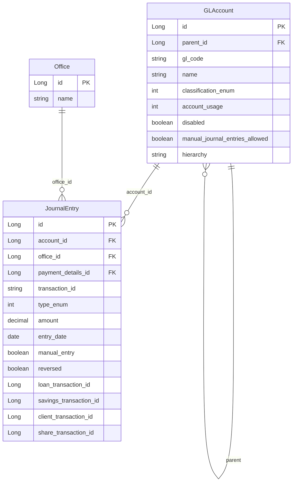

The `fineract-accounting` module implements the full double-entry general ledger engine for Apache Fineract. At its core sits the `acc_gl_account` table (the chart of accounts), which is navigated via `GLAccount` entities organised in a parent-child hierarchy. Every financial event produces `JournalEntry` rows that reference GL accounts; period integrity is enforced through `GLClosure`; and the mapping from loan or savings product actions to specific GL accounts is managed by `ProductToGLAccountMapping`.

<CardGroup cols={2}>
  <Card title="Journal Entries" icon="receipt" href="/accounting/journal-entries">
    How transactions produce debit/credit pairs and how accrual posting works
  </Card>
  <Card title="Provisioning" icon="shield-halved" href="/accounting/provisioning">
    Loan loss reserves that create their own GL entries
  </Card>
  <Card title="Savings Accounts" icon="piggy-bank" href="/savings/savings-accounts">
    Interest posting and charges that drive GL credits/debits
  </Card>
</CardGroup>

---

## Module layout

```
fineract-accounting/src/main/java/org/apache/fineract/accounting/
├── accrual/                    # AccrualAccountingWritePlatformService
├── closure/                    # GLClosure entity and services
├── common/                     # AccountingRuleType enum
├── financialactivityaccount/   # FinancialActivityAccount — activity-to-GL mapping
├── glaccount/                  # GLAccount entity, TrialBalance, UpdateTrialBalance job
├── journalentry/               # JournalEntry entity, services, running balance
├── producttoaccountmapping/    # ProductToGLAccountMapping
├── provisioning/               # ProvisioningEntry services
├── rule/                       # AccountingRule — manual accounting rules
└── trialbalance/               # Trial balance read services
```

Core enums (`GLAccountType`, `GLAccountUsage`, `JournalEntryType`) are published from `fineract-core` so the domain layer can reference them without a circular dependency on the accounting module.

---

## `GLAccount` entity

**Source:** `fineract-core/src/main/java/org/apache/fineract/accounting/glaccount/domain/GLAccount.java`  
**Table:** `acc_gl_account`

```java
@Entity
@Table(name = "acc_gl_account",
    uniqueConstraints = { @UniqueConstraint(columnNames = {"gl_code"}, name = "acc_gl_code") })
@Getter @Setter @NoArgsConstructor @Accessors(chain = true)
public class GLAccount extends AbstractPersistableCustom<Long> {

    @ManyToOne(fetch = FetchType.LAZY)
    @JoinColumn(name = "parent_id")
    private GLAccount parent;

    @Column(name = "hierarchy", nullable = true, length = 50)
    private String hierarchy;                       // dot-delimited path string

    @OneToMany(fetch = FetchType.LAZY)
    @JoinColumn(name = "parent_id")
    private List<GLAccount> children = new ArrayList<>();

    @Column(name = "name", nullable = false, length = 45)
    private String name;

    @Column(name = "gl_code", nullable = false, length = 100)
    private String glCode;                          // unique chart-of-accounts code

    @Column(name = "disabled", nullable = false)
    private boolean disabled;

    @Column(name = "manual_journal_entries_allowed", nullable = false)
    private boolean manualEntriesAllowed = true;

    @Column(name = "classification_enum", nullable = false)
    private Integer type;                           // GLAccountType integer

    @Column(name = "account_usage", nullable = false)
    private Integer usage;                          // GLAccountUsage: DETAIL=1, HEADER=2

    @Column(name = "description", nullable = true, length = 500)
    private String description;

    @ManyToOne(fetch = FetchType.LAZY)
    @JoinColumn(name = "tag_id")
    private CodeValue tagId;
}
```

### `GLAccountType` — the five account types

```java
// fineract-core/.../accounting/glaccount/domain/GLAccountType.java
public enum GLAccountType {
    ASSET(1, "accountType.asset"),
    LIABILITY(2, "accountType.liability"),
    EQUITY(3, "accountType.equity"),
    INCOME(4, "accountType.income"),
    EXPENSE(5, "accountType.expense");
}
```

| Type | Int | Normal balance | Typical usage |
|---|---|---|---|
| ASSET | 1 | Debit | Loans receivable, cash, fixed assets |
| LIABILITY | 2 | Credit | Deposits, borrowings, tax payable |
| EQUITY | 3 | Credit | Share capital, retained earnings |
| INCOME | 4 | Credit | Interest income, fee income |
| EXPENSE | 5 | Debit | Interest expense, loan loss provision |

### `GLAccountUsage`

```java
public enum GLAccountUsage {
    DETAIL(1, "accountUsage.detail"),   // leaf — can receive journal entries
    HEADER(2, "accountUsage.header");   // parent — aggregation only, no direct postings
}
```

<Warning>
Journal entries can only be posted to accounts with `usage = DETAIL` (1). Attempting to post to a `HEADER` account will raise `GLAccountInvalidUsageException`. The `manualEntriesAllowed` flag adds a further guard — set it to `false` for accounts that must only receive system-generated entries.
</Warning>

---

## Chart of accounts hierarchy

The `hierarchy` column stores a dot-separated path of ancestor IDs (e.g. `".1.5.12."`), enabling efficient subtree queries without recursive CTEs:

```sql
-- All accounts in the "Loans Receivable" subtree (id=12):
SELECT * FROM acc_gl_account
WHERE hierarchy LIKE '.1.5.12.%'
  AND disabled = 0;
```

The `GLAccountWritePlatformServiceJpaRepositoryImpl` recomputes `hierarchy` whenever a parent is changed:

```
fineract-accounting/.../glaccount/service/
    GLAccountWritePlatformServiceJpaRepositoryImpl.java
    GLAccountReadPlatformServiceImpl.java
```

---

## ER diagram: GLAccount → JournalEntry



---

## Trial balance: `TrialBalance` and `UpdateTrialBalanceDetailsJob`

**Source:** `fineract-accounting/.../glaccount/domain/TrialBalance.java`  
**Table:** `m_trial_balance`

```java
@Entity
@Table(name = "m_trial_balance")
public class TrialBalance extends AbstractPersistableCustom<Long> {
    @Column(name = "office_id", nullable = false)
    private Long officeId;

    @Column(name = "account_id", nullable = false)
    private Long glAccountId;

    @Column(name = "amount", nullable = false)
    private BigDecimal amount;

    @Column(name = "entry_date", nullable = false)
    private LocalDate entryDate;

    @Column(name = "created_date", nullable = true)
    private LocalDate transactionDate;

    @Column(name = "closing_balance", nullable = false)
    private BigDecimal closingBalance;
}
```

Trial balance rows are **pre-aggregated snapshots** — they are not computed on the fly from `acc_gl_journal_entry`. The `UpdateTrialBalanceDetailsTasklet` (configured in `UpdateTrialBalanceDetailsConfig`) runs as a scheduled Spring Batch step that:

1. Selects all journal entries for the batch date
2. Aggregates debits and credits per (office, GL account) pair
3. Upserts `m_trial_balance` rows with the running closing balance

<Note>
The trial balance table is a reporting cache. If it diverges from the journal entry sum for a period (e.g. after a manual DB patch), re-run the `Update Trial Balance Details` job from the Scheduler UI or via `POST /runreports`.
</Note>

---

## GL Closure: `GLClosure`

**Source:** `fineract-accounting/.../closure/domain/GLClosure.java`  
**Table:** `acc_gl_closure`

A GL closure locks a period for a specific office. No journal entries with a `transaction_date` ≤ `closing_date` may be created after the closure is posted.

```java
@Entity
@Table(name = "acc_gl_closure",
    uniqueConstraints = {
        @UniqueConstraint(columnNames = {"office_id", "closing_date"}, name = "office_id_closing_date")
    })
public class GLClosure extends AbstractAuditableCustom {

    @ManyToOne
    @JoinColumn(name = "office_id", nullable = false)
    private Office office;

    @Column(name = "closing_date")
    private LocalDate closingDate;

    @Column(name = "comments", nullable = true, length = 500)
    private String comments;

    @Column(name = "is_deleted", nullable = false)
    private boolean deleted = true;
}
```

The uniqueness constraint `(office_id, closing_date)` prevents duplicate closures for the same day. Closures can be deleted (soft-deleted via `is_deleted`) if made in error, but there is no concept of re-opening — you delete the closure and recreate if needed.

**REST:** `GLClosuresApiResource` at `/fineract-provider/api/v1/glclosures`

| Method | Path | Action |
|---|---|---|
| `POST` | `/glclosures` | Create a new closure |
| `GET` | `/glclosures` | List closures (filter by `officeId`) |
| `GET` | `/glclosures/{closureId}` | Retrieve single closure |
| `PUT` | `/glclosures/{closureId}` | Update comments |
| `DELETE` | `/glclosures/{closureId}` | Delete (soft) |

---

## Financial Activity Accounts: `FinancialActivityAccount`

**Source:** `fineract-accounting/.../financialactivityaccount/domain/FinancialActivityAccount.java`  
**Table:** `acc_gl_financial_activity_account`

This entity maps a named financial activity (e.g. "Asset Transfer", "Liability Transfer", "Cash") to a concrete `GLAccount`. The activity type is stored as an integer (`financial_activity_type`) and resolved by the front-end using a code-value lookup.

```java
@Entity
@Table(name = "acc_gl_financial_activity_account")
public class FinancialActivityAccount extends AbstractPersistableCustom<Long> {

    @ManyToOne(fetch = FetchType.EAGER)
    @JoinColumn(name = "gl_account_id")
    private GLAccount glAccount;

    @Column(name = "financial_activity_type", nullable = false)
    private Integer financialActivityType;
}
```

These mappings are used for inter-office transfers, opening balances, and any generic platform activity that needs a GL account but is not tied to a specific product.

**REST:** `FinancialActivityAccountsApiResource` at `/fineract-provider/api/v1/financialactivityaccounts`

---

## Product-to-account mapping: `ProductToGLAccountMapping`

**Source:** `fineract-accounting/.../producttoaccountmapping/domain/ProductToGLAccountMapping.java`  
**Table:** `acc_product_mapping`

```java
@Entity
@Table(name = "acc_product_mapping",
    uniqueConstraints = {
        @UniqueConstraint(columnNames = {"product_id", "product_type",
            "financial_account_type", "payment_type"}, name = "financial_action")
    })
public class ProductToGLAccountMapping extends AbstractPersistableCustom<Long> {

    @ManyToOne(optional = true)
    @JoinColumn(name = "gl_account_id")
    private GLAccount glAccount;

    @Column(name = "product_id", nullable = true)
    private Long productId;

    @Column(name = "product_type", nullable = true)
    private int productType;               // 1=LOAN, 2=SAVINGS, 3=SHARES

    @Column(name = "financial_account_type", nullable = true)
    private int financialAccountType;      // cash, income, expense, overpayment, etc.

    @ManyToOne
    @JoinColumn(name = "payment_type", nullable = true)
    private PaymentType paymentType;       // optional payment-channel override

    @ManyToOne
    @JoinColumn(name = "charge_id", nullable = true)
    private Charge charge;                 // optional charge-specific override

    @ManyToOne
    @JoinColumn(name = "charge_off_reason_id", nullable = true)
    private CodeValue chargeOffReason;
}
```

When a loan disbursement or savings deposit fires, the accounting layer resolves the target GL accounts by querying `acc_product_mapping` for the triplet `(productId, productType, financialAccountType)`. Payment-type-specific overrides (e.g. different cash accounts for mobile money vs. branch cash) are stored as separate rows with a non-null `payment_type`.

Helper classes per product family:

| Class | Purpose |
|---|---|
| `ProductToGLAccountMappingHelper` | Generic save/update/delete for all product types |
| `SavingsProductToGLAccountMappingHelper` | Savings-specific financial account types |
| `ShareProductToGLAccountMappingHelper` | Share-specific account types |
| `WorkingCapitalLoanProductAdvancedAccountingReadHelper` | Advanced accounting for working-capital loans |

---

## Key GL services

### `GLAccountReadPlatformService` / `GLAccountReadPlatformServiceImpl`

Located in `fineract-accounting/.../glaccount/service/`. Provides:

- `retrieveAllGLAccounts(type, searchParam, usage, manualEntriesAllowed, ...)` — filtered list for the chart-of-accounts screen
- `retrieveGLAccountById(id)` — single account with its children
- `retrieveAllEnabledDetailGLAccounts(type)` — all `DETAIL` accounts of a given type (used when building product-mapping dropdowns)

### `GLAccountWritePlatformServiceJpaRepositoryImpl`

Handles create, update, delete with validation:

- Prevents deleting accounts that have journal entries
- Prevents disabling accounts that are active product mappings
- Recomputes `hierarchy` on parent change

---

## REST: `/glaccounts`

Base path: `/fineract-provider/api/v1/glaccounts`

| Method | Path | Action |
|---|---|---|
| `POST` | `/glaccounts` | Create GL account |
| `GET` | `/glaccounts` | List accounts (filter `type`, `usage`, `disabled`, `manualEntriesAllowed`, `tagId`, `searchParam`) |
| `GET` | `/glaccounts/{glAccountId}` | Retrieve with children |
| `PUT` | `/glaccounts/{glAccountId}` | Update |
| `DELETE` | `/glaccounts/{glAccountId}` | Delete (only if no entries) |
| `GET` | `/glaccounts/template` | Form template for new account |
