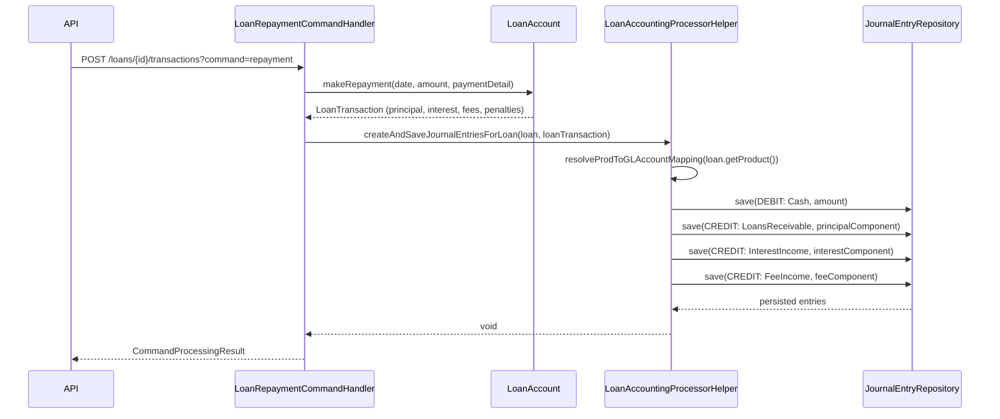

Every financial transaction in Fineract ultimately produces one or more `JournalEntry` rows in `acc_gl_journal_entry`. The accounting module maintains strict double-entry discipline: each source event generates a balanced set of DEBIT and CREDIT entries, linked to the originating transaction via `transaction_id`. This page covers the entity model, how loan and savings events trigger entries, the accrual subsystem, and the running-balance maintenance service.

<CardGroup cols={2}>
  <Card title="General Ledger" icon="book" href="/accounting/general-ledger">
    GLAccount entity, chart of accounts hierarchy, and product-to-GL mapping
  </Card>
  <Card title="Provisioning" icon="shield-halved" href="/accounting/provisioning">
    How provisioning entries create their own journal entry pairs
  </Card>
  <Card title="Savings Accounts" icon="piggy-bank" href="/savings/savings-accounts">
    Savings transaction types that drive GL postings
  </Card>
</CardGroup>

---

## `JournalEntry` entity

**Source:** `fineract-accounting/.../journalentry/domain/JournalEntry.java`  
**Table:** `acc_gl_journal_entry`

```java
@Entity
@Getter
@Table(name = "acc_gl_journal_entry")
public class JournalEntry extends AbstractAuditableWithUTCDateTimeCustom<Long> {

    @ManyToOne
    @JoinColumn(name = "office_id", nullable = false)
    private Office office;

    @ManyToOne
    @JoinColumn(name = "payment_details_id")
    private PaymentDetail paymentDetail;

    @ManyToOne
    @JoinColumn(name = "account_id", nullable = false)
    private GLAccount glAccount;

    @Column(name = "currency_code", length = 3, nullable = false)
    private String currencyCode;

    @Column(name = "transaction_id", nullable = false, length = 50)
    private String transactionId;           // groups all entries for one business event

    @Column(name = "type_enum", nullable = false)
    private Integer type;                   // JournalEntryType: CREDIT=1, DEBIT=2

    @Column(name = "amount", scale = 6, precision = 19, nullable = false)
    private BigDecimal amount;

    @Column(name = "entry_date")
    private LocalDate transactionDate;

    @Column(name = "manual_entry", nullable = false)
    private boolean manualEntry = false;

    @Setter
    @Column(name = "reversed", nullable = false)
    private boolean reversed = false;

    @Setter
    @ManyToOne(fetch = FetchType.LAZY)
    @JoinColumn(name = "reversal_id")
    private JournalEntry reversalJournalEntry;

    // Source transaction linkage — exactly one will be non-null for system entries:
    @Column(name = "loan_transaction_id")
    private Long loanTransactionId;

    @Column(name = "savings_transaction_id")
    private Long savingsTransactionId;

    @Column(name = "client_transaction_id")
    private Long clientTransactionId;

    @Column(name = "share_transaction_id")
    private Long shareTransactionId;

    @Column(name = "description", length = 500)
    private String description;

    @Column(name = "entity_type_enum", length = 50)
    private Integer entityType;

    @Column(name = "entity_id")
    private Long entityId;

    @Column(name = "ref_num")
    private String referenceNumber;

    @Column(name = "submitted_on_date", nullable = false)
    private LocalDate submittedOnDate;
}
```

### Key field notes

| Field | Notes |
|---|---|
| `payment_details_id` | Optional FK to `PaymentDetail` — populated for cash transactions that carry payment channel metadata |
| `transaction_id` | String key grouping a balanced entry set (e.g. `"L123"`, `"S456"`). All DEBIT + CREDIT rows for one business event share this value. |
| `type_enum` | `JournalEntryType.CREDIT = 1`, `JournalEntryType.DEBIT = 2` |
| `manual_entry` | `true` for user-submitted entries via `/journalentries`; `false` for system-generated |
| `reversed` | Set to `true` when this entry is cancelled by a reversal pair |
| `reversal_id` | FK back to the original entry that this row reverses (if any) |
| `loan_transaction_id` / `savings_transaction_id` / `share_transaction_id` | Exactly one is set for automated entries, providing a traceable link to the originating module row |
| `entity_type_enum` / `entity_id` | For entries not linked to a single transaction type (e.g. provisioning), these capture the entity category and its id |
| `submitted_on_date` | Business date at time of creation (`DateUtils.getBusinessLocalDate()`) |

---

## `JournalEntryType`

```java
// fineract-core/.../accounting/journalentry/domain/JournalEntryType.java
public enum JournalEntryType {
    CREDIT(1, "journalEntryType.credit"),
    DEBIT(2,  "journalEntrytType.debit");   // note: legacy typo in code string
}
```

The static factory `JournalEntry.createNew(...)` requires a `JournalEntryType` parameter which is stored as its integer value.

---

## Manual vs. automated journal entries

### Automated entries

System-generated entries are created by product-specific accounting helpers whenever a financial event fires through the command-handling pipeline. Examples:

- `LoanAccountingProcessorHelper` — loan disbursements, repayments, charge-offs
- `SavingsAccountDomainService` — savings deposits, withdrawals, interest postings
- `ShareProductToGLAccountMappingHelper` — share purchases, redemptions, dividends

These entries set `manual_entry = false` and populate one of the `*_transaction_id` FK columns.

### Manual entries

An operator creates a manual entry via `POST /journalentries` with `debits[]` and `credits[]` arrays. The API resource (`JournalEntryApiResource`) validates balance (total debits = total credits) via `JournalEntryDataValidator` and routes through `JournalEntryCommandFromApiJsonDeserializer` → `JournalEntryCommand`.

Manual entries set `manual_entry = true`. They can be reversed via `POST /journalentries/{transactionId}?command=reverse`, which creates a new set of entries with opposite signs and links them via `reversal_id`.

<Warning>
Manual entries respect `GLClosure` — any entry whose `transactionDate` falls on or before the office's current closing date will be rejected with `JournalEntryInvalidException`. See [General Ledger](/accounting/general-ledger) for closure details.
</Warning>

---

## Accounting rules engine: `AccountingRule`

**Source:** `fineract-accounting/.../rule/domain/AccountingRule.java`  
**Table:** `acc_accounting_rule`

`AccountingRule` provides a configurable template for recurring manual entries — a named rule that pre-fills the debit and credit accounts:

```java
@Entity
@Table(name = "acc_accounting_rule",
    uniqueConstraints = { @UniqueConstraint(columnNames = {"name"}, name = "accounting_rule_name_unique") })
public class AccountingRule extends AbstractPersistableCustom<Long> {

    @Column(name = "name", nullable = false, length = 500)
    private String name;

    @ManyToOne
    @JoinColumn(name = "office_id")
    private Office office;

    @Column(name = "description")
    private String description;

    // Debit/credit GLAccount or tag references
    // Set<AccountingTagRule> debitTags, creditTags
}
```

When a manual journal entry references an `AccountingRule`, the API pre-populates the account fields. This is purely a convenience layer — it does not restrict which accounts the user can ultimately select.

---

## Loan repayment → journal entry sequence



The `transaction_id` for all four rows in the example above is the same string (typically `"L<loanId>_<transactionId>"`), making the balanced set queryable with a single `WHERE transaction_id = ?`.

---

## Accrual accounting

### `AccrualAccountingWritePlatformService`

**Source:** `fineract-accounting/.../accrual/service/AccrualAccountingWritePlatformService.java`

```java
public interface AccrualAccountingWritePlatformService {
    CommandProcessingResult executeLoansPeriodicAccrual(JsonCommand command);
}
```

Periodic accrual posts interest income entries to the GL for the period ending on the supplied `tillDate`, without waiting for actual cash receipt. This enables income recognition on an accrual basis.

The execution flow:

1. `POST /periodicaccrualaccounting` with `{"tillDate": "2024-12-31"}`
2. `ExecutePeriodicAccrualCommandHandler` dispatches to `AccrualAccountingWritePlatformService`
3. The service iterates all active loans with `accrualAccountingEnabled`, computes accrued interest up to `tillDate`, and writes DEBIT/CREDIT pairs to `acc_gl_journal_entry`
4. Entries carry `entity_type_enum` = LOAN and `entity_id` = loanId

**Upfront accrual** is handled at disbursement time by a different path in the loan accounting helper — all expected interest for the loan term is recognised immediately on the debit side.

### REST: `/periodicaccrualaccounting`

| Method | Path | Action |
|---|---|---|
| `POST` | `/periodicaccrualaccounting` | Run periodic accrual up to `tillDate` |

---

## Running balance maintenance: `JournalEntryRunningBalanceUpdateService`

**Source:** `fineract-accounting/.../journalentry/service/JournalEntryRunningBalanceUpdateService.java`

```java
public interface JournalEntryRunningBalanceUpdateService {
    void updateRunningBalance();
    CommandProcessingResult updateOfficeRunningBalance(JsonCommand command);
}
```

`updateRunningBalance()` is called by a scheduled job (`Update Accounting Running Balances`) that computes the cumulative balance for each GL account across all offices. The service sets `is_running_balance_calculated = true` on processed journal entries and writes the organisation-level running balance into the `acc_gl_account` view used by financial reports that need a point-in-time balance.

`updateOfficeRunningBalance(command)` scopes the recalculation to a single office, used after corrective postings or reversals.

<Note>
If running balances appear stale after a bulk data migration, trigger `updateRunningBalance()` manually via the `Update Accounting Running Balances` scheduler job before generating period-end reports.
</Note>

---

## REST endpoints

Base path: `/fineract-provider/api/v1/journalentries`

| Method | Path | Action |
|---|---|---|
| `POST` | `/journalentries` | Create a manual journal entry |
| `GET` | `/journalentries` | List entries (filter by `glAccountId`, `officeId`, `manualEntriesOnly`, `transactionId`, `fromDate`, `toDate`, `transactionDetails`) |
| `GET` | `/journalentries/{transactionId}` | Retrieve all entries for a transaction group |
| `POST` | `/journalentries/{transactionId}?command=reverse` | Reverse a manual entry |
| `GET` | `/journalentries/openingbalance` | Office opening balance template |
| `POST` | `/journalentries?command=updateRunningBalance` | Trigger running balance update for an office |

---

## Accounting rules REST

Base path: `/fineract-provider/api/v1/accountingrules`

| Method | Path | Action |
|---|---|---|
| `POST` | `/accountingrules` | Create rule |
| `GET` | `/accountingrules` | List rules |
| `GET` | `/accountingrules/{ruleId}` | Retrieve rule |
| `PUT` | `/accountingrules/{ruleId}` | Update rule |
| `DELETE` | `/accountingrules/{ruleId}` | Delete rule |

<Tip>
To audit all GL movement for a specific loan, query `acc_gl_journal_entry WHERE loan_transaction_id IN (SELECT id FROM m_loan_transaction WHERE loan_id = ?)`. The `transaction_id` column gives you natural grouping by business event.
</Tip>
