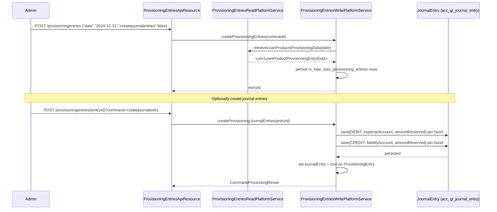

Loan loss provisioning is the process of recognising reserves in the income statement for loans that may not be fully recovered. Fineract's provisioning subsystem allows administrators to define `ProvisioningCriteria` — a set of aging bands mapped to reserve percentages — and to run provisioning entries that calculate the required reserve for each loan product. When journal entries are requested, the system writes DEBIT/CREDIT pairs to the GL against liability and expense accounts configured in the criteria.

<CardGroup cols={2}>
  <Card title="General Ledger" icon="book" href="/accounting/general-ledger">
    GLAccount hierarchy and chart of accounts used by provisioning entries
  </Card>
  <Card title="Journal Entries" icon="receipt" href="/accounting/journal-entries">
    How provisioning GL entries fit into the broader double-entry engine
  </Card>
</CardGroup>

---

## Module layout

```
fineract-accounting/.../accounting/provisioning/
├── api/
│   └── ProvisioningEntriesApiResource.java
├── constant/
│   └── ProvisioningEntriesApiConstants.java
├── data/
│   ├── ProvisioningEntryData.java
│   ├── LoanProductProvisioningEntryData.java
│   └── request/ProvisionEntryRequest.java
├── exception/
│   ├── NoProvisioningCriteriaDefinitionFound.java
│   ├── ProvisioningEntryAlreadyCreatedException.java
│   ├── ProvisioningJournalEntriesCannotbeCreatedException.java
│   └── ...
├── serialization/
│   └── ProvisioningEntriesDefinitionJsonDeserializer.java
└── service/
    ├── ProvisioningEntriesReadPlatformService.java
    └── ProvisioningEntriesReadPlatformServiceImpl.java

fineract-provider/.../organisation/provisioning/
├── domain/
│   ├── ProvisioningCriteria.java
│   ├── ProvisioningCriteriaDefinition.java
│   ├── ProvisioningCategory.java
│   └── LoanProductProvisionCriteria.java
└── ...
```

---

## Provisioning criteria: `ProvisioningCriteria`

**Source:** `fineract-provider/.../organisation/provisioning/domain/ProvisioningCriteria.java`  
**Table:** `m_provisioning_criteria`

```java
@Entity
@Table(name = "m_provisioning_criteria",
    uniqueConstraints = { @UniqueConstraint(columnNames = {"criteria_name"}) })
public class ProvisioningCriteria extends AbstractAuditableCustom {

    @Column(name = "criteria_name", nullable = false)
    private String criteriaName;

    @OneToMany(cascade = CascadeType.ALL, mappedBy = "criteria",
               orphanRemoval = true, fetch = FetchType.EAGER)
    Set<ProvisioningCriteriaDefinition> provisioningCriteriaDefinition = new HashSet<>();

    @OneToMany(cascade = CascadeType.ALL, mappedBy = "criteria",
               orphanRemoval = true, fetch = FetchType.EAGER)
    Set<LoanProductProvisionCriteria> loanProductMapping = new HashSet<>();
}
```

A `ProvisioningCriteria` is a named set of aging definitions plus the loan products it applies to. One criteria can cover multiple loan products; a loan product can only belong to one active criteria at a time.

---

## Aging bands: `ProvisioningCriteriaDefinition`

**Source:** `fineract-provider/.../organisation/provisioning/domain/ProvisioningCriteriaDefinition.java`  
**Table:** `m_provisioning_criteria_definition`

```java
@Entity
@Table(name = "m_provisioning_criteria_definition")
public class ProvisioningCriteriaDefinition extends AbstractPersistableCustom<Long> {

    @ManyToOne(optional = false)
    @JoinColumn(name = "criteria_id", referencedColumnName = "id", nullable = false)
    private ProvisioningCriteria criteria;

    @ManyToOne
    @JoinColumn(name = "category_id", nullable = false)
    private ProvisioningCategory provisioningCategory;  // e.g. "Standard", "Sub-standard", "Doubtful", "Loss"

    @Column(name = "min_age", nullable = false)
    private Long minimumAge;                            // days overdue — lower bound

    @Column(name = "max_age", nullable = false)
    private Long maximumAge;                            // days overdue — upper bound

    @Column(name = "provision_percentage", nullable = false)
    private BigDecimal provisioningPercentage;          // e.g. 1.00 = 1%

    @ManyToOne
    @JoinColumn(name = "liability_account", nullable = false)
    private GLAccount liabilityAccount;                 // Loan Loss Reserve (LIABILITY)

    @ManyToOne
    @JoinColumn(name = "expense_account", nullable = false)
    private GLAccount expenseAccount;                   // Provision for Loan Losses (EXPENSE)
}
```

### Example aging band table

| Category | Min age (days) | Max age (days) | Provision % | Liability GL | Expense GL |
|---|---|---|---|---|---|
| Standard | 0 | 29 | 1.00 | Loan Loss Reserve | Provision Expense |
| Sub-standard | 30 | 89 | 20.00 | Loan Loss Reserve | Provision Expense |
| Doubtful | 90 | 179 | 50.00 | Loan Loss Reserve | Provision Expense |
| Loss | 180 | 999999 | 100.00 | Loan Loss Reserve | Provision Expense |

Each band can point to different liability and expense accounts if the institution uses separate reserve pools per risk category.

---

## `ProvisioningEntryData` and `LoanProductProvisioningEntryData`

### `ProvisioningEntryData`

**Source:** `fineract-accounting/.../provisioning/data/ProvisioningEntryData.java`

This is the read-side aggregate for a single provisioning run:

```java
@Data @NoArgsConstructor @Accessors(chain = true)
public class ProvisioningEntryData implements Serializable {
    private Long id;
    private Boolean journalEntry;           // true if GL entries have been created
    private Long createdById;
    private String createdUser;
    private LocalDate createdDate;
    private Long modifiedById;
    private String modifiedUser;
    private BigDecimal reservedAmount;      // total reserve across all products
    private Collection<LoanProductProvisioningEntryData> provisioningEntries;
}
```

### `LoanProductProvisioningEntryData`

**Source:** `fineract-accounting/.../provisioning/data/LoanProductProvisioningEntryData.java`

One row per (office, loan product, provisioning category) combination:

```java
@Data @NoArgsConstructor @Accessors(chain = true)
public class LoanProductProvisioningEntryData {
    private Long historyId;
    private Long officeId;
    private String officeName;
    private String currencyCode;
    private Long productId;
    private String productName;
    private Long categoryId;
    private String categoryName;
    private Long overdueInDays;             // max days overdue in this band
    private BigDecimal percentage;          // provision percentage
    private BigDecimal balance;             // outstanding principal in this band
    private BigDecimal amountreserved;      // balance × percentage / 100
    private Long liablityAccount;           // GL account id for reserve
    private String liabilityAccountCode;
    private String liabilityAccountName;
    private Long expenseAccount;            // GL account id for expense
    private String expenseAccountCode;
    private String expenseAccountName;
    private Long criteriaId;
}
```

---

## `ProvisioningEntriesReadPlatformService`

**Source:** `fineract-accounting/.../provisioning/service/ProvisioningEntriesReadPlatformService.java`

```java
public interface ProvisioningEntriesReadPlatformService {

    Collection<LoanProductProvisioningEntryData> retrieveLoanProductsProvisioningData(LocalDate date);

    ProvisioningEntryData retrieveProvisioningEntryData(Long entryId);

    Page<ProvisioningEntryData> retrieveAllProvisioningEntries(Integer offset, Integer limit);

    ProvisioningEntryData retrieveProvisioningEntryData(String date);

    ProvisioningEntryData retrieveProvisioningEntryDataByCriteriaId(Long criteriaId);

    ProvisioningEntryData retrieveExistingProvisioningIdDateWithJournals();

    Page<LoanProductProvisioningEntryData> retrieveProvisioningEntries(SearchParameters searchParams);
}
```

`retrieveLoanProductsProvisioningData(date)` is the core calculation method — it executes the aging query against live loan data for the given date and returns the per-band reserves without persisting anything. This allows a preview before committing.

---

## Provisioning flow



<Note>
The provisioning entry and its GL entries are separate operations. You can create the entry (which persists the calculation snapshot) without immediately posting journal entries, allowing a review step. The `journalEntry` boolean on `ProvisioningEntryData` tracks whether GL entries exist for this run.
</Note>

---

## GL integration

When provisioning journal entries are created, the system writes a balanced pair for each `LoanProductProvisioningEntryData` row:

| Side | GL Account | Amount |
|---|---|---|
| DEBIT | `expenseAccount` (EXPENSE type) | `amountreserved` |
| CREDIT | `liabilityAccount` (LIABILITY type) | `amountreserved` |

The `entity_type_enum` on both rows is set to `PROVISIONING` and `entity_id` to the `historyId` of the provisioning entry, providing a direct audit trail from the GL back to the calculation.

If a subsequent provisioning run finds that the required reserve has decreased (loan repaid or upgraded), the system can generate a reversal entry (CREDIT expense, DEBIT liability) to release the excess reserve.

<Warning>
Provisioning journal entries cannot be created if the provisioning date falls within a closed GL period. Create the provisioning entry first and verify the date before requesting GL creation. The `ProvisioningJournalEntriesCannotbeCreatedException` is thrown if the date is already closed.
</Warning>

---

## REST endpoints

### Provisioning Entries — `/fineract-provider/api/v1/provisioningentries`

| Method | Path | Action |
|---|---|---|
| `POST` | `/provisioningentries` | Create provisioning entry (snapshot) |
| `GET` | `/provisioningentries` | Paginated list of entries |
| `GET` | `/provisioningentries/{entryId}` | Retrieve entry with line items |
| `POST` | `/provisioningentries/{entryId}?command=createjournalentry` | Generate GL entries for this snapshot |
| `PUT` | `/provisioningentries/{entryId}` | Re-run calculation (update snapshot, requires no existing GL entries) |
| `DELETE` | `/provisioningentries/{entryId}` | Delete entry (only if no GL entries created) |

### Provisioning Criteria — `/fineract-provider/api/v1/provisioningcriteria`

| Method | Path | Action |
|---|---|---|
| `POST` | `/provisioningcriteria` | Create criteria with aging bands |
| `GET` | `/provisioningcriteria` | List all criteria |
| `GET` | `/provisioningcriteria/{criteriaId}` | Retrieve with band definitions |
| `PUT` | `/provisioningcriteria/{criteriaId}` | Update bands and product mappings |
| `DELETE` | `/provisioningcriteria/{criteriaId}` | Delete (only if no provisioning entries reference it) |

<Tip>
To audit the reserve calculation for a specific loan product, call `GET /provisioningentries/{entryId}` and filter the `provisioningEntries` collection by `productId`. The `overdueInDays`, `balance`, `percentage`, and `amountreserved` fields give a complete view of how the reserve was derived.
</Tip>
