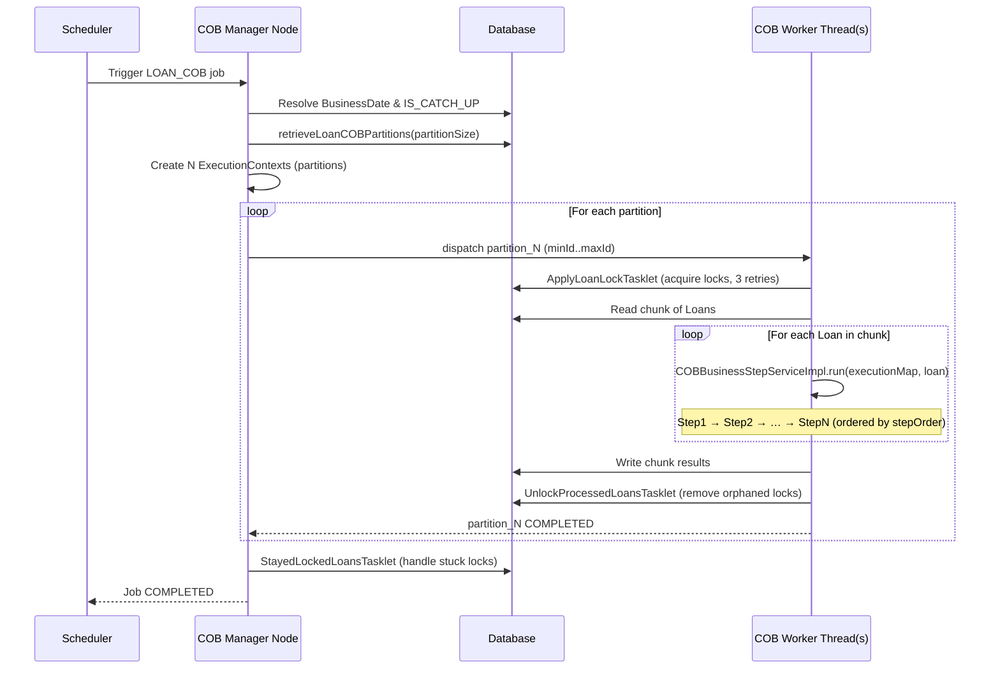

The `fineract-cob` module is the backbone of nightly batch processing in Apache Fineract. Every day, after business hours, a Spring Batch job iterates over every eligible (non-closed) loan and runs an ordered sequence of user-configurable business steps — accruals, arrears aging, delinquency tagging, charge application, and more. The framework is designed for horizontal scale: loan IDs are partitioned into ranges, each range is processed by an independent worker thread or node, and account locks prevent concurrent API mutations during processing.

<CardGroup cols={2}>
  <Card title="COB Loan Steps" icon="list-ol" href="/batch/cob-loan-steps">
    Concrete step implementations for loans
  </Card>
  <Card title="Scheduled Jobs" icon="clock" href="/batch/scheduled-jobs">
    Job scheduler, cron configuration, and REST API
  </Card>
  <Card title="Multi-Tenancy" icon="building" href="/platform/multi-tenancy">
    How tenant context flows into batch workers
  </Card>
</CardGroup>

---

## Module layout

```
fineract-cob/src/main/java/org/apache/fineract/cob/
├── COBBusinessStep.java          # SPI interface
├── COBBusinessStepService.java   # Service contract
├── COBBusinessStepServiceImpl.java
├── COBConstant.java              # Shared constants
├── api/                          # REST endpoints for step configuration
├── common/                       # CommonPartitioner base class
├── conditions/                   # BatchManagerCondition, BatchWorkerCondition
├── data/                         # COBParameter, COBPartition, BusinessStepNameAndOrder
├── domain/                       # AccountLock, BatchBusinessStep, LockOwner, …
├── exceptions/
├── listener/
├── processor/
├── resolver/                     # BusinessDateResolver, CatchUpFlagResolver
├── service/                      # AccountLockService, RetrieveIdService, …
└── tasklet/                      # ApplyCommonLockTasklet, UnlockProcessedAccountsTasklet
```

---

## The `COBBusinessStep` SPI

Every piece of business logic executed during COB must implement this interface, located at
`fineract-cob/src/main/java/org/apache/fineract/cob/COBBusinessStep.java`:

```java
public interface COBBusinessStep<T extends AbstractPersistableCustom<Long>> {

    T execute(T input);

    String getEnumStyledName();   // e.g. "ADD_PERIODIC_ACCRUAL_ENTRIES"

    String getHumanReadableName(); // e.g. "Add periodic accrual entries"
}
```

- `execute(T input)` receives the domain object (typically a `Loan`), performs its mutation or side effect, and returns the same object (possibly reloaded by `ReloaderService`).
- `getEnumStyledName()` is the canonical key stored in the `m_batch_business_steps` table and referenced in the execution map.
- `getHumanReadableName()` is used in the management REST API and logging.

For loans the marker sub-interface `LoanCOBBusinessStep extends COBBusinessStep<Loan>` (in `fineract-loan`) narrows the generic. All loan steps implement that narrower interface.

---

## `BatchBusinessStep` — step registry in the database

```java
@Entity
@Table(name = "m_batch_business_steps")
public class BatchBusinessStep extends AbstractPersistableCustom<Long> {

    @Column(name = "job_name", nullable = false)
    private String jobName;          // e.g. "LOAN_COB"

    @Column(name = "step_name", nullable = false)
    private String stepName;         // matches getEnumStyledName()

    @Column(name = "step_order", nullable = false)
    private Long stepOrder;          // lower order runs first
}
```

Source: `fineract-cob/src/main/java/org/apache/fineract/cob/domain/BatchBusinessStep.java`

At runtime, `COBBusinessStepServiceImpl` queries `BatchBusinessStepRepository` for all rows with `jobName = "LOAN_COB"`, sorts them by `stepOrder`, and builds a `TreeMap<Long, String>` (order → enumStyledName) which it hands to each worker.

---

## `COBBusinessStepServiceImpl` — orchestrating a single loan

The core execution loop inside `COBBusinessStepServiceImpl.run()`:

```java
for (String businessStep : executionMap.values()) {
    ThreadLocalContextUtil.setActionContext(ActionContext.COB);
    COBBusinessStep<S> businessStepBean =
        (COBBusinessStep<S>) applicationContext.getBean(businessStep);
    item = reloaderService.reload(item);       // re-fetch from DB
    item = businessStepBean.execute(item);
}
```

When the global configuration flag `isCOBBulkEventEnabled` is `true`, `businessEventNotifierService.startExternalEventRecording()` is called before the loop and events are flushed at the end so that Kafka/JMS message payloads are emitted in a single batch per loan rather than per step.

Source: `fineract-cob/src/main/java/org/apache/fineract/cob/COBBusinessStepServiceImpl.java`

---

## Partitioning with `CommonPartitioner`

`CommonPartitioner` (in `fineract-cob/src/main/java/org/apache/fineract/cob/common/`) is the abstract base that splits the full loan set into parallel work units:

```java
public Map<String, ExecutionContext> getPartitions(
        int partitionSize,
        Set<BusinessStepNameAndOrder> cobBusinessSteps) {

    LocalDate businessDate = BusinessDateResolver.resolve(stepExecution);
    boolean isCatchUp  = CatchUpFlagResolver.resolve(stepExecution);

    List<COBPartition> partitions =
        retrieveIdService.retrieveLoanCOBPartitions(
            numberOfDays, businessDate, isCatchUp, partitionSize);

    // Always produce at least one partition (avoids empty-job edge case)
    if (partitions.isEmpty()) {
        partitions.add(new COBPartition(0L, 0L, 1L, 0L));
    }

    return partitions.stream().collect(Collectors.toMap(
        l -> COBConstant.PARTITION_PREFIX + l.getPageNo(),
        l -> createExecutionContextForPartition(cobBusinessSteps, l, businessDate, isCatchUp)
    ));
}
```

Each partition carries `minAccountId`, `maxAccountId`, and `count` so workers can page-query the DB without cross-partition overlap. The concrete subclass `LoanCOBPartitioner` (in `fineract-provider`) wires in the loan-specific retrieval service.

---

## Account locking

### `AccountLock` entity

```java
@MappedSuperclass
public abstract class AccountLock implements Persistable<Long>, Serializable {

    @Id
    @Column(name = "loan_id", nullable = false)
    private Long loanId;

    @Version
    @Column(name = "version")
    private Long version;           // optimistic lock version

    @Enumerated(EnumType.STRING)
    @Column(name = "lock_owner", nullable = false)
    private LockOwner lockOwner;    // COB or LOAN_INLINE_COB
}
```

Source: `fineract-cob/src/main/java/org/apache/fineract/cob/domain/AccountLock.java`

The concrete `LoanAccountLock` maps to table `m_loan_account_lock`. `LockOwner` is an enum with values `LOAN_COB_CHUNK_PROCESSING` and `LOAN_INLINE_COB_PROCESSING`.

### `ApplyCommonLockTasklet` — acquire locks with retry

`ApplyCommonLockTasklet` is an abstract tasklet that runs at the start of each partition step to acquire COB locks. It retries up to `NUMBER_OF_RETRIES = 3` times before throwing `LockCannotBeAppliedException`:

```java
private static final long NUMBER_OF_RETRIES = 3;

public RepeatStatus execute(StepContribution contribution, ChunkContext chunkContext) {
    long numberOfExecutions = contribution.getStepExecution().getCommitCount();
    // ... resolve loanIds for this partition ...
    List<List<Long>> loanIdPartitions = Lists.partition(loanIds, getInClauseParameterSizeLimit());
    // lock in sub-batches inside a new transaction
}
```

Source: `fineract-cob/src/main/java/org/apache/fineract/cob/tasklet/ApplyCommonLockTasklet.java`

### `UnlockProcessedAccountsTasklet` — release orphaned locks

After chunk processing completes, `UnlockProcessedAccountsTasklet` delegates to `AccountLockService.removeOrphanedLocksForProcessedAccounts()`. A lock is "orphaned" when the loan's `last_closed_business_date` matches `lock_placed_on_cob_business_date` — meaning all steps completed but the lock was not removed in the happy path.

<Warning>
If the batch worker JVM is killed mid-run, locks remain. The `StayedLockedLoansTasklet` publishes a `LoanAccountsStayedLockedBusinessEvent` so downstream systems can react to loans that are stuck locked.
</Warning>

---

## Business date resolution

`BusinessDateResolver` (in `fineract-cob/src/main/java/org/apache/fineract/cob/resolver/`) reads the `BusinessDate` key from the Spring Batch `JobExecutionContext`:

```java
public static LocalDate resolve(StepExecution stepExecution) {
    Object bd = stepExecution.getJobExecution()
                             .getExecutionContext()
                             .get(COBConstant.BUSINESS_DATE_PARAMETER_NAME);
    return switch (bd) {
        case null       -> throw new IllegalStateException("Missing BusinessDate ...");
        case String s   -> LocalDate.parse(s);
        case LocalDate d -> d;
        default         -> throw new IllegalStateException("...");
    };
}
```

The date is injected before partitioning by `ResolveLoanCOBCustomJobParametersTasklet`, which reads from the platform's `BusinessDate` global configuration (see `ConfigurationDomainService`).

---

## Catch-up mode

`CatchUpFlagResolver` reads `COBConstant.IS_CATCH_UP_PARAMETER_NAME` ("IS_CATCH_UP") from the same `JobExecutionContext`:

```java
public static boolean resolve(StepExecution stepExecution) {
    Object isCatchUp = stepExecution.getJobExecution()
                                    .getExecutionContext()
                                    .get(COBConstant.IS_CATCH_UP_PARAMETER_NAME);
    return switch (isCatchUp) {
        case null         -> false;
        case String s     -> Boolean.parseBoolean(s);
        case Boolean b    -> b;
        default           -> throw new IllegalStateException(...);
    };
}
```

When catch-up mode is `true`, `RetrieveIdService.retrieveAllNonClosedLoansByLastClosedBusinessDateAndMinAndMaxLoanId` uses a different query predicate that includes loans whose `last_closed_business_date` is earlier than the target date — i.e., loans that missed one or more prior COB runs. This ensures no loan is permanently skipped if a scheduled run was aborted.

---

## Manager vs. Worker deployment modes

Fineract can run in one of four role combinations, each toggled via `FineractProperties.FineractModeProperties`:

| Property | Default | Effect |
|---|---|---|
| `fineract.mode.batch-manager-enabled` | `true` | Node acts as the COB partition manager (schedules workers) |
| `fineract.mode.batch-worker-enabled` | `true` | Node accepts and processes partitioned work |
| `fineract.mode.read-enabled` | `true` | API read endpoints active |
| `fineract.mode.write-enabled` | `true` | API write endpoints active |

The Spring conditions `BatchManagerCondition` and `BatchWorkerCondition` (in `fineract-cob/src/main/java/org/apache/fineract/cob/conditions/`) gate entire `@Configuration` classes so that beans like the partitioner step or the worker chunk step are not registered unless the corresponding mode is enabled.

```java
// BatchManagerCondition.java
protected boolean matches(FineractProperties properties) {
    return properties.getMode().isBatchManagerEnabled();
}

// BatchWorkerCondition.java
protected boolean matches(FineractProperties properties) {
    return properties.getMode().isBatchWorkerEnabled();
}
```

In a clustered setup, you would typically run one manager pod (write/manager enabled, worker disabled) alongside multiple worker pods (worker enabled, manager/write disabled).

---

## Configuration reference

All LOAN_COB tuning knobs live under `fineract.partitioned-job.partitioned-job-properties[0]`:

```properties
fineract.partitioned-job.partitioned-job-properties[0].job-name=LOAN_COB
fineract.partitioned-job.partitioned-job-properties[0].chunk-size=${LOAN_COB_CHUNK_SIZE:100}
fineract.partitioned-job.partitioned-job-properties[0].partition-size=${LOAN_COB_PARTITION_SIZE:100}
fineract.partitioned-job.partitioned-job-properties[0].thread-pool-core-pool-size=${LOAN_COB_THREAD_POOL_CORE_POOL_SIZE:5}
fineract.partitioned-job.partitioned-job-properties[0].thread-pool-max-pool-size=${LOAN_COB_THREAD_POOL_MAX_POOL_SIZE:5}
fineract.partitioned-job.partitioned-job-properties[0].thread-pool-queue-capacity=${LOAN_COB_THREAD_POOL_QUEUE_CAPACITY:20}
fineract.partitioned-job.partitioned-job-properties[0].retry-limit=${LOAN_COB_RETRY_LIMIT:5}
fineract.partitioned-job.partitioned-job-properties[0].poll-interval=${LOAN_COB_POLL_INTERVAL:500}
```

- **chunk-size**: number of loans fetched per Spring Batch chunk read/process/write cycle.
- **partition-size**: number of loans per partition (worker unit).
- **retry-limit**: how many times a failed chunk is retried before the step fails.
- **poll-interval**: milliseconds the manager polls for worker step completion.

---

## Job execution flow



---

## How to add a new COB step

1. **Implement the interface** in an appropriate module (e.g. `fineract-loan` or your custom module):

   ```java
   @Component
   @RequiredArgsConstructor
   public class MyCustomCOBStep implements LoanCOBBusinessStep {

       @Override
       public Loan execute(Loan loan) {
           // mutate loan or trigger side effects
           return loan;
       }

       @Override
       public String getEnumStyledName() {
           return "MY_CUSTOM_STEP";
       }

       @Override
       public String getHumanReadableName() {
           return "My custom step";
       }
   }
   ```

2. **Register the step** by inserting a row into `m_batch_business_steps`:

   ```sql
   INSERT INTO m_batch_business_steps (job_name, step_name, step_order)
   VALUES ('LOAN_COB', 'MY_CUSTOM_STEP', 150);
   ```

   `step_order` determines execution position relative to built-in steps (see [COB Loan Steps](/batch/cob-loan-steps) for existing order values).

3. **Verify via API**: `GET /v1/jobs/LOAN_COB/steps` returns the active step list including your new entry.

<Tip>
The step bean name (Spring bean id) must match the value returned by `getEnumStyledName()`. Spring's `@Component` defaults to the uncapitalized class name, so override it explicitly if your class name does not produce the right camelCase mapping: `@Component("MY_CUSTOM_STEP")`.
</Tip>

<Note>
`COBBusinessStepServiceImpl` looks up beans via `applicationContext.getBean(businessStep)` where `businessStep` is the string from `executionMap.values()`. The string must exactly match a registered Spring bean name.
</Note>
