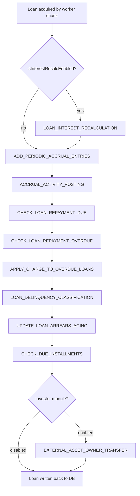

Apache Fineract ships a set of concrete loan COB steps spread across two modules: the `fineract-provider` module (core platform steps) and the `fineract-investor` module (external asset transfer step). Each step implements `LoanCOBBusinessStep`, which is itself a type alias for `COBBusinessStep<Loan>`. For the mechanics of how these steps are loaded and executed, see [COB Framework](/batch/cob-framework).

---

## The `LoanCOBBusinessStep` marker interface

```java
// fineract-loan/src/main/java/org/apache/fineract/cob/loan/LoanCOBBusinessStep.java
public interface LoanCOBBusinessStep extends COBBusinessStep<Loan> {
}
```

All loan-specific steps implement this interface so Spring can discover them with a typed `getBeansOfType(LoanCOBBusinessStep.class)` call during API introspection. The `COBBusinessStepServiceImpl` resolves the concrete bean at runtime using `applicationContext.getBean(stepName)` where `stepName` is the `getEnumStyledName()` value stored in `m_batch_business_steps`.

---

## Step ordering

Steps are ordered by the `step_order` column in the `m_batch_business_steps` table. Lower values run first. The framework builds a `TreeMap<Long, String>` (order → enumStyledName) and iterates in ascending key order. Gaps in step order values are intentional — they leave room for custom steps to be inserted between built-in steps without renumbering.

<Warning>
Changing `step_order` for a running tenant requires a live DB update followed by a COB job restart. There is no auto-reload while a job execution is in progress.
</Warning>

---

## Built-in steps reference

The following table lists every step shipped in `fineract-provider` and `fineract-investor`. Source paths are relative to the repo root.

| Enum styled name | Human readable name | Source class | Module |
|---|---|---|---|
| `LOAN_INTEREST_RECALCULATION` | Loan Interest Recalculation | `cob/loan/LoanInterestRecalculationCOBBusinessStep.java` | fineract-provider |
| `ADD_PERIODIC_ACCRUAL_ENTRIES` | Add periodic accrual entries | `cob/loan/AddPeriodicAccrualEntriesBusinessStep.java` | fineract-provider |
| `ACCRUAL_ACTIVITY_POSTING` | Accrual Activity Posting on Installment Due Date | `cob/loan/AccrualActivityPostingBusinessStep.java` | fineract-provider |
| `CHECK_LOAN_REPAYMENT_DUE` | Check loan repayment due | `cob/loan/CheckLoanRepaymentDueBusinessStep.java` | fineract-provider |
| `CHECK_LOAN_REPAYMENT_OVERDUE` | Check loan repayment overdue | `cob/loan/CheckLoanRepaymentOverdueBusinessStep.java` | fineract-provider |
| `APPLY_CHARGE_TO_OVERDUE_LOANS` | Apply charge to overdue loans | `cob/loan/ApplyChargeToOverdueLoansBusinessStep.java` | fineract-provider |
| `LOAN_DELINQUENCY_CLASSIFICATION` | Loan Delinquency Classification | `cob/loan/SetLoanDelinquencyTagsBusinessStep.java` | fineract-provider |
| `UPDATE_LOAN_ARREARS_AGING` | Update loan arrears aging | `cob/loan/UpdateLoanArrearsAgingBusinessStep.java` | fineract-provider |
| `CHECK_DUE_INSTALLMENTS` | Check Due Installments | `cob/loan/CheckDueInstallmentsBusinessStep.java` | fineract-provider |
| `BUY_DOWN_FEE_AMORTIZATION` | Buy Down Fee amortization | `cob/loan/BuyDownFeeAmortizationBusinessStep.java` | fineract-provider |
| `CAPITALIZED_INCOME_AMORTIZATION` | Capitalized income amortization | `cob/loan/CapitalizedIncomeAmortizationBusinessStep.java` | fineract-provider |
| `EXTERNAL_ASSET_OWNER_TRANSFER` | Execute external asset owner transfer | `investor/cob/loan/LoanAccountOwnerTransferBusinessStep.java` | fineract-investor |

---

## Step-by-step breakdown

### `LOAN_INTEREST_RECALCULATION`
**Class:** `LoanInterestRecalculationCOBBusinessStep`  
**Path:** `fineract-provider/src/main/java/org/apache/fineract/cob/loan/`

Delegates to `LoanWritePlatformService` to recalculate compound or flat interest based on the loan's repayment strategy. This step is only meaningful for loans with interest recalculation enabled (`isInterestRecalculationEnabled()`). It should run before accrual steps so accruals are calculated on the correctly recalculated schedule.

---

### `ADD_PERIODIC_ACCRUAL_ENTRIES`
**Class:** `AddPeriodicAccrualEntriesBusinessStep`  
**Path:** `fineract-provider/src/main/java/org/apache/fineract/cob/loan/`

```java
@Override
public Loan execute(Loan loan) {
    loanAccrualsProcessingService.addPeriodicAccruals(
        DateUtils.getBusinessLocalDate(), loan);
    return loan;
}
```

Calls `LoanAccrualsProcessingService.addPeriodicAccruals()` to create journal entries for interest and fee accruals up to the business date. Applies to loans using periodic accrual accounting. Throws `BusinessStepException` wrapping `MultiException` if any individual accrual calculation fails.

---

### `ACCRUAL_ACTIVITY_POSTING`
**Class:** `AccrualActivityPostingBusinessStep`  
**Path:** `fineract-provider/src/main/java/org/apache/fineract/cob/loan/`

Posts accrual activity journal entries on installment due dates for loans using the accrual-activity accounting model. Delegates to `LoanAccrualActivityProcessingService`. Distinct from `ADD_PERIODIC_ACCRUAL_ENTRIES` — this step handles due-date-triggered activity rather than time-based periodic accrual.

---

### `CHECK_LOAN_REPAYMENT_DUE`
**Class:** `CheckLoanRepaymentDueBusinessStep`  
**Path:** `fineract-provider/src/main/java/org/apache/fineract/cob/loan/`

Inspects each loan's repayment schedule to determine if any installment falls within the configurable look-ahead window (`number-of-days-before-due-date-to-raise-event`). If so, fires a `LoanRepaymentDueBusinessEvent` via `BusinessEventNotifierService`. Only active for tenants with the global configuration `days-before-repayment-is-due` set.

---

### `CHECK_LOAN_REPAYMENT_OVERDUE`
**Class:** `CheckLoanRepaymentOverdueBusinessStep`  
**Path:** `fineract-provider/src/main/java/org/apache/fineract/cob/loan/`

Similar to the due-date check above, but fires `LoanRepaymentOverdueBusinessEvent` for installments that are already past due by more than the configured grace period. Both steps are gated by the `ConfigurationDomainService` global configuration, so they are no-ops when the feature is disabled.

---

### `APPLY_CHARGE_TO_OVERDUE_LOANS`
**Class:** `ApplyChargeToOverdueLoansBusinessStep`  
**Path:** `fineract-provider/src/main/java/org/apache/fineract/cob/loan/`

Reads overdue charge configurations via `LoanReadPlatformService` and delegates to `LoanChargeWritePlatformService` to apply penalty charges for overdue installments. Only runs on loans whose product has an overdue charge configured.

---

### `LOAN_DELINQUENCY_CLASSIFICATION`
**Class:** `SetLoanDelinquencyTagsBusinessStep`  
**Path:** `fineract-provider/src/main/java/org/apache/fineract/cob/loan/`

Computes the loan's current delinquency bucket by examining the number of days past due and the delinquency range configuration. Uses `DelinquencyReadPlatformService` to resolve applicable ranges and `DelinquencyEffectivePauseHelper` to honor delinquency pause periods (e.g., moratoriums). Updates the loan's delinquency tag and fires business events if the classification changes.

---

### `UPDATE_LOAN_ARREARS_AGING`
**Class:** `UpdateLoanArrearsAgingBusinessStep`  
**Path:** `fineract-provider/src/main/java/org/apache/fineract/cob/loan/`

Delegates to `LoanArrearsAgeingUpdateHandler` to recalculate and persist arrears aging data (days in arrears, outstanding principal in arrears, outstanding interest in arrears). This data feeds the `m_loan_arrears_aging` table used by reporting and delinquency dashboards.

---

### `CHECK_DUE_INSTALLMENTS`
**Class:** `CheckDueInstallmentsBusinessStep`  
**Path:** `fineract-provider/src/main/java/org/apache/fineract/cob/loan/`

Checks whether any installment became due on the current business date and fires appropriate events. This is distinct from the repayment-due look-ahead — it fires on the exact due date rather than N days before.

---

### `BUY_DOWN_FEE_AMORTIZATION`
**Class:** `BuyDownFeeAmortizationBusinessStep`  
**Path:** `fineract-provider/src/main/java/org/apache/fineract/cob/loan/`

Amortizes buy-down fees (upfront fee rebates that reduce the effective interest rate) across the loan term. Applicable only to loan products that use the buy-down fee mechanism; acts as a no-op for other loans.

---

### `CAPITALIZED_INCOME_AMORTIZATION`
**Class:** `CapitalizedIncomeAmortizationBusinessStep`  
**Path:** `fineract-provider/src/main/java/org/apache/fineract/cob/loan/`

Amortizes capitalized income (fees or premiums added to the principal at origination) on a straight-line or schedule-based basis over the remaining loan term. Produces journal entries for the amortization portion recognised on the business date.

---

### `EXTERNAL_ASSET_OWNER_TRANSFER` (fineract-investor module)
**Class:** `LoanAccountOwnerTransferBusinessStep`  
**Path:** `fineract-investor/src/main/java/org/apache/fineract/investor/cob/loan/`

This step is only registered when the investor module is enabled (`@Conditional(InvestorModuleIsEnabledCondition.class)`). It processes pending external asset owner transfers — transitioning loans between `PENDING → ACTIVE` or `ACTIVE → BUYBACK` states for securitisation / loan sale workflows. It queries `ExternalAssetOwnerTransferRepository` for transfers in `PENDING` or `PENDING_INTERMEDIATE` status and updates ownership records and journal entries accordingly.

```java
@Component
@Conditional(InvestorModuleIsEnabledCondition.class)
public class LoanAccountOwnerTransferBusinessStep implements LoanCOBBusinessStep {

    public static final LocalDate FUTURE_DATE_9999_12_31 = LocalDate.of(9999, 12, 31);

    @Override
    public String getEnumStyledName() {
        return "EXTERNAL_ASSET_OWNER_TRANSFER";
    }

    @Override
    public String getHumanReadableName() {
        return "Execute external asset owner transfer";
    }
}
```

---

## Event bulk-recording

When the global configuration `isCOBBulkEventEnabled` is `true`, `COBBusinessStepServiceImpl` wraps all steps for a single loan inside a recording session:

```
startExternalEventRecording()
  → Step 1 execute(loan)   // events queued, not published
  → Step 2 execute(loan)
  → ...
stopExternalEventRecording()  // all queued events flushed to Kafka/JMS as one batch
```

This reduces message broker pressure when many events are fired per loan per night. The feature is controlled by `ConfigurationDomainService.isCOBBulkEventEnabled()` (global config key `COB_BULK_EVENT`).

---

## Typical COB run for a single loan



<Note>
The actual execution order is determined by `step_order` in `m_batch_business_steps`, not by the diagram above. The diagram reflects typical default ordering. Always query the DB or the `/v1/jobs/LOAN_COB/steps` API to confirm the effective order for a given tenant.
</Note>

---

## Adding a custom loan COB step

See the [COB Framework](/batch/cob-framework) page for the full walkthrough. For loan steps specifically:

1. Implement `LoanCOBBusinessStep` (not the raw `COBBusinessStep<Loan>`).
2. Annotate with `@Component` — the bean name must match `getEnumStyledName()`.
3. Insert a row into `m_batch_business_steps` with `job_name = 'LOAN_COB'`.
4. Choose a `step_order` value that places your step correctly relative to existing steps (e.g., after `UPDATE_LOAN_ARREARS_AGING` at order 90, before `EXTERNAL_ASSET_OWNER_TRANSFER` at order 100).
