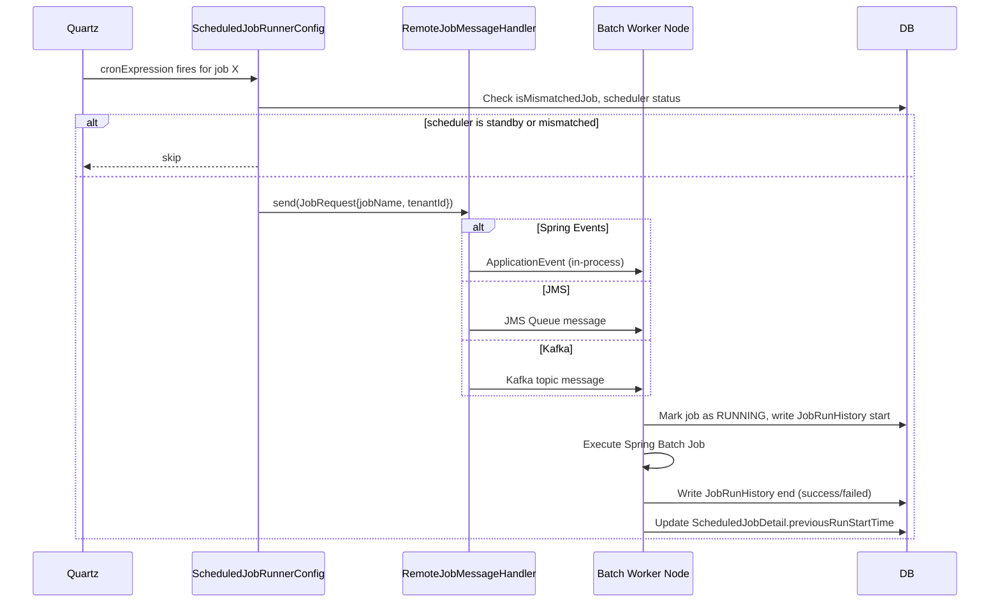

Fineract's job scheduler is a thin coordination layer on top of Spring Batch. Every runnable operation — from LOAN_COB to interest accrual to report mailing — is registered as a `ScheduledJobDetail` row in the tenant database. The scheduler reads these rows at startup, registers Quartz/Spring-managed triggers, and dispatches each job when its cron expression fires. Remote dispatch (to batch worker nodes) is handled by pluggable message handlers supporting Spring Events (default), JMS (ActiveMQ), or Kafka.

<CardGroup cols={2}>
  <Card title="COB Framework" icon="gears" href="/batch/cob-framework">
    Deep dive into the LOAN_COB partitioned job
  </Card>
  <Card title="Multi-Tenancy" icon="building" href="/platform/multi-tenancy">
    How tenant context is propagated into batch jobs
  </Card>
</CardGroup>

---

## Core domain entities

### `ScheduledJobDetail` — job registry

```java
@Entity
@Table(name = "job",
       uniqueConstraints = @UniqueConstraint(columnNames = {"short_name"}))
public class ScheduledJobDetail extends AbstractPersistableCustom<Long> {

    @Column(name = "name")
    private String jobName;

    @Column(name = "display_name")
    private String jobDisplayName;

    @Column(name = "cron_expression")
    private String cronExpression;      // standard Quartz cron

    @Column(name = "node_id")
    private Integer nodeId;             // cluster node assignment

    @Column(name = "is_mismatched_job")
    private boolean isMismatchedJob;    // true if node_id doesn't match this instance

    @Column(name = "task_priority")
    private Short taskPriority;

    @Column(name = "previous_run_start_time")
    private Date previousRunStartTime;

    @Column(name = "next_run_time")
    private Date nextRunTime;
    // ...
}
```

Source: `fineract-provider/src/main/java/org/apache/fineract/infrastructure/jobs/domain/ScheduledJobDetail.java`

A `short_name` unique constraint means each logical job type exists only once per tenant database. The `cronExpression` follows Quartz syntax (6 fields: seconds minutes hours day-of-month month day-of-week).

### `ScheduledJobRunHistory` — execution audit

```java
@Entity
@Table(name = "job_run_history")
public class ScheduledJobRunHistory extends AbstractPersistableCustom<Long> {

    @ManyToOne
    @JoinColumn(name = "job_id")
    private ScheduledJobDetail scheduledJobDetail;

    @Column(name = "version")
    private Long version;

    @Column(name = "start_time")
    private Date startTime;

    @Column(name = "end_time")
    private Date endTime;

    @Column(name = "status")
    private String status;     // "success" | "failed" | "..."
    // trigger_type, error_message, error_log, run_as_nonscheduled_task, ...
}
```

Source: `fineract-provider/src/main/java/org/apache/fineract/infrastructure/jobs/domain/ScheduledJobRunHistory.java`

Every execution — whether triggered by cron or via the REST API — appends a `job_run_history` row. Query these rows to investigate failures.

### `SchedulerDetail` — global scheduler state

`SchedulerDetail` (table `scheduler_detail`) holds a single row per tenant recording whether the scheduler is `active` or `standby`. When in standby, cron triggers are suspended but on-demand runs via the REST API still work.

---

## Job categories

| Category | Typical cron | Examples |
|---|---|---|
| Daily (overnight) | `0 0 1 * * ?` | `LOAN_COB`, `Update Loan Arrears Ageing`, `Apply Annual Fee` |
| Daily (business hours) | `0 0 8 * * ?` | `Update Business Date`, `Update Loan Summary` |
| Weekly | `0 0 2 ? * MON` | `Post Dividents For Shares` |
| On-demand only | _(none)_ | `Generate Trial Balance`, inline COB |

Cron expressions are stored per-tenant in `ScheduledJobDetail.cronExpression` and can be updated via the REST API without a deployment restart.

---

## Built-in jobs reference

The following jobs are seeded by Liquibase migrations and are available in every fresh tenant:

| Job name | Description |
|---|---|
| `LOAN_COB` | Nightly close-of-business for all loans (see [COB Framework](/batch/cob-framework)) |
| `Update Loan Arrears Ageing` | Refreshes `m_loan_arrears_aging` outside of COB |
| `Update NPA for Loans` | Marks loans as Non-Performing Asset based on arrears threshold |
| `Apply Annual Fee` | Applies annual fee charges on savings accounts |
| `Update Loan Summary` | Recomputes loan summary fields |
| `Post Dividents For Shares` | Posts share dividend entries |
| `Update Business Date` | Advances the platform business date |
| `Add Accrual Transactions` | Periodic accrual outside of COB (legacy path) |
| `Add Periodic Accrual Transactions` | Periodic accrual for accrual-basis accounting |
| `Generate Trial Balance` | Produces journal trial balance |
| `Report Mailing Job` | Emails scheduled `ReportMailingJob` reports |

<Note>
`LOAN_COB` is the only Spring Batch partitioned job. All other jobs are implemented as plain Spring `@Component` tasklets or `JobRunner` beans without partitioning.
</Note>

---

## Remote job message handlers

When `batch-worker-enabled` is `true` on one or more nodes and `batch-manager-enabled` is on a different node, the manager must dispatch work to workers. This is done via a pluggable message handler. Exactly one handler should be enabled at a time.

### Spring Events (default)

```properties
fineract.remote-job-message-handler.spring-events.enabled=true
```

Uses Spring's `ApplicationEventPublisher` in-process. Suitable for single-node or embedded deployments. Zero infrastructure dependencies.

### JMS (ActiveMQ)

```properties
fineract.remote-job-message-handler.jms.enabled=true
fineract.remote-job-message-handler.jms.request-queue-name=JMS-request-queue
fineract.remote-job-message-handler.jms.broker-url=tcp://127.0.0.1:61616
fineract.remote-job-message-handler.jms.broker-username=
fineract.remote-job-message-handler.jms.broker-password=
```

Sends job requests to an ActiveMQ queue. Worker nodes consume from the same queue. Suitable for multi-node deployments with moderate throughput.

### Kafka

```properties
fineract.remote-job-message-handler.kafka.enabled=true
fineract.remote-job-message-handler.kafka.topic.name=job-topic
fineract.remote-job-message-handler.kafka.topic.partitions=10
fineract.remote-job-message-handler.kafka.topic.replicas=1
fineract.remote-job-message-handler.kafka.topic.auto-create=true
fineract.remote-job-message-handler.kafka.bootstrap-servers=localhost:9092
```

Sends job requests to a Kafka topic. Worker nodes subscribe to the topic. Preferred for large-scale horizontal deployments.

<Warning>
Only one of `spring-events`, `jms`, or `kafka` may be enabled at a time. Enabling multiple handlers results in duplicate job executions.
</Warning>

---

## Stuck job retry

If a batch worker node dies mid-execution, the job's status in the `job` table may remain in a running state indefinitely. Fineract detects this with the stuck-retry threshold:

```properties
fineract.job.stuck-retry-threshold=${FINERACT_JOB_STUCK_RETRY_THRESHOLD:5}
```

After a job has been "running" for more than `stuck-retry-threshold` minutes with no heartbeat update, the scheduler considers it stuck and re-queues it. This prevents permanent job stalls from infrastructure failures.

---

## Instance mode and job eligibility

The `node_id` column on `ScheduledJobDetail` controls which cluster node owns a given job. When `isMismatchedJob = true` (the row's `node_id` differs from the current node's configured `fineract.nodeId`), the node skips triggering that job even if its cron fires. This provides basic affinity without a distributed lock.

```properties
fineract.nodeId=1   # Set per-node; used to filter ScheduledJobDetail rows
```

---

## REST API

All scheduler endpoints are under `/v1/`:

### Scheduler control

| Method | Path | Description |
|---|---|---|
| `GET` | `/v1/scheduler` | Returns scheduler status (`active` / `standby`) |
| `POST` | `/v1/scheduler?command=start` | Activate the scheduler |
| `POST` | `/v1/scheduler?command=stop` | Put scheduler in standby |

Source: `SchedulerApiResource` at `infrastructure/jobs/api/SchedulerApiResource.java`

### Job management

| Method | Path | Description |
|---|---|---|
| `GET` | `/v1/jobs` | List all scheduled jobs |
| `GET` | `/v1/jobs/{jobId}` | Get a single job's detail |
| `PUT` | `/v1/jobs/{jobId}` | Update cron expression or display name |
| `POST` | `/v1/jobs/{jobId}?command=executeJob` | Trigger job immediately (on-demand) |
| `GET` | `/v1/jobs/{jobId}/runhistory` | Paginated execution history |

Source: `SchedulerJobApiResource` at `infrastructure/jobs/api/SchedulerJobApiResource.java`

### Inline COB (loan-specific)

| Method | Path | Description |
|---|---|---|
| `POST` | `/v1/loans/{loanId}/inlinecob` | Run COB for a specific loan immediately |

The inline COB path uses `InlineCOBLoanItemReader` / `InlineCOBLoanItemProcessor` / `InlineCOBLoanItemWriter` — a separate Spring Batch job configuration that bypasses the partitioner and processes a single loan synchronously within the API request thread. This is used when an API call detects that a loan's COB is behind the current business date (via `LoanCOBApiFilter`).

---

## `ScheduledJobRunnerConfig`

`ScheduledJobRunnerConfig` (at `infrastructure/jobs/ScheduledJobRunnerConfig.java`) is the Spring `@Configuration` class that:

1. Creates a `ThreadPoolTaskExecutor` sized by `fineract.taskExecutor.*` properties.
2. Registers each `ScheduledJobDetail` with Quartz or Spring's `@Scheduled` infrastructure.
3. Wires the correct remote message handler based on which `fineract.remote-job-message-handler.*` flag is `true`.

---

## `ExecuteJobCommandHandler`

On-demand job execution (via `POST /v1/jobs/{id}?command=executeJob`) flows through the standard CQRS command bus:

```
SchedulerJobApiResource
  → CommandWrapperBuilder.executeSchedulerJob()
  → PortfolioCommandSourceWritePlatformService
  → ExecuteJobCommandHandler
  → JobRegisterService.executeJob(jobName)
  → RemoteJobMessageHandler.send(jobRequest)
```

Source: `infrastructure/jobs/handler/ExecuteJobCommandHandler.java`

---

## Job execution flow


