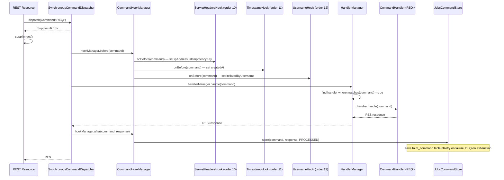

The Fineract command system is a CQRS-inspired write pipeline that decouples REST resources from business logic. All state-mutating operations pass through a `CommandDispatcher`, which runs pre-hooks, delegates to a typed `CommandHandler`, runs post-hooks, and optionally persists the command envelope to a relational store for idempotency and auditability. The system spans four Gradle modules: `fineract-command` (core abstractions + synchronous dispatcher), `fineract-command-jdbc` (persistence), `fineract-command-async` (WIP async), and `fineract-command-disruptor` (WIP ring-buffer).

## Core Abstractions (`fineract-command`)

### `Command<T>` — The Command Envelope

`Command<T>` is the serializable envelope that wraps every write payload. It is defined in `org.apache.fineract.command.core.Command`:

```java
@Data
@FieldNameConstants
public class Command<T> implements Serializable {
    private Long commandId;
    private String idempotencyKey;
    private String ipAddress;
    private Instant createdAt;
    private Instant updatedAt;
    private Instant executedAt;
    private Instant approvedAt;
    private Instant rejectedAt;
    private String initiatedByUsername;
    private String executedByUsername;
    private String approvedByUsername;
    private String rejectedByUsername;
    private String error;
    private T payload;      // the typed domain-specific request object
}
```

`commandId` is populated by `JdbcCommandStore.store()` after the entity is persisted. `idempotencyKey` is extracted from the `Idempotency-Key` HTTP header by `ServletHeadersCommandHook`.

### `CommandState` — Lifecycle Enum

```java
public enum CommandState {
    INVALID, PROCESSED, AWAITING_APPROVAL, REJECTED,
    UNDER_PROCESSING, ERROR, UNKNOWN
}
```

`UNKNOWN` is the sentinel returned by `JdbcCommandStore` when no record matches a given ID or idempotency key.

### `CommandHandler<REQ, RES>` — Business Logic Contract

```java
public interface CommandHandler<REQ, RES> {
    RES handle(Command<REQ> command);

    @SneakyThrows
    default RES fallback(Command<REQ> command, Throwable t) {
        // NOTE: any command handler can override this default to implement more specialized fallbacks.
        throw t;
    }

    default boolean matches(Command<REQ> command) {
        TypeToken<REQ> handlerType = new TypeToken<>(getClass()) {};
        return handlerType.getRawType().isAssignableFrom(
            command.getPayload().getClass());
    }
}
```

Handler resolution in `DefaultCommandHandlerManager` iterates all `CommandHandler` beans and calls `matches(command)` to find the right one. The match is type-safe via Guava `TypeToken`.

### `CommandDispatcher` — The Entry Point

```java
public interface CommandDispatcher {
    <REQ, RES> Supplier<RES> dispatch(Command<REQ> command);
}
```

Returns a `Supplier<RES>` — calling `.get()` on it triggers execution. This design lets async dispatchers return a future-backed supplier while preserving a uniform interface.

### `CommandStore` — Persistence Interface

```java
public interface CommandStore {
    <T> T getRequestById(Long id);
    <T> T getResponseById(Long id);
    CommandState getStateById(Long id);
    <T> T getRequestByKey(String key);
    <T> T getResponseByKey(String key);
    CommandState getStateByKey(String key);
    void store(Command<?> command, Object response, CommandState state);
}
```

## The Three Dispatchers

### `SynchronousCommandDispatcher` (default)

`org.apache.fineract.command.implementation.SynchronousCommandDispatcher` is active when no other `CommandDispatcher` bean is present (`@ConditionalOnMissingBean`). It executes everything on the calling thread:

```java
@Component
@ConditionalOnMissingBean(value = CommandDispatcher.class,
    ignored = SynchronousCommandDispatcher.class)
public class SynchronousCommandDispatcher implements CommandDispatcher {

    public <REQ, RES> Supplier<RES> dispatch(final Command<REQ> command) {
        requireNonNull(command, "Command must not be null");
        return () -> {
            try {
                hookManager.before(command);
                RES response = handlerManager.handle(command);
                hookManager.after(command, response);
                return response;
            } catch (Exception e) {
                hookManager.error(command, e);
                throw e;
            }
        };
    }
}
```

### `AsyncCommandDispatcher` (WIP)

`org.apache.fineract.command.async.implementation.AsyncCommandDispatcher` activates when `fineract.command.async.enabled=true`. It submits work to `CompletableFuture.supplyAsync()` and blocks the caller for up to 3 seconds (TODO: make configurable) before throwing `TimeoutException`.

```java
// TODO: WIP - not ready yet for prime time
@ConditionalOnProperty(value = "fineract.command.async.enabled", havingValue = "true")
public class AsyncCommandDispatcher implements CommandDispatcher { ... }
```

<Warning>
`AsyncCommandDispatcher` is explicitly marked "WIP — not ready for prime time" in the source. Do not enable `fineract.command.async.enabled=true` in production deployments.
</Warning>

### `DisruptorCommandDispatcher` (WIP)

`org.apache.fineract.command.disruptor.implementation.DisruptorCommandDispatcher` activates when `fineract.command.disruptor.enabled=true`. It publishes `CommandEvent` objects to an LMAX Disruptor ring buffer and returns a `CompletableFuture`-backed supplier.

```java
// TODO: WIP - not ready yet for prime time
@ConditionalOnProperty(value = "fineract.command.disruptor.enabled", havingValue = "true")
public class DisruptorCommandDispatcher implements CommandDispatcher, Closeable { ... }
```

<Warning>
`DisruptorCommandDispatcher` is also marked WIP. Ring buffer size defaults to 1024 (`fineract.command.disruptor.ring-buffer-size`).
</Warning>

## Built-in Pre-Hooks

Hooks implement `CommandHookBefore<Object>` and are ordered by integer constant from `CommandConstants`. They are gated by `@ConditionalOnProperty`.

| Hook class | Order | Property | Action |
|---|---|---|---|
| `ServletHeadersCommandHook` | `10` (`COMMAND_HOOK_ORDER_HEADERS`) | `fineract.command.hooks.servlet-header-pre=true` | Extracts `IP` and `Idempotency-Key` headers from the current servlet request into the command |
| `TimestampCommandHook` | `11` (`COMMAND_HOOK_ORDER_TIMESTAMP`) | `fineract.command.hooks.timestamp-pre=true` | Sets `command.createdAt = Instant.now()` if not already set |
| `UsernameCommandHook` | `12` (`COMMAND_HOOK_ORDER_USERNAME`) | `fineract.command.hooks.username-pre=true` | Populates `initiatedByUsername` from `SecurityContextHolder.getContext().getAuthentication().getName()` |

The `fineract-command-audit` module adds three more hooks (pre, post, error) that write to the `m_portfolio_command_source` audit table, controlled by `fineract.command.hooks.audit-pre`, `audit-post`, and `audit-error`.

### Hook Lifecycle Interfaces

```java
// Three hook contract interfaces:
public interface CommandHookBefore<REQ>          { void onBefore(Command<REQ> command); }
public interface CommandHookAfter<REQ, RES>      { void onAfter(Command<REQ> command, RES response); }
public interface CommandHookError<REQ>           { void onError(Command<REQ> command, Throwable error); }
```

`DefaultCommandHookManager` collects all beans implementing these interfaces and calls them in `@Order` sequence.

## Idempotency via `Idempotency-Key` Header

The idempotency key header name is configurable (default `Idempotency-Key`):

```properties
# application.properties
fineract.command.idempotency-key-header-name=${FINERACT_IDEMPOTENCY_KEY_HEADER_NAME:Idempotency-Key}
```

`ServletHeadersCommandHook` reads this header (lower-cased) from the servlet request and sets `command.setIdempotencyKey(value)`. `JdbcCommandStore` then stores this key in the `idempotency_key` column of `m_command`. Subsequent requests with the same key can retrieve the stored response via `getResponseByKey(key)` without re-executing the handler.

The header name is also accessible via `CommandProperties.getIdemPotencyKeyHeaderName()`:

```java
@ConfigurationProperties(prefix = "fineract.command")
public final class CommandProperties implements Serializable {
    private Boolean enabled = true;
    private Map<String, Boolean> hooks = new HashMap<>();
    private String idemPotencyKeyHeaderName = "Idempotency-Key";
}
```

## JDBC Persistence (`fineract-command-jdbc`)

### `JdbcCommandStore` and `CommandEntity`

`JdbcCommandStore` (`org.apache.fineract.command.jdbc.store.JdbcCommandStore`) is active when no other `CommandStore` bean exists and `fineract.command.jdbc.enabled=true`. It maps between `Command<T>` and the Spring Data JDBC entity `CommandEntity`:

```java
@Table("m_command")
public class CommandEntity implements Serializable {
    @Id @Column("id")               Long id;
    @Column("idempotency_key")      String idempotencyKey;
    @Column("state")                CommandState state;
    @Column("initiated_by_username")String initiatedByUsername;
    @Column("ip_address")           String ipAddress;
    @Column("created_at")           Instant createdAt;
    @Column("executed_at")          Instant executedAt;
    @Column("request")              JsonNode request;   // payload as JSON
    @Column("response")             JsonNode response;  // result as JSON
    @Column("error")                String error;
    // ... additional audit timestamps
}
```

Request and response objects are serialized to `JsonNode` via `JsonNodeWritingConverter` / `JsonNodeReadingConverter`. The payload class name is stored under the `@class` attribute key (`COMMAND_JSON_CLASS_ATTRIBUTE`) to allow deserialization back to the correct type.

### Resilience4j Retry + File Dead Letter Queue

```java
@Retry(name = "commandStore", fallbackMethod = "fallback")
public void store(Command<?> command, Object response, CommandState state) { ... }

void fallback(Command<?> command, Object response, CommandState state, Throwable t) {
    if (Boolean.TRUE.equals(properties.getFileDeadLetterQueueEnabled())) {
        write(command);  // write JSON to fileDeadLetterQueuePath/<epoch>-<idempotencyKey>.json
    }
}
```

The Resilience4j `commandStore` retry policy should be configured in `application.properties` under `resilience4j.retry.instances.commandStore`. If all retries fail and `fineract.command.jdbc.file-dead-letter-queue-enabled=true`, the command is written as a JSON file under `fineract.command.jdbc.file-dead-letter-queue-path` (default `/tmp/fineract/dlq`).

## Configuration Properties Reference

### `fineract.command.*` (`CommandProperties`)

| Property | Env Var | Default | Description |
|---|---|---|---|
| `fineract.command.enabled` | — | `true` | Master enable switch |
| `fineract.command.idempotency-key-header-name` | `FINERACT_IDEMPOTENCY_KEY_HEADER_NAME` | `Idempotency-Key` | HTTP header name |
| `fineract.command.hooks.servlet-header-pre` | `FINERACT_COMMAND_PROCESSORS_SERVLET_HEADER_PRE` | `true` | Enable `ServletHeadersCommandHook` |
| `fineract.command.hooks.timestamp-pre` | `FINERACT_COMMAND_PROCESSORS_TIMESTAMP_PRE` | `true` | Enable `TimestampCommandHook` |
| `fineract.command.hooks.username-pre` | `FINERACT_COMMAND_PROCESSORS_USERNAME_PRE` | `true` | Enable `UsernameCommandHook` |
| `fineract.command.hooks.audit-pre` | `FINERACT_COMMAND_PROCESSORS_AUDIT_PRE` | `true` | Enable audit pre-hook |
| `fineract.command.hooks.audit-post` | `FINERACT_COMMAND_PROCESSORS_AUDIT_POST` | `true` | Enable audit post-hook |
| `fineract.command.hooks.audit-error` | `FINERACT_COMMAND_PROCESSORS_AUDIT_ERROR` | `true` | Enable audit error-hook |

### `fineract.command.jdbc.*` (`JdbcCommandProperties`)

| Property | Env Var | Default | Description |
|---|---|---|---|
| `fineract.command.jdbc.enabled` | `FINERACT_COMMAND_JDBC_ENABLED` | `false` | Enable `JdbcCommandStore` |
| `fineract.command.jdbc.file-dead-letter-queue-enabled` | `FINERACT_COMMAND_JDBC_FILE_DEAD_LETTER_QUEUE_ENABLED` | `false` | Write failed commands to disk |
| `fineract.command.jdbc.file-dead-letter-queue-path` | `FINERACT_COMMAND_JDBC_FILE_DEAD_LETTER_QUEUE_PATH` | `/tmp/fineract/dlq` | DLQ directory |

## Sequence Diagram



## Writing a New Command Handler

1. Define a request POJO (plain Java, no Spring):
   ```java
   public record DisburseLoanCommand(Long loanId, BigDecimal amount, LocalDate date) {}
   ```

2. Implement `CommandHandler<DisburseLoanCommand, CommandProcessingResult>` and annotate with `@Component`:
   ```java
   @Component
   public class DisburseLoanCommandHandler
       implements CommandHandler<DisburseLoanCommand, CommandProcessingResult> {

       @Override
       public CommandProcessingResult handle(Command<DisburseLoanCommand> command) {
           var req = command.getPayload();
           // ... call domain service ...
           return CommandProcessingResult.resourceResult(req.loanId());
       }
   }
   ```

3. In the REST resource, inject `CommandDispatcher` and call:
   ```java
   var cmd = new Command<DisburseLoanCommand>();
   cmd.setPayload(new DisburseLoanCommand(loanId, amount, date));
   var result = commandDispatcher.<DisburseLoanCommand, CommandProcessingResult>dispatch(cmd).get();
   ```

The `matches()` default implementation handles type resolution via Guava `TypeToken`, so no manual registration is needed.
