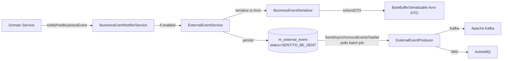

Fineract has two distinct but connected event layers: an **internal synchronous bus** (`infrastructure.event.business`) used to decouple domain services from side-effect logic (notifications, audit, external emission), and an **external asynchronous pipeline** (`infrastructure.event.external`) that serializes events to Apache Avro and delivers them to Kafka or ActiveMQ. Both layers are housed in `fineract-core`, with concrete event definitions spread across domain modules (`fineract-loan`, `fineract-savings`, `fineract-provider`).

## Internal Event Bus

### `BusinessEvent<T>` and `AbstractBusinessEvent<T>`

Every internal event implements `BusinessEvent<T>`, a generic interface that carries a typed aggregate value:

```java
// fineract-core: infrastructure.event.business.domain
public abstract class AbstractBusinessEvent<T> implements BusinessEvent<T> {
    private final T value;

    @Override
    public T get() { return value; }
}
```

Concrete events extend `AbstractBusinessEvent` and encode the event semantics in their class name:

```java
// fineract-loan: ...event.business.domain.loan
public class LoanApprovedBusinessEvent extends AbstractBusinessEvent<Loan> { ... }
public class LoanDisbursalBusinessEvent extends AbstractBusinessEvent<Loan> { ... }
public class LoanRepaymentBusinessEvent extends AbstractBusinessEvent<LoanTransaction> { ... }
public class LoanCreatedBusinessEvent extends AbstractBusinessEvent<Loan> { ... }
```

### `BusinessEventNotifierService`

The central dispatcher interface in `infrastructure.event.business.service`:

```java
public interface BusinessEventNotifierService {
    void notifyPreBusinessEvent(BusinessEvent<?> event);
    void notifyPostBusinessEvent(BusinessEvent<?> event);
    <T extends BusinessEvent<?>> void addPreBusinessEventListener(Class<T> eventType, BusinessEventListener<T> listener);
    <T extends BusinessEvent<?>> void addPostBusinessEventListener(Class<T> eventType, BusinessEventListener<T> listener);
    void startExternalEventRecording();
    void stopExternalEventRecording();
    void resetEventRecording();
}
```

Domain services call `notifyPostBusinessEvent(new LoanApprovedBusinessEvent(loan))` after a successful state change. `BusinessEventNotifierServiceImpl` then calls all registered `BusinessEventListener<T>` beans that match the event type, as well as forwarding enabled events to `ExternalEventService` if external event recording is active.

The `startExternalEventRecording()` / `stopExternalEventRecording()` pair is used by the COB batch processor to batch-collect events during close-of-business and emit them as a single `BulkBusinessEvent`.

### `BulkBusinessEvent`

```java
// infrastructure.event.business.domain
public class BulkBusinessEvent implements BusinessEvent<List<BusinessEvent<?>>> { ... }
```

During COB processing, individual per-loan events are accumulated in a bulk envelope and emitted as a single Avro `BulkMessagePayloadV1` object. This keeps the `m_external_event` table row count manageable during large batch runs.

## Event Categories

Events are organized by domain area. Each concrete event class name is also its external `type` string used in `m_external_event.type`.

### Loan Events (`fineract-loan`)

| Event class | Trigger |
|---|---|
| `LoanCreatedBusinessEvent` | Loan application submitted |
| `LoanApprovedBusinessEvent` | Loan approved |
| `LoanDisbursalBusinessEvent` | Loan disbursed |
| `LoanRepaymentBusinessEvent` | Repayment posted |
| `LoanRejectedBusinessEvent` | Loan rejected |
| `LoanCloseBusinessEvent` | Loan closed |
| `LoanBalanceChangedBusinessEvent` | Outstanding balance changed (e.g. charge waive) |
| `LoanDelinquencyRangeChangeBusinessEvent` | Delinquency classification changed |
| `LoanAccountSnapshotBusinessEvent` | Snapshot captured (COB) |
| `LoanInterestRecalculationBusinessEvent` | Interest recalculated |
| `LoanChargebackTransactionBusinessEvent` | Chargeback posted |
| `LoanJournalEntryCreatedBusinessEvent` | Journal entry created for loan transaction |

### Savings Events (`fineract-provider`)

| Event class | Trigger |
|---|---|
| `SavingsCreateBusinessEvent` | Account created |
| `SavingsActivateBusinessEvent` | Account activated |
| `SavingsApproveBusinessEvent` | Account approved |
| `SavingsCloseBusinessEvent` | Account closed |
| `SavingsDepositBusinessEvent` | Deposit posted |
| `SavingsWithdrawalBusinessEvent` | Withdrawal posted |
| `SavingsPostInterestBusinessEvent` | Interest posting job run |
| `SavingsAccountForceWithdrawalBusinessEvent` | Force withdrawal |

### Client Events (`fineract-provider`)

| Event class | Trigger |
|---|---|
| `ClientCreateBusinessEvent` | Client record created |
| `ClientActivateBusinessEvent` | Client activated |
| `ClientRejectBusinessEvent` | Client rejected |

### Share / Deposit Events (`fineract-provider`)

`ShareAccountCreateBusinessEvent`, `ShareAccountApproveBusinessEvent`, `FixedDepositAccountCreateBusinessEvent`, `RecurringDepositAccountCreateBusinessEvent`.

### Data Table Events (`fineract-core`)

`DatatableEntryCreatedBusinessEvent`, `DatatableEntryUpdatedBusinessEvent`, `DatatableEntryDeletedBusinessEvent` — fired from the dataqueries subsystem whenever a dynamic data-table row changes.

## External Event Pipeline

### Flow Overview



### `ExternalEventService`

`org.apache.fineract.infrastructure.event.external.service.ExternalEventService` is the serialization and persistence entry point:

```java
@Service @Transactional
public class ExternalEventService {

    public <T> void postEvent(BusinessEvent<T> event) {
        entityManager.flush();  // flush JPA changes before serializing
        ExternalEvent externalEvent;
        if (event instanceof BulkBusinessEvent) {
            externalEvent = handleBulkBusinessEvent((BulkBusinessEvent) event);
        } else {
            externalEvent = handleRegularBusinessEvent(event);
        }
        repository.save(externalEvent);
    }
}
```

The `entityManager.flush()` call before serialization ensures that JPA entity state is written to the database before the Avro DTO is built, preventing stale data in the emitted event.

### `BusinessEventSerializer`

Each event type has a corresponding `BusinessEventSerializer` implementation:

```java
public interface BusinessEventSerializer {
    <T> boolean canSerialize(BusinessEvent<T> event);
    Class<? extends GenericContainer> getSupportedSchema();  // the Avro schema class
    <T> ByteBufferSerializable toAvroDTO(BusinessEvent<T> rawEvent);
}
```

`BusinessEventSerializerFactory` iterates all serializer beans and calls `canSerialize(event)` to find the matching one. The resolved Avro DTO is then passed through `DataEnricherProcessor` (which may add tenant metadata or custom fields) and serialized to `byte[]` via `ByteBufferConverter`.

### `ExternalEvent` JPA Entity

```java
@Entity @Table(name = "m_external_event")
public class ExternalEvent extends AbstractPersistableCustom<Long> {
    String type;        // e.g. "LoanApprovedBusinessEvent"
    String category;    // e.g. "Loan"
    String schema;      // fully qualified Avro class name
    byte[] data;        // Avro-serialized payload
    OffsetDateTime createdAt;
    ExternalEventStatus status;  // TO_BE_SENT, SENT, FAILED
    String idempotencyKey;
    Long aggregateRootId;
}
```

### `SendAsynchronousEventsTasklet`

A Spring Batch tasklet (`infrastructure.event.external.jobs.SendAsynchronousEventsTasklet`) polls `m_external_event` for rows with `status = TO_BE_SENT`, groups them into batches, and calls `ExternalEventProducer.sendEvents(events)`. On success the status transitions to `SENT`. A separate `PurgeExternalEventsTasklet` deletes old `SENT` rows.

### Producer Implementations

| Class | Transport | Activation property |
|---|---|---|
| `KafkaExternalEventProducer` (`fineract-provider`) | Apache Kafka | `fineract.events.external.producer.kafka.enabled=true` |
| `JMSMultiExternalEventProducer` (`fineract-provider`) | ActiveMQ (JMS) | `fineract.events.external.producer.jms.enabled=true` |
| `NoopExternalEventProducer` (`fineract-core`) | No-op (discard) | default when neither Kafka nor JMS is enabled |

## COB Bulk Event Recording

The Close-of-Business batch processor wraps each loan's processing in a recording session:

```java
businessEventNotifierService.startExternalEventRecording();
try {
    // ... process loan (charges, accruals, delinquency) ...
    // ... each sub-step emits individual BusinessEvents ...
} finally {
    businessEventNotifierService.stopExternalEventRecording();
    // stopExternalEventRecording() wraps all recorded events in a BulkBusinessEvent
    // and calls ExternalEventService.postEvent(bulkEvent)
}
```

This pattern collapses potentially dozens of per-loan events into a single `m_external_event` row per loan per COB cycle, keeping the table from growing unbounded during large batch runs.

`resetEventRecording()` clears the in-flight buffer without emitting, used in error recovery paths.

## External Event Configuration

```properties
# Enable external event feature
fineract.events.external.enabled=${FINERACT_EXTERNAL_EVENTS_ENABLED:false}

# Batch processing
fineract.events.external.partition-size=${FINERACT_EXTERNAL_EVENTS_PARTITION_SIZE:5000}
fineract.events.external.thread-pool-core-pool-size=${FINERACT_EVENT_TASK_EXECUTOR_CORE_POOL_SIZE:2}
fineract.events.external.thread-pool-max-pool-size=${FINERACT_EVENT_TASK_EXECUTOR_MAX_POOL_SIZE:25}
fineract.events.external.thread-pool-queue-capacity=${FINERACT_EVENT_TASK_EXECUTOR_QUEUE_CAPACITY:500}

# Kafka producer
fineract.events.external.producer.kafka.enabled=${FINERACT_EXTERNAL_EVENTS_PRODUCER_KAFKA_ENABLED:false}
fineract.events.external.producer.kafka.bootstrap-servers=${FINERACT_EXTERNAL_EVENTS_PRODUCER_KAFKA_BOOTSTRAP_SERVERS:localhost:9092}
fineract.events.external.producer.kafka.topic.name=${FINERACT_EXTERNAL_EVENTS_PRODUCER_KAFKA_TOPIC_NAME:}
fineract.events.external.producer.kafka.topic.auto-create=${FINERACT_EXTERNAL_EVENTS_KAFKA_TOPIC_AUTO_CREATE:true}

# JMS / ActiveMQ producer
fineract.events.external.producer.jms.enabled=${FINERACT_EXTERNAL_EVENTS_PRODUCER_JMS_ENABLED:false}
fineract.events.external.producer.jms.broker-url=${FINERACT_EXTERNAL_EVENTS_PRODUCER_JMS_BROKER_URL:tcp://127.0.0.1:61616}
fineract.events.external.producer.jms.event-queue-name=${FINERACT_EXTERNAL_EVENTS_PRODUCER_JMS_QUEUE_NAME:}
fineract.events.external.producer.jms.event-topic-name=${FINERACT_EXTERNAL_EVENTS_PRODUCER_JMS_TOPIC_NAME:}
fineract.events.external.producer.jms.producer-count=${FINERACT_EXTERNAL_EVENTS_PRODUCER_JMS_PRODUCER_COUNT:1}
fineract.events.external.producer.jms.async-send-enabled=${FINERACT_EXTERNAL_EVENTS_PRODUCER_JMS_ASYNC_SEND_ENABLED:false}
```

## Per-Event Enablement API

External events can be enabled or disabled per event type at runtime via the REST API:

```
GET  /api/v1/externalevents/configuration          – list all event configurations
PUT  /api/v1/externalevents/configuration          – bulk update enabled/disabled flags
```

These settings are persisted in the `external_event_configuration` table and read by `ExternalBusinessEventConfigurationService`. The configuration is tenant-scoped; enabling an event type on one tenant has no effect on others.

<Note>
Adding a new event type requires: (1) defining a concrete `AbstractBusinessEvent<T>` subclass, (2) implementing `BusinessEventSerializer` for it, (3) generating Avro schema classes in `fineract-avro-schemas`, and (4) inserting a row into `external_event_configuration` via a Liquibase migration.
</Note>
