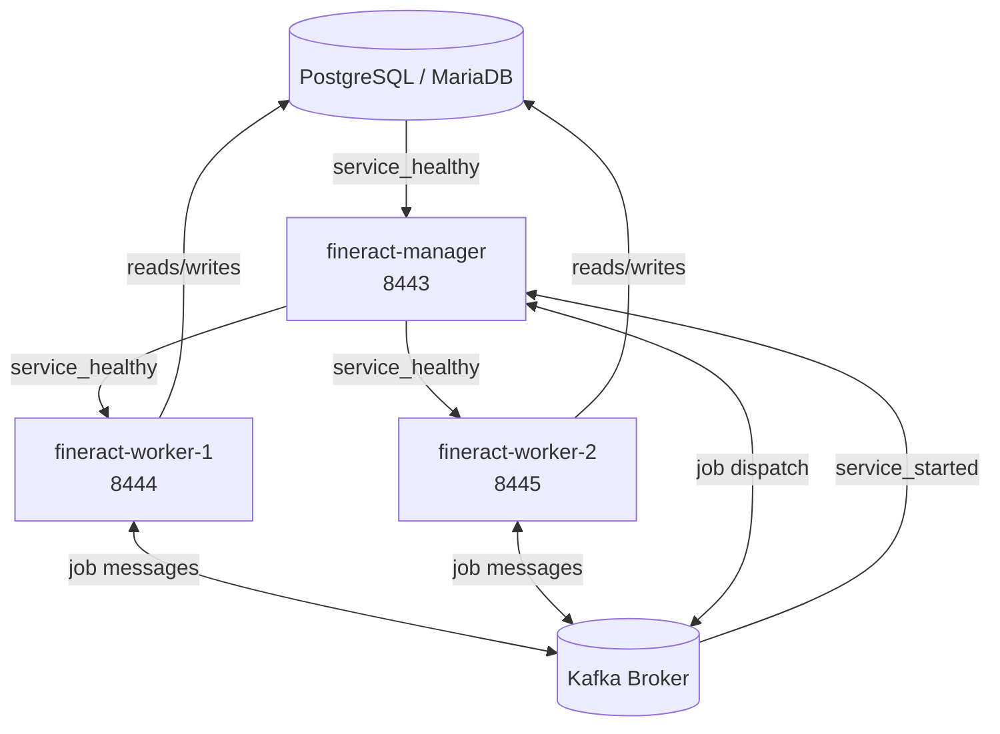

Fineract provides a library of Docker Compose files, service fragment files, and
environment files under `config/docker/` for local development and integration
testing. Each compose file combines a database, the Fineract application, and
optional message brokers. All compose files carry an explicit warning:

<Warning>
**FOR TESTING PURPOSES ONLY! NOT SUITABLE FOR PRODUCTION USAGE!**

The compose files use default credentials, expose debug ports, and make no
guarantees about durability or availability. Do not expose them to the internet
or use them as a template for production deployments.
</Warning>

<CardGroup cols={2}>
  <Card title="Kubernetes" href="/deployment/kubernetes" icon="ship">
    Production-oriented Kubernetes manifests
  </Card>
  <Card title="Configuration" href="/deployment/configuration" icon="sliders">
    Full application.properties reference
  </Card>
</CardGroup>

## Compose File Index

| File | Database | Message Broker | Notes |
|------|----------|----------------|-------|
| `docker-compose.yml` | PostgreSQL | — | Default, single Fineract instance |
| `docker-compose-postgresql.yml` | PostgreSQL | — | Explicit PostgreSQL variant |
| `docker-compose-mariadb.yml` | MariaDB | — | MariaDB variant |
| `docker-compose-mysql.yml` | MySQL | — | MySQL variant |
| `docker-compose-postgresql-kafka.yml` | PostgreSQL | Kafka (apache/kafka:4.2.0-rc2) | Manager + Worker split |
| `docker-compose-postgresql-activemq.yml` | PostgreSQL | ActiveMQ | JMS variant |
| `docker-compose-postgresql-kafka-msk.yml` | PostgreSQL | Amazon MSK (Kafka) | MSK-compatible |
| `docker-compose-development.yml` | PostgreSQL | — | Dev mode with hot reload |
| `docker-compose-oauth2-test.yml` | PostgreSQL | — | OAuth2 integration test |
| `docker-compose-twofactor-test.yml` | PostgreSQL | — | 2FA integration test |
| `docker-compose-community-app.yml` | PostgreSQL | — | Includes community web app |
| `docker-compose-web-app.yml` | PostgreSQL | — | Includes web UI |
| `docker-compose-custom.yml` | PostgreSQL | — | Custom extension example |
| `docker-compose-mariadb-test.yml` | MariaDB | — | MariaDB integration tests |
| `docker-compose-mysql-test.yml` | MySQL | — | MySQL integration tests |
| `docker-compose-postgresql-test.yml` | PostgreSQL | — | PostgreSQL integration tests |
| `docker-compose-postgresql-test-activemq.yml` | PostgreSQL | ActiveMQ | Tests with JMS |

## Default Setup (`docker-compose.yml`)

The default compose file starts two services:

```yaml
services:
  db:
    extends:
      file: ./config/docker/compose/postgresql.yml
      service: postgresql

  fineract:
    extends:
      file: ./config/docker/compose/fineract.yml
      service: fineract
    ports:
      - "8443:8443"   # HTTPS API
      - "5000:5000"   # Java remote debug (JDWP)
    depends_on:
      db:
        condition: service_healthy
    env_file:
      - ./config/docker/env/fineract.env
      - ./config/docker/env/fineract-common.env
      - ./config/docker/env/fineract-postgresql.env
```

Start it with:

```bash
docker compose up -d
# API available at https://localhost:8443/fineract-provider/api/v1/
```

## Service Library (`config/docker/compose/`)

| File | Service(s) |
|------|-----------|
| `postgresql.yml` | `postgresql` — PostgreSQL 16 with healthcheck |
| `mariadb.yml` | `mariadb` — MariaDB with healthcheck |
| `activemq.yml` | `activemq` — Apache ActiveMQ Classic |
| `fineract.yml` | `fineract` — base Fineract service definition (image, env, healthcheck) |
| `fineract-custom.yml` | `fineract` — variant for custom extension builds |
| `logging-loki.yml` | `loki`, `promtail` — Grafana Loki log aggregation |
| `observability.yml` | `prometheus`, `grafana`, `tempo` — metrics/tracing stack |

All compose files use the `extends` directive to avoid duplication. The top-level
compose files pull in service fragments and layer environment files on top.

## Environment File Library (`config/docker/env/`)

| File | Purpose |
|------|---------|
| `fineract.env` | Base Fineract settings (image tag, JVM opts) |
| `fineract-common.env` | Common overrides applied across all deployments |
| `fineract-postgresql.env` | PostgreSQL JDBC URL, username, password |
| `fineract-mariadb.env` | MariaDB JDBC URL, username, password |
| `fineract-mysql.env` | MySQL JDBC URL, username, password |
| `fineract-manager.env` | Manager role: `FINERACT_MODE_BATCH_MANAGER_ENABLED=true`, worker disabled |
| `fineract-worker.env` | Worker role: `FINERACT_MODE_BATCH_WORKER_ENABLED=true`, manager disabled, Liquibase disabled |
| `kafka-server.env` | Kafka broker configuration (listeners, log dirs) |
| `kafka-client.env` | Kafka client bootstrap servers |
| `kafka-client-msk.env` | MSK-specific Kafka client settings (SASL/TLS) |
| `activemq.env` | ActiveMQ broker URL and credentials |
| `tracing.env` | OpenTelemetry exporter settings |
| `postgresql.env` | PostgreSQL server init env vars |
| `mariadb.env` | MariaDB server init env vars |
| `mysql.env` | MySQL server init env vars |
| `debug.env` | Java agent debug port |
| `aws.env` | AWS credentials for MSK |
| `cloudwatch.env` | CloudWatch log group settings |
| `prometheus.env` | Prometheus scrape config |
| `oltp.env` | OpenTelemetry OTLP exporter endpoint |

## Manager / Worker Split-Role Deployment

Fineract supports a horizontally scaled deployment where the batch manager and
batch workers run as separate processes. The Kafka-based compose file
(`docker-compose-postgresql-kafka.yml`) shows the canonical split:

```yaml
services:
  kafka:
    image: "apache/kafka:4.2.0-rc2"
    ports: ["9092:9092"]
    env_file: [./config/docker/env/kafka-server.env]

  fineract-manager:
    extends: { file: config/docker/compose/fineract.yml, service: fineract }
    ports: ["8443:8443"]
    depends_on:
      db: { condition: service_healthy }
      kafka: { condition: service_started }
    env_file:
      - ./config/docker/env/fineract-manager.env   # BATCH_MANAGER=true, BATCH_WORKER=false
      - ./config/docker/env/fineract-common.env
      - ./config/docker/env/fineract-postgresql.env
      - ./config/docker/env/kafka-client.env

  fineract-worker:
    extends: { file: config/docker/compose/fineract.yml, service: fineract }
    deploy:
      mode: replicated
      replicas: 2
    ports: ["8444-8445:8443"]
    depends_on:
      fineract-manager: { condition: service_healthy }
    env_file:
      - ./config/docker/env/fineract-worker.env    # BATCH_WORKER=true, BATCH_MANAGER=false
      - ./config/docker/env/fineract-common.env
      - ./config/docker/env/fineract-postgresql.env
      - ./config/docker/env/kafka-client.env
```

Key env vars from the role files:

```bash
# fineract-manager.env
FINERACT_NODE_ID=1
FINERACT_MODE_BATCH_MANAGER_ENABLED=true
FINERACT_MODE_BATCH_WORKER_ENABLED=false
LOAN_COB_CHUNK_SIZE=10
LOAN_COB_PARTITION_SIZE=10
LOAN_COB_POLL_INTERVAL=1000

# fineract-worker.env
FINERACT_NODE_ID=2
FINERACT_MODE_BATCH_MANAGER_ENABLED=false
FINERACT_MODE_BATCH_WORKER_ENABLED=true
FINERACT_LIQUIBASE_ENABLED=false   # workers do NOT run Liquibase
```

<Note>
Workers must have `FINERACT_LIQUIBASE_ENABLED=false`. Only the manager instance
should run Liquibase migrations at startup. Running migrations from multiple
pods simultaneously will cause conflicts.
</Note>

## Service Dependency Graph



## Quick Start Commands

```bash
# Default PostgreSQL setup
docker compose up -d

# PostgreSQL + Kafka with manager/worker split
docker compose -f docker-compose-postgresql-kafka.yml up -d

# MariaDB variant
docker compose -f docker-compose-mariadb.yml up -d

# PostgreSQL + ActiveMQ
docker compose -f docker-compose-postgresql-activemq.yml up -d

# With observability stack (Prometheus + Grafana + Tempo)
docker compose \
  -f docker-compose-postgresql.yml \
  -f config/docker/compose/observability.yml \
  up -d

# Tear down and remove volumes
docker compose down -v
```

## Healthcheck

The `fineract.yml` base service includes a healthcheck against Spring Boot Actuator:

```
GET https://localhost:8443/fineract-provider/actuator/health/liveness
```

Compose marks the container `healthy` once this endpoint returns 200. The worker
services use `condition: service_healthy` on the manager dependency to ensure
migrations finish before workers start.
