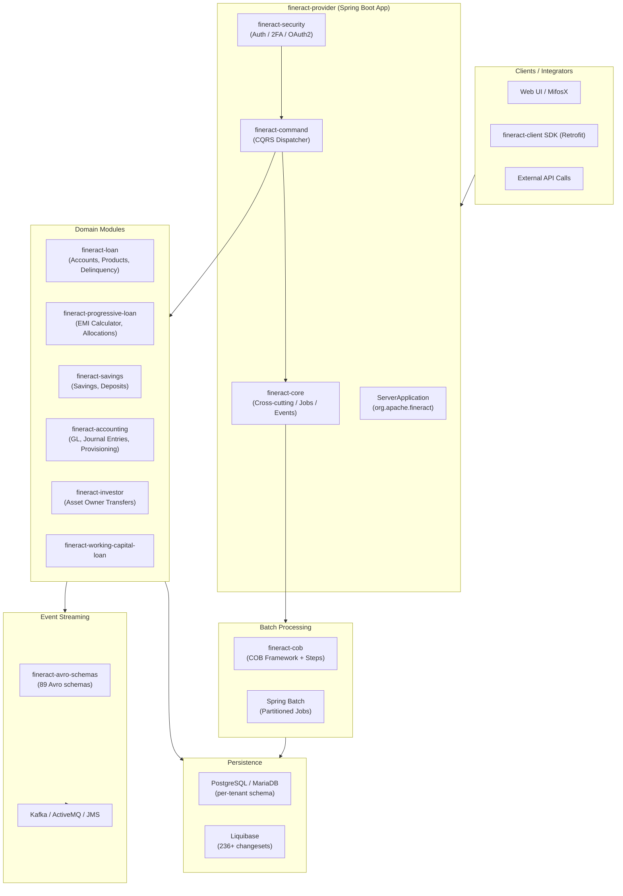

Apache Fineract is a production-grade, open-core banking platform built on Spring Boot. It exposes a multi-tenant REST API that financial institutions use to manage loan origination, savings accounts, double-entry accounting, and nightly Close-of-Business (COB) batch processing. The codebase is a 30-module Gradle monorepo where each domain (loans, savings, accounting, investor transfers) lives in its own module, with a central `fineract-provider` module assembling them into a deployable WAR/JAR.

## High-Level Architecture

## Subsystem Map

<CardGroup cols={2}>
  <Card title="Overview & Architecture" icon="map" href="/overview/introduction">
    Project classification, key abstractions, and the full module dependency map.
  </Card>
  <Card title="Core Infrastructure" icon="server" href="/core/fineract-core">
    The `fineract-core` backbone: cross-cutting services, CQRS command pipeline, event bus, and security filters.
  </Card>
  <Card title="Loan Domain" icon="file-contract" href="/loan/loan-accounts">
    Loan account lifecycle, loan products, progressive EMI engine, delinquency buckets, and rescheduling.
  </Card>
  <Card title="Savings Domain" icon="piggy-bank" href="/savings/savings-accounts">
    Savings accounts, fixed and recurring deposits, interest rate charts, and share accounts.
  </Card>
  <Card title="Accounting" icon="calculator" href="/accounting/general-ledger">
    Double-entry general ledger, journal entries, accruals, period closures, and loan loss provisioning.
  </Card>
  <Card title="Batch & COB" icon="clock" href="/batch/cob-framework">
    Spring Batch Close-of-Business pipeline: partitioning, account locking, step execution, and catch-up.
  </Card>
  <Card title="Platform Services" icon="building" href="/platform/multi-tenancy">
    Multi-tenancy, organisation hierarchy, user administration, reporting, and bulk import.
  </Card>
  <Card title="Investor & Asset Transfer" icon="arrow-right-arrow-left" href="/investor/external-asset-owners">
    External asset owner registration, loan securitisation, buybacks, and intermediary transfers.
  </Card>
  <Card title="Integration & Clients" icon="plug" href="/integration/java-client-sdk">
    Java Retrofit SDK, Avro event schemas for Kafka, and the Mojaloop interoperability layer.
  </Card>
  <Card title="Build & Deployment" icon="rocket" href="/deployment/build-system">
    Gradle multi-module build, Docker Compose profiles, Kubernetes manifests, and Liquibase migrations.
  </Card>
</CardGroup>

## Where to Start

<Note>
New to Fineract? Read [Architecture Overview](/overview/architecture) first, then follow the dependency chain: `fineract-core` → `fineract-security` → `fineract-command` → domain modules → `fineract-provider`.
</Note>

Key entry points in the source tree:

| File | Purpose |
|---|---|
| `fineract-provider/src/main/java/org/apache/fineract/ServerApplication.java` | Spring Boot main class — start here |
| `fineract-provider/src/main/resources/application.properties` | All configuration properties with env-var overrides |
| `fineract-command/src/main/java/.../command/core/CommandDispatcher.java` | CQRS dispatch interface |
| `fineract-cob/src/main/java/.../cob/COBBusinessStep.java` | COB step SPI — implement to add nightly jobs |
| `fineract-client/src/main/java/.../client/util/FineractClient.java` | Java SDK builder entry point |
| `fineract-provider/src/main/resources/db/changelog/db.changelog-master.xml` | Liquibase master changelog |
| `settings.gradle` | All 30 registered submodules |
