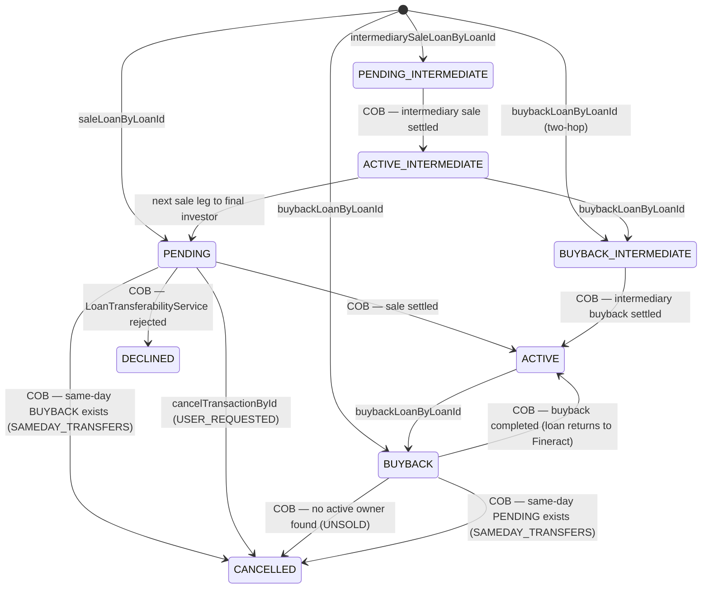
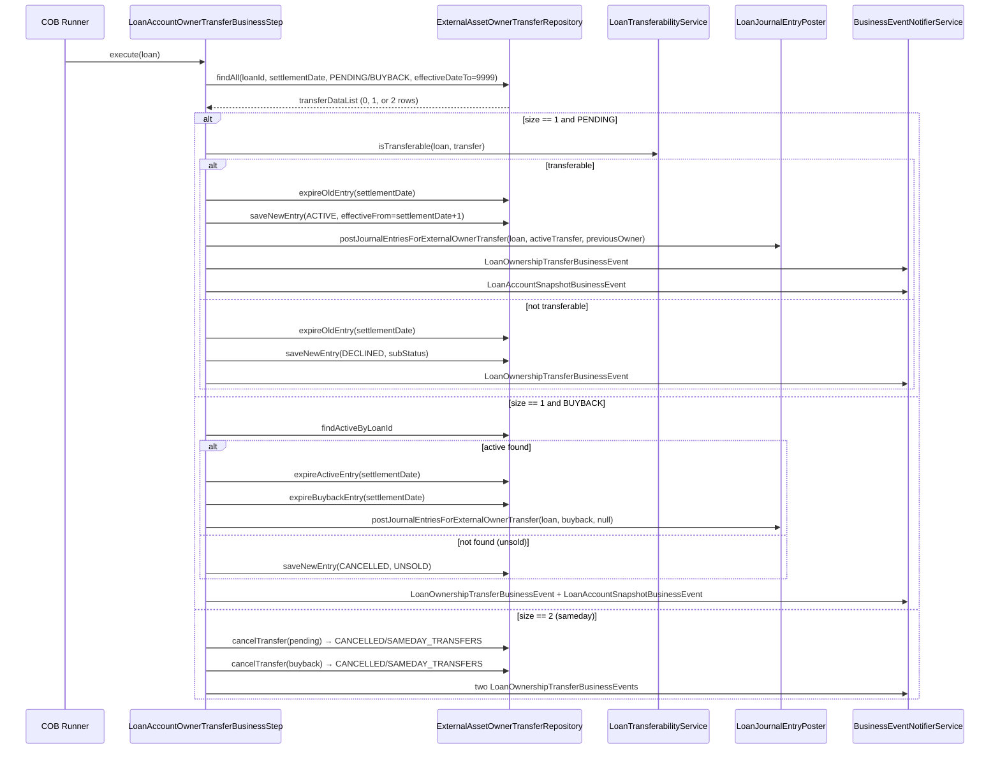

A loan ownership transfer in Fineract follows an *intent → COB settlement* pattern. An API call records the intent as a `PENDING` (or `BUYBACK`) row; the actual ownership change and accounting happen inside the Close-of-Business pipeline on the requested settlement date. This page traces the complete lifecycle including intermediary two-hop chains and delayed settlement.

<CardGroup cols={2}>
  <Card title="Asset Owners Domain Model" href="/investor/external-asset-owners" icon="building-columns">
    Entity fields, REST endpoints, and accounting helper
  </Card>
  <Card title="DB Migrations" href="/deployment/database-migrations" icon="database">
    Investor module Liquibase changesets
  </Card>
</CardGroup>

## Status Transition Diagram



Every state change creates a **new** row in `m_external_asset_owner_transfer`; the old row's `effective_date_to` is set to the settlement date. The sentinel date `LocalDate.of(9999, 12, 31)` marks the single "live" row for any loan-owner pair. This is implemented in `LoanAccountOwnerTransferBusinessStep.createNewEntryAndExpireOldEntry()`.

## Purchase Price Ratio

`purchasePriceRatio` is stored as a `String` (column length 50) rather than a numeric type. This allows exact representation of arbitrary decimal fractions (e.g. `"0.975"`) without floating-point rounding. It is passed through from the API request body to the `ExternalAssetOwnerTransfer` entity without arithmetic transformation. Downstream systems that consume the `LoanOwnershipTransferDataV1` Avro event receive the raw string in the `purchasePriceRatio` field.

## COB Settlement Matching

`LoanAccountOwnerTransferBusinessStep.execute()` runs for every loan processed
by COB. The matching query is:

```java
externalAssetOwnerTransferRepository.findAll(
    (root, query, criteriaBuilder) -> criteriaBuilder.and(
        criteriaBuilder.equal(root.get("loanId"), loanId),
        criteriaBuilder.equal(root.get("settlementDate"), settlementDate),   // today's business date
        root.get("status").in(PENDING_STATUSES + BUYBACK_STATUSES),
        criteriaBuilder.greaterThanOrEqualTo(root.get("effectiveDateTo"), FUTURE_DATE_9999_12_31)
    ),
    Sort.by(Sort.Direction.ASC, "id")
);
```

`settlementDate` is `DateUtils.getBusinessLocalDate()`, not the wall-clock date. This ensures COB always operates on the configured business date even when running a catch-up. The `PENDING_STATUSES` list contains `[PENDING_INTERMEDIATE, PENDING]`; `BUYBACK_STATUSES` contains `[BUYBACK_INTERMEDIATE, BUYBACK]`.

Possible result sizes:

| `size` | Interpretation |
|--------|---------------|
| `0` | No pending transfers today — step is a no-op |
| `1` | Single sale or single buyback |
| `2` | Same-day sale + buyback → both cancelled with `SAMEDAY_TRANSFERS` |
| `>2` | Not expected; behaviour is undefined |

## COB Settlement Sequence



## Intermediary Transfers (Two-Hop Ownership)

Fineract supports a two-hop ownership chain: Fineract → Intermediary → Final Investor. This models structures where a loan first moves to an SPV or intermediary before reaching the end buyer.

| Step | Status progression |
|------|--------------------|
| Request sale to intermediary | `PENDING_INTERMEDIATE` |
| COB settles intermediary sale | `ACTIVE_INTERMEDIATE` |
| Request sale from intermediary to final investor | `PENDING` |
| COB settles final sale | `ACTIVE` (intermediary ACTIVE_INTERMEDIATE expires) |

The `determinePreviousOwnerAndCleanupIfNeeded()` method in `LoanAccountOwnerTransferBusinessStep` distinguishes between regular and delayed-settlement cases:

- For `PENDING_INTERMEDIATE` or no delayed settlement: uses the loan mapping to find the current active owner and expires it.
- When delayed settlement is enabled and the status is `PENDING` (final leg): looks for an `ACTIVE_INTERMEDIATE` row and uses that as the `previousOwner`, then expires it and removes its mapping.

`BUYBACK_INTERMEDIATE` follows the same pattern in reverse: the step looks for `ACTIVE_INTERMEDIATE` (not `ACTIVE`) as the expected active status.

## Buyback

A buyback (`buybackLoanByLoanId`) creates a `BUYBACK` row. During COB:

1. `handleBuyback()` looks for an `ACTIVE` (or `ACTIVE_INTERMEDIATE` for two-hop) row with the same owner for the same loan.
2. If found: both rows get `effective_date_to = settlementDate`. The loan mapping is deleted. Reversal journal entries are posted via `loanJournalEntryPoster.postJournalEntriesForExternalOwnerTransfer(loan, buybackTransfer, null)`.
3. If no active row exists (the loan was never actually sold): a `CANCELLED/UNSOLD` row is created.

## Transfer Validations

`LoanTransferabilityService` is called inside COB before a sale is settled:

```java
public interface LoanTransferabilityService {
    boolean isTransferable(Loan loan, ExternalAssetOwnerTransfer externalAssetOwnerTransfer);
    ExternalTransferSubStatus getDeclinedSubStatus(Loan loan);
}
```

A sale is declined (status → `DECLINED`) with the appropriate `subStatus` when:

| Condition | `ExternalTransferSubStatus` |
|-----------|----------------------------|
| Loan outstanding balance is zero | `BALANCE_ZERO` |
| Loan outstanding balance is negative | `BALANCE_NEGATIVE` |

<Note>
Additional validation (e.g. loan must be active, not closed, not already owned
by another external party) is enforced by the write-side service
`ExternalAssetOwnersWriteServiceImpl` at the time of the API call, before a
PENDING row is even created.
</Note>

## Interest Calculation at Transfer

`ExternalAssetOwnerTransferOutstandingInterestCalculation` (package
`org.apache.fineract.investor.service`) calculates the outstanding interest
snapshot stored in `ExternalAssetOwnerTransferDetails.totalInterestOutstanding`.
The bean is `@Conditional(InvestorModuleIsEnabledCondition.class)` and uses
`ConfigurationDomainService` to select the appropriate calculation strategy
(e.g. accrual-based vs. schedule-based). The result is used exclusively for the
snapshot; it does not affect the loan's own interest calculation.

```java
final BigDecimal interestAmount =
    externalAssetOwnerTransferOutstandingInterestCalculation.calculateOutstandingInterest(loan);
details.setTotalInterestOutstanding(interestAmount);
```

## Delayed Settlement

`DelayedSettlementAttributeService` (interface in `org.apache.fineract.investor.service`) exposes a single method:

```java
public interface DelayedSettlementAttributeService {
    boolean isEnabled(Long loanProductId);
}
```

When delayed settlement is enabled for a loan product, the two-hop flow is
enforced. The COB step will throw `IllegalStateException` if both a PENDING and
a BUYBACK arrive on the same day when delayed settlement is active — this
combination is only allowed in the standard (non-delayed) path.

Delayed settlement is configured per loan product via
`ExternalAssetOwnerLoanProductAttributes` (attribute key stored in `AttributeKey`
enum, managed via the `SettlementModelExternalAssetOwnerLoanProductAttribute` data
class).

## `effectiveDateFrom` and Effective Date Range

After a successful sale, the new `ACTIVE` row has:
- `effectiveDateFrom = settlementDate + 1` (ownership starts the day after settlement)
- `effectiveDateTo = 9999-12-31` (open-ended)

After a buyback, both the `ACTIVE` and `BUYBACK` rows have:
- `effectiveDateTo = settlementDate` (ownership ended on settlement day)

`DECLINED` and `CANCELLED` rows have both dates equal to `settlementDate`.
