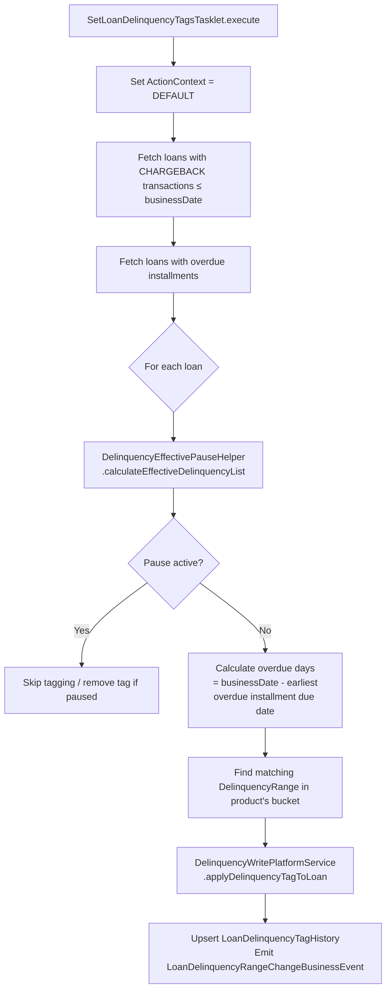

The delinquency subsystem in `fineract-loan` provides a configurable framework for classifying active loans by how many days overdue they are. Administrators define `DelinquencyRange` objects (e.g. "1–30 days", "31–60 days") and group them into a `DelinquencyBucket` that is then attached to a loan product. A nightly batch job scans all active loans and assigns or updates a delinquency tag on each one, which is then emitted as a business event for downstream consumers such as reporting systems or collections workflows.

<CardGroup cols={2}>
  <Card title="Loan Accounts" icon="file-invoice-dollar" href="/loan/loan-accounts">
    Loan status machine and the SetLoanDelinquencyTagsJob batch job
  </Card>
  <Card title="Loan Products" icon="box" href="/loan/loan-products">
    Attaching a DelinquencyBucket to a product definition
  </Card>
</CardGroup>

---

## Package layout

All delinquency classes live under `org.apache.fineract.portfolio.delinquency` in the `fineract-loan` module, except the JPA entities which live in `fineract-core`:

| Package | Contents |
|---|---|
| `fineract-core/…/delinquency/domain` | `DelinquencyBucket`, `DelinquencyRange` JPA entities |
| `fineract-loan/…/delinquency/api` | `DelinquencyApiResource`, request/response types |
| `fineract-loan/…/delinquency/domain` | `DelinquencyBucketMappings`, `LoanDelinquencyTagHistory`, `LoanInstallmentDelinquencyTag`, `LoanDelinquencyAction`, repositories |
| `fineract-loan/…/delinquency/service` | `DelinquencyReadPlatformService`, `DelinquencyWritePlatformService` |
| `fineract-loan/…/delinquency/helper` | `DelinquencyEffectivePauseHelper` |
| `fineract-loan/…/delinquency/validator` | `LoanDelinquencyActionData` |
| `fineract-loan/…/delinquency/spi` | `DelinquencyBucketUsageChecker` |
| `fineract-loan/…/delinquency/mapper` | `DelinquencyResponseMapper` |
| `fineract-loan/…/loanaccount/jobs/setloandelinquencytags` | `SetLoanDelinquencyTagsTasklet`, `SetLoanDelinquencyTagsConfig` |

---

## Domain entities

### `DelinquencyRange`

Stored in `m_delinquency_range`. Each range defines a named classification and an overdue-day window:

```java
// fineract-core/…/delinquency/domain/DelinquencyRange.java
@Entity
@Table(name = "m_delinquency_range",
    uniqueConstraints = @UniqueConstraint(
        name = "uq_delinquency_range_classification",
        columnNames = { "classification" }))
public class DelinquencyRange extends AbstractAuditableWithUTCDateTimeCustom<Long> {

    @Column(name = "classification", nullable = false)
    private String classification;     // e.g. "BUCKET_1", "30_DAYS_OVERDUE"

    @Column(name = "min_age_days", nullable = false)
    private Integer minimumAgeDays;    // inclusive lower bound (days overdue)

    @Column(name = "max_age_days")
    private Integer maximumAgeDays;    // null means open-ended ("90+ days")
}
```

Ranges must not overlap within the same bucket. `DelinquencyBucketAgesOverlapedException` is thrown by the service if a new range conflicts with an existing one in the same bucket.

### `DelinquencyBucket`

Stored in `m_delinquency_bucket`. A bucket is a named ordered collection of ranges:

```java
// fineract-core/…/delinquency/domain/DelinquencyBucket.java
@Entity
@Table(name = "m_delinquency_bucket",
    uniqueConstraints = @UniqueConstraint(
        name = "uq_delinquency_bucket_name",
        columnNames = { "name" }))
public class DelinquencyBucket extends AbstractAuditableWithUTCDateTimeCustom<Long> {

    @Column(name = "name", nullable = false)
    private String name;

    @ManyToMany(fetch = FetchType.LAZY)
    @JoinTable(name = "m_delinquency_bucket_mappings",
        joinColumns = @JoinColumn(name = "delinquency_bucket_id"),
        inverseJoinColumns = @JoinColumn(name = "delinquency_range_id"))
    private List<DelinquencyRange> ranges;

    @Enumerated(EnumType.STRING)
    @Column(name = "bucket_type")
    private DelinquencyBucketType bucketType;

    @Version
    private Long version;
}
```

The join table `m_delinquency_bucket_mappings` links buckets to ranges. `DelinquencyBucketType` distinguishes between standard overdue buckets and any specialized variants.

### Bucket-to-product binding

`LoanProduct` holds a `@ManyToOne` reference to `DelinquencyBucket` (mapped in `fineract-loan`). When the nightly job classifies a loan, it reads the bucket from the loan's product definition.

---

## Bucket-to-range configuration

To set up delinquency classification:

1. **Create ranges** via `POST /v1/delinquency/ranges` — specify `classification`, `minimumAgeDays`, `maximumAgeDays`.
2. **Create a bucket** via `POST /v1/delinquency/buckets` — name the bucket and reference the range IDs.
3. **Attach to a product** — set `delinquencyBucketId` when creating or updating a `LoanProduct`.

Example ranges for a standard bucket:

| Classification | Min days | Max days |
|---|---|---|
| `BUCKET_1` | 1 | 30 |
| `BUCKET_2` | 31 | 60 |
| `BUCKET_3` | 61 | 90 |
| `BUCKET_4` | 91 | null (open-ended) |

---

## Tagging entities

### `LoanDelinquencyTagHistory`

Stored in `m_loan_delinquency_tag_history`. Records when a loan entered and exited a given delinquency range:

| Column | Description |
|---|---|
| `loan_id` | Foreign key to `m_loan` |
| `delinquency_range_id` | The range the loan was classified into |
| `added_on_date` | Business date when tag was applied |
| `lifted_on_date` | Business date when tag was removed (null if still active) |

### `LoanInstallmentDelinquencyTag`

Stored in `m_loan_installment_delinquency_tag`. Tracks delinquency at the individual installment level, useful for partial-payment scenarios where some installments are overdue and others are current.

### `LoanDelinquencyAction`

Stored in `m_loan_delinquency_action`. Records business actions taken against a delinquent loan (e.g. pause, resume). `LoanDelinquencyAction` has an action type and effective date range. The helper `DelinquencyEffectivePauseHelper` computes the net effective pause window from overlapping action records.

---

## `DelinquencyApiResource` REST endpoints

Base path: `@Path("/v1/delinquency")` — `DelinquencyBucketUsageChecker`'s permission constant is `"DELINQUENCY_BUCKET"`.

| Method | Path | Description |
|---|---|---|
| `GET` | `/v1/delinquency/ranges` | List all ranges |
| `GET` | `/v1/delinquency/ranges/{id}` | Get a specific range |
| `POST` | `/v1/delinquency/ranges` | Create a range |
| `PUT` | `/v1/delinquency/ranges/{id}` | Update a range |
| `DELETE` | `/v1/delinquency/ranges/{id}` | Delete a range |
| `GET` | `/v1/delinquency/buckets` | List all buckets |
| `GET` | `/v1/delinquency/buckets/{id}` | Get bucket with associated ranges |
| `POST` | `/v1/delinquency/buckets` | Create a bucket |
| `PUT` | `/v1/delinquency/buckets/{id}` | Update bucket (replace ranges) |
| `DELETE` | `/v1/delinquency/buckets/{id}` | Delete bucket (blocked if in use) |

Write operations flow through `PortfolioCommandSourceWritePlatformService` via `CommandWrapperBuilder` — they are auditable and idempotent via command deduplication.

---

## The SPI: `DelinquencyBucketUsageChecker`

```java
// fineract-loan/…/delinquency/spi/DelinquencyBucketUsageChecker.java
public interface DelinquencyBucketUsageChecker {
    boolean hasUsages(DelinquencyBucket delinquencyBucket);
}
```

This SPI allows modules outside `fineract-loan` to register whether a given bucket is in use before the core allows deletion. If any registered `DelinquencyBucketUsageChecker` bean returns `true`, the delete operation is blocked. Implement this interface in any module that references `DelinquencyBucket` and register the bean with `@Component`.

---

## Nightly batch job: `SetLoanDelinquencyTagsJob`

The `SetLoanDelinquencyTagsTasklet` is executed as a Spring Batch step. Its configuration lives in `SetLoanDelinquencyTagsConfig`.

```java
// fineract-loan/…/jobs/setloandelinquencytags/SetLoanDelinquencyTagsTasklet.java
@Slf4j @RequiredArgsConstructor
public class SetLoanDelinquencyTagsTasklet implements Tasklet {

    private final DelinquencyWritePlatformService delinquencyWritePlatformService;
    private final LoanRepaymentScheduleInstallmentRepository loanRepaymentScheduleInstallmentRepository;
    private final LoanTransactionRepository loanTransactionRepository;
    private final DelinquencyEffectivePauseHelper delinquencyEffectivePauseHelper;
    private final DelinquencyReadPlatformService delinquencyReadPlatformService;

    @Override
    public RepeatStatus execute(StepContribution contribution, ChunkContext chunkContext) {
        ThreadLocalContextUtil.setActionContext(ActionContext.DEFAULT);
        final LocalDate businessDate = DateUtils.getBusinessLocalDate();

        // Phase 1: loans with chargeback transactions
        Collection<LoanScheduleDelinquencyData> chargebackLoans =
            loanTransactionRepository.fetchLoanTransactionsByTypeAndLessOrEqualDate(
                LoanTransactionType.CHARGEBACK, businessDate);
        applyDelinquencyTagToLoans(chargebackLoans);

        // Phase 2: loans with overdue installments
        // ... (reads from m_loan_repayment_schedule)
        return RepeatStatus.FINISHED;
    }
}
```

### Processing flow



### Business events

When a loan's delinquency classification changes, a `LoanDelinquencyRangeChangeBusinessEvent` is published via `BusinessEventNotifierService`. Downstream modules (e.g. reporting, notification systems) can subscribe to this event.

<Warning>
`SetLoanDelinquencyTagsTasklet` explicitly sets `ActionContext.DEFAULT` to operate on the current business date. This means it does **not** run under the COB (Close of Business) date context. Do not confuse this job with COB loan processing steps.
</Warning>

---

## `DelinquencyWritePlatformService`

Key write operations:

```java
public interface DelinquencyWritePlatformService {
    CommandProcessingResult createDelinquencyRange(JsonCommand command);
    CommandProcessingResult updateDelinquencyRange(Long delinquencyRangeId, JsonCommand command);
    CommandProcessingResult deleteDelinquencyRange(Long delinquencyRangeId, JsonCommand command);
    CommandProcessingResult createDelinquencyBucket(JsonCommand command);
    CommandProcessingResult updateDelinquencyBucket(Long delinquencyBucketId, JsonCommand command);
    CommandProcessingResult deleteDelinquencyBucket(Long delinquencyBucketId, JsonCommand command);
    CommandProcessingResult applyDelinquencyTagToLoan(Long loanId, JsonCommand command);
    void removeDelinquencyTagToLoan(Loan loan);
    void cleanLoanDelinquencyTags(Loan loan);
    LoanScheduleDelinquencyData calculateDelinquencyData(
        LoanScheduleDelinquencyData loanScheduleDelinquencyData,
        List<LoanDelinquencyActionData> effectiveDelinquencyList);
    void applyDelinquencyTagToLoan(LoanScheduleDelinquencyData loanDelinquencyData,
        List<LoanDelinquencyActionData> effectiveDelinquencyList);
    CommandProcessingResult createDelinquencyAction(Long loanId, JsonCommand command);
}
```

`cleanLoanDelinquencyTags` removes all tags when a loan is closed or written-off. `removeDelinquencyTagToLoan` removes the current active tag only.

<Tip>
`ProgressivePossibleNextRepaymentCalculationServiceImpl` in `fineract-progressive-loan` provides delinquency-aware next repayment date calculation for progressive loans — it accounts for interest pauses and balance corrections when determining the minimum payment.
</Tip>
