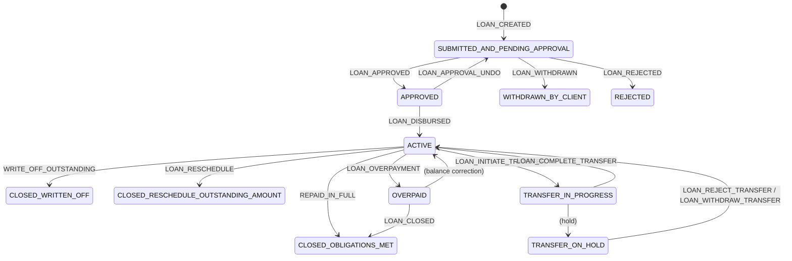

The `fineract-loan` module owns the full lifecycle of individual loan accounts — from application submission through disbursement, repayment, rescheduling, and eventual closure or write-off. Everything lives under `org.apache.fineract.portfolio.loanaccount`. This page covers the domain model, the state machine that drives status transitions, the transaction processor SPI, and the REST endpoints that front-end clients call.

<CardGroup cols={2}>
  <Card title="Loan Products" icon="box" href="/loan/loan-products">
    Product templates that seed account defaults at origination
  </Card>
  <Card title="Progressive Loans" icon="chart-line" href="/loan/progressive-loan">
    Actuarial EMI calculation and the advanced payment processor
  </Card>
  <Card title="Delinquency" icon="triangle-exclamation" href="/loan/delinquency">
    Overdue classification and bucket tagging
  </Card>
  <Card title="Origination" icon="file-signature" href="/loan/origination">
    Originator attribution before disbursement
  </Card>
</CardGroup>

---

## Module & package layout

| Package | Purpose |
|---|---|
| `portfolio.loanaccount.domain` | JPA entities: `Loan`, `LoanTransaction`, `LoanRepaymentScheduleInstallment`, `LoanCharge` |
| `portfolio.loanaccount.api` | JAX-RS resources exposed via `fineract-provider` |
| `portfolio.loanaccount.service` | Read/write platform service interfaces and implementations |
| `portfolio.loanaccount.handler` | CQRS command handlers (one per loan operation) |
| `portfolio.loanaccount.data` | Read-model DTOs assembled for API responses |
| `portfolio.loanaccount.loanschedule` | Schedule generator interface, model, and repayment data |
| `portfolio.loanaccount.rescheduleloan` | Reschedule request entity, validators, and API resource |
| `portfolio.loanaccount.guarantor` | Guarantor domain, commands, and handlers |
| `portfolio.loanaccount.jobs` | Spring Batch tasklets: delinquency tags, accruals, arrears ageing |
| `portfolio.loanaccount.serialization` | JSON deserializers for loan commands |

---

## The `Loan` entity

`Loan` (`m_loan`) is the central aggregate. It extends `AbstractAuditableWithUTCDateTimeCustom<Long>` and carries full JPA audit timestamps.

```java
// fineract-loan/src/main/java/org/apache/fineract/portfolio/loanaccount/domain/Loan.java
@Entity
@Table(name = "m_loan", uniqueConstraints = {
    @UniqueConstraint(columnNames = { "account_no" }, name = "loan_account_no_UNIQUE"),
    @UniqueConstraint(columnNames = { "external_id" }, name = "loan_externalid_UNIQUE")
})
@Getter
public class Loan extends AbstractAuditableWithUTCDateTimeCustom<Long> {

    @Version
    int version;  // optimistic locking

    @Column(name = "account_no", length = 20, unique = true, nullable = false)
    private String accountNumber;

    @Column(name = "external_id")
    private ExternalId externalId;

    @ManyToOne
    @JoinColumn(name = "client_id")
    private Client client;

    @ManyToOne
    @JoinColumn(name = "group_id")
    private Group group;

    @Enumerated
    @Column(name = "loan_type_enum", nullable = false)
    private AccountType loanType;

    @ManyToOne(fetch = FetchType.LAZY)
    @JoinColumn(name = "product_id", nullable = false)
    private LoanProduct loanProduct;

    @Column(name = "loan_status_id", nullable = false)
    @Convert(converter = LoanStatusConverter.class)
    private LoanStatus loanStatus;

    @Embedded
    private LoanProductRelatedDetail loanRepaymentScheduleDetail;

    @OrderBy(value = "installmentNumber")
    @OneToMany(cascade = CascadeType.ALL, mappedBy = "loan", fetch = FetchType.LAZY)
    private List<LoanRepaymentScheduleInstallment> repaymentScheduleInstallments;

    @OrderBy(value = "dateOf, createdDate, id")
    @OneToMany(cascade = CascadeType.ALL, mappedBy = "loan", fetch = FetchType.LAZY)
    private List<LoanTransaction> loanTransactions;

    @OneToMany(cascade = CascadeType.ALL, mappedBy = "loan", fetch = FetchType.LAZY)
    private List<LoanPaymentAllocationRule> paymentAllocationRules;

    @OneToMany(cascade = CascadeType.ALL, mappedBy = "loan", fetch = FetchType.LAZY)
    private List<LoanCreditAllocationRule> creditAllocationRules;
    // ...
}
```

### Key fields

| DB column | Java field | Notes |
|---|---|---|
| `account_no` | `accountNumber` | Human-readable, unique per tenant |
| `external_id` | `externalId` | Optional idempotency key from callers |
| `loan_status_id` | `loanStatus` | Integer code; see `LoanStatus` enum |
| `loan_transaction_strategy_code` | `transactionProcessingStrategyCode` | Selects the transaction processor bean |
| `principal_amount_proposed` | `proposedPrincipal` | Amount at submission |
| `approved_principal` | `approvedPrincipal` | May differ from proposed after underwriting |
| `net_disbursal_amount` | `netDisbursalAmount` | Actual disbursed amount |
| `fixed_emi_amount` | `fixedEmiAmount` | Overrides calculated EMI when set |
| `term_frequency` + `term_period_frequency_enum` | `termFrequency` / `termPeriodFrequencyType` | Loan tenor |
| `submittedon_date` / `approvedon_date` / `disbursedon_date` / `closedon_date` | various `LocalDate` fields | Lifecycle timestamps |
| `writtenoffon_date` | `writtenOffOnDate` | Non-null when CLOSED_WRITTEN_OFF |

---

## Loan status state machine

Loan status is governed by `DefaultLoanLifecycleStateMachine` (implements `LoanLifecycleStateMachine`). Transitions are triggered by `LoanEvent` enum values. The status integer codes are defined in `LoanStatus`:

```java
// fineract-core/src/main/java/org/apache/fineract/portfolio/loanaccount/domain/LoanStatus.java
SUBMITTED_AND_PENDING_APPROVAL(100, ...),
APPROVED(200, ...),
ACTIVE(300, ...),
TRANSFER_IN_PROGRESS(303, ...),
TRANSFER_ON_HOLD(304, ...),
WITHDRAWN_BY_CLIENT(400, ...),
REJECTED(500, ...),
CLOSED_OBLIGATIONS_MET(600, ...),
CLOSED_WRITTEN_OFF(601, ...),
CLOSED_RESCHEDULE_OUTSTANDING_AMOUNT(602, ...),
OVERPAID(700, ...);
```

### State diagram



<Note>
`DefaultLoanLifecycleStateMachine.transition()` calls `loanBalanceService.updateLoanSummaryDerivedFields(loan)` before every transition, ensuring balance summaries are current. It also emits a `LoanStatusChangedBusinessEvent` for downstream consumers.
</Note>

### Key lifecycle operations and their handlers

| Operation | Handler class | Event |
|---|---|---|
| Submit application | `LoanApplicationSubmitCommandHandler` | `LOAN_CREATED` |
| Approve | `LoanApplicationApprovalCommandHandler` | `LOAN_APPROVED` |
| Disburse | `DisburseLoanCommandHandler` | `LOAN_DISBURSED` |
| Disburse to savings | `DisburseLoanToSavingsCommandHandler` | `LOAN_DISBURSED` |
| Undo disbursal | `UndoLoanDisbursalCommandHandler` | `LOAN_DISBURSAL_UNDO` |
| Make repayment | `LoanRepaymentCommandHandler` | `LOAN_REPAYMENT_OR_WAIVER` |
| Write-off | `WriteOffLoanCommandHandler` | `WRITE_OFF_OUTSTANDING` |
| Charge-off | `ChargeOffLoanCommandHandler` | `LOAN_CONTRACT_TERMINATION` |
| Close | `CloseLoanCommandHandler` | `LOAN_CLOSED` |
| Add charge | `AddLoanChargeCommandHandler` | `LOAN_CHARGE_ADDED` |
| Foreclosure | `ForeClosureCommandHandler` | `LOAN_FORECLOSURE` |
| Credit balance refund | `CreditBalanceRefundCommandHandler` | `LOAN_CREDIT_BALANCE_REFUND` |
| Chargeback | (processed by transaction processor) | `LOAN_CHARGEBACK` |

All handlers are discovered via Spring's `@CommandScope` and routed by `PortfolioCommandSourceWritePlatformService`.

---

## REST endpoints

The main API resources live in `fineract-provider` and delegate to the domain module.

| Resource class | Base path | Operations |
|---|---|---|
| `LoansApiResource` | `GET/POST /v1/loans` | List, create, approve, reject, withdraw, disburse, close via `?command=` param |
| `LoanTransactionsApiResource` | `/v1/loans/{loanId}/transactions` | Read transactions, make repayment, waiver, chargeback |
| `LoanChargesApiResource` | `/v1/loans/{loanId}/charges` | Add, update, delete, pay charges |
| `RescheduleLoansApiResource` | `GET/POST /v1/rescheduleloans` | Create reschedule request, approve/reject |
| `LoanScheduleApiResource` | `POST /v1/loans/{loanId}/schedule` | Preview schedule changes |
| `LoanProductsDetailsApiResource` | `/v1/loanproducts` | Product CRUD (see [Loan Products](/loan/loan-products)) |
| `DelinquencyApiResource` | `/v1/delinquency` | Bucket/range management (see [Delinquency](/loan/delinquency)) |

<Tip>
`LoansApiResource` uses a single `POST /v1/loans/{loanId}` endpoint with a `?command=` query parameter (`approve`, `reject`, `disburse`, `repayment`, `writeoff`, `close`, etc.). Inspect `CommandWrapperBuilder` to map command strings to `CommandWrapper` instances.
</Tip>

---

## Transaction processor pattern

The `LoanRepaymentScheduleTransactionProcessor` interface defines how incoming money is applied to an installment schedule:

```java
// fineract-loan/…/transactionprocessor/LoanRepaymentScheduleTransactionProcessor.java
public interface LoanRepaymentScheduleTransactionProcessor {
    String getCode();
    String getName();
    boolean accept(String s);

    ChangedTransactionDetail processLatestTransaction(
        LoanTransaction loanTransaction, TransactionCtx ctx);

    ChangedTransactionDetail reprocessLoanTransactions(
        LocalDate disbursementDate,
        List<LoanTransaction> repaymentsOrWaivers,
        MonetaryCurrency currency,
        List<LoanRepaymentScheduleInstallment> repaymentScheduleInstallments,
        Set<LoanCharge> charges);
}
```

`reprocessLoanTransactions` is invoked whenever an existing transaction is adjusted or a backdated transaction is inserted — the entire schedule must be replayed from disbursement.

### Built-in processors (cumulative schedule)

Located in `…/transactionprocessor/impl/`:

| Class | Strategy code |
|---|---|
| `FineractStyleLoanRepaymentScheduleTransactionProcessor` | `mifos-standard` |
| `HeavensFamilyLoanRepaymentScheduleTransactionProcessor` | `heavensfamily` |
| `CreocoreLoanRepaymentScheduleTransactionProcessor` | `creocore` |
| `RBILoanRepaymentScheduleTransactionProcessor` | `rbi-india` |
| `PrincipalInterestPenaltyFeesOrderLoanRepaymentScheduleTransactionProcessor` | `principal-interest-in-advance` |
| `InterestPrincipalPenaltyFeesOrderLoanRepaymentScheduleTransactionProcessor` | `interest-principal-penalties-fees` |
| `EarlyPaymentLoanRepaymentScheduleTransactionProcessor` | `early-repayment` |
| `DuePenFeeIntPriInAdvancePriPenFeeIntLoanRepaymentScheduleTransactionProcessor` | (due+advance ordering variant) |

For progressive (actuarial) loans, `AdvancedPaymentScheduleTransactionProcessor` is used — see [Progressive Loans](/loan/progressive-loan).

The active processor for a loan instance is resolved by `LoanRepaymentScheduleTransactionProcessorFactory` using `loan.getTransactionProcessingStrategyCode()`.

---

## Schedule calculation

`LoanScheduleGenerator` is the interface for generating or rescheduling a repayment schedule:

```java
// fineract-loan/…/loanschedule/domain/LoanScheduleGenerator.java
public interface LoanScheduleGenerator {

    LoanScheduleModel generate(MathContext mc,
        LoanApplicationTerms loanApplicationTerms,
        Set<LoanCharge> loanCharges,
        HolidayDetailDTO holidayDetailDTO);

    LoanScheduleDTO rescheduleNextInstallments(MathContext mc,
        LoanApplicationTerms loanApplicationTerms,
        Loan loan,
        HolidayDetailDTO holidayDetailDTO,
        LoanRepaymentScheduleTransactionProcessor loanRepaymentScheduleTransactionProcessor,
        LocalDate rescheduleFrom);

    OutstandingAmountsDTO calculatePrepaymentAmount(
        MonetaryCurrency currency, LocalDate onDate,
        LoanApplicationTerms loanApplicationTerms,
        MathContext mc, Loan loan, ...);
}
```

### Schedule types

The `LoanScheduleType` enum selects the generator implementation:

| Value | Generator | Description |
|---|---|---|
| `CUMULATIVE` | Default cumulative generator | Flat or declining-balance interest, standard installments |
| `PROGRESSIVE` | `ProgressiveLoanScheduleGenerator` | Actuarial EMI, interest-period model (see [Progressive Loans](/loan/progressive-loan)) |

`LoanApplicationTerms` wraps all product configuration and loan-level overrides passed into the generator. The resulting `LoanScheduleModel` is then persisted as `LoanRepaymentScheduleInstallment` rows in `m_loan_repayment_schedule`.

### Interest methods

From `InterestMethod` in `portfolio.loanproduct.domain`:

```java
DECLINING_BALANCE(0, "interestType.declining.balance"),
FLAT(1, "interestType.flat"),
```

For `DECLINING_BALANCE`, interest is recalculated each period on the outstanding principal. For `FLAT`, interest is a fixed portion computed once over total principal × tenor.

---

## Guarantor sub-module

`portfolio.loanaccount.guarantor` manages third-party guarantors linked to a loan:

| Class | Role |
|---|---|
| `GuarantorCommand` | CQRS command DTO |
| `GuarantorDTO` / `IGuarantor` | Read-model and interface |
| `GuarantorFundStatusType` | `ACTIVE`, `WITHDRAWN`, `COMPLETED` fund statuses |
| `GuarantorType` | `CUSTOMER`, `STAFF`, `EXTERNAL` |
| `CreateGuarantorCommandHandler` | Validates and persists a new guarantor record |
| `DeleteGuarantorCommandHandler` | Soft-deletes guarantor associations |

Guarantors are referenced in the broader origination context alongside collateral — see [Loan Origination](/loan/origination).

---

## Scheduled jobs

Two relevant Spring Batch tasklets run as nightly jobs:

| Tasklet | Config class | What it does |
|---|---|---|
| `SetLoanDelinquencyTagsTasklet` | `SetLoanDelinquencyTagsConfig` | Scans overdue installments and chargeback transactions; applies delinquency tags (see [Delinquency](/loan/delinquency)) |
| `UpdateLoanArrearsAgeingTasklet` | `UpdateLoanArrearsAgeingConfig` | Updates arrears ageing summary table for reporting |
| `AddPeriodicAccrualEntriesTasklet` | `AddPeriodicAccrualEntriesConfig` | Posts periodic accrual journal entries for active loans |

<Warning>
`SetLoanDelinquencyTagsTasklet` sets `ActionContext.DEFAULT` explicitly so it operates on the current business date, not the COB date. Do not confuse this job with the COB step that processes loans individually.
</Warning>
