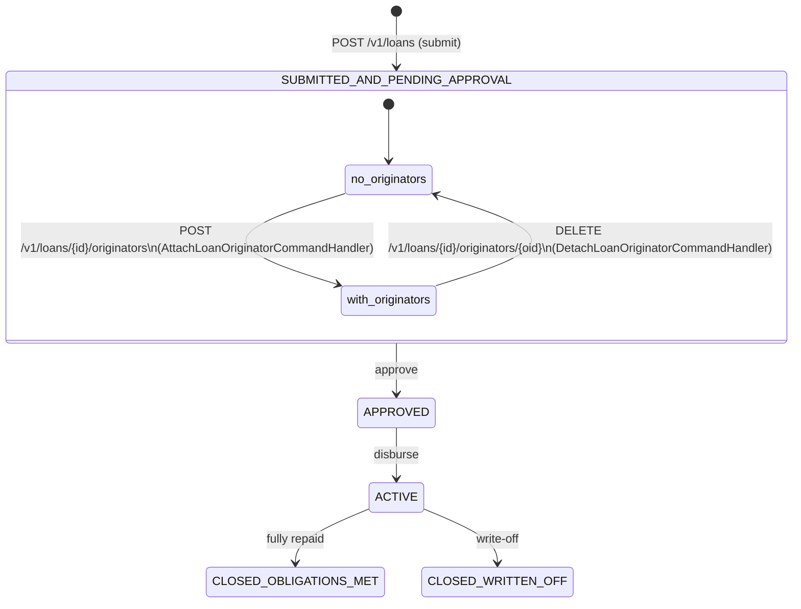

The `fineract-loan-origination` module provides originator attribution for loan accounts — it records which external entity (broker, partner, channel) originated a loan application. Originator records are managed independently of the loan lifecycle and are attached to a loan while it is in the `SUBMITTED_AND_PENDING_APPROVAL` state. Once the loan advances to `APPROVED` or beyond, originator mappings become read-only. The module is conditionally enabled at runtime via a feature flag.

<CardGroup cols={2}>
  <Card title="Loan Accounts" icon="file-invoice-dollar" href="/loan/loan-accounts">
    The Loan entity, state machine, and lifecycle handlers
  </Card>
  <Card title="Delinquency" icon="triangle-exclamation" href="/loan/delinquency">
    Delinquency range enrichment via the originator enricher
  </Card>
</CardGroup>

---

## Module activation

The module is guarded by `LoanOriginationModuleIsEnabledCondition`:

```java
// fineract-loan-origination/…/loanorigination/config/LoanOriginationModuleIsEnabledCondition.java
public class LoanOriginationModuleIsEnabledCondition extends PropertiesCondition {
    @Override
    protected boolean matches(FineractProperties properties) {
        return properties.getModule().getLoanOrigination().isEnabled();
    }
}
```

All beans, API resources, and handlers in this module are annotated `@ConditionalOnProperty(value = "fineract.module.loan-origination.enabled", havingValue = "true")`. Set this property to `true` in your environment's `application.properties` or pass it as `--fineract.module.loan-origination.enabled=true`.

---

## Package layout

All sources live under `org.apache.fineract.portfolio.loanorigination` in `fineract-loan-origination/src/main/java/`:

| Package | Key classes |
|---|---|
| `…/api` | `LoanOriginatorApiResource`, `LoanOriginatorsApiResource`, `LoanOriginatorApiConstants` |
| `…/domain` | `LoanOriginator`, `LoanOriginatorMapping`, `LoanOriginatorStatus`, repositories |
| `…/data` | `LoanApplicationOriginatorData`, `LoanOriginatorTemplateData`, `LoanOriginatorsResponse`, `LoanOriginatorMappingResponse`, `LoanOriginatorRequestData` |
| `…/service` | `LoanOriginatorReadPlatformService`, `LoanOriginatorWritePlatformService`, `LoanOriginatorReadPlatformServiceImpl`, `LoanOriginatorWritePlatformServiceImpl` |
| `…/handler` | `CreateLoanOriginatorCommandHandler`, `UpdateLoanOriginatorCommandHandler`, `DeleteLoanOriginatorCommandHandler`, `AttachLoanOriginatorCommandHandler`, `DetachLoanOriginatorCommandHandler` |
| `…/enricher` | `LoanAccountDataV1OriginatorEnricher`, `LoanAccountDelinquencyRangeDataV1OriginatorEnricher`, `LoanChargeDataV1OriginatorEnricher`, `LoanTransactionDataV1OriginatorEnricher`, `LoanRepaymentDueDataV1OriginatorEnricher`, `LoanTransactionAdjustmentDataV1OriginatorEnricher`, `LoanOriginatorAvroMapper` |
| `…/helper` | `LoanOriginatorDetailsResolver` |
| `…/mapper` | `LoanOriginatorMapper` |
| `…/serialization` | `LoanOriginatorDataValidator`, `LoanApplicationOriginatorDataValidator` |
| `…/exception` | Domain exceptions (see below) |
| `…/config` | `LoanOriginationModuleIsEnabledCondition` |

---

## Domain entities

### `LoanOriginator`

Stored in `m_loan_originator`. Represents an originating entity — a broker firm, partner channel, or internal sales unit:

```java
// fineract-loan-origination/…/domain/LoanOriginator.java
@Entity
@Table(name = "m_loan_originator")
public class LoanOriginator extends AbstractAuditableWithUTCDateTimeCustom<Long> {

    @Column(name = "external_id", nullable = false, length = 100, unique = true)
    private ExternalId externalId;

    @Column(name = "name", length = 255)
    private String name;

    @Enumerated(EnumType.STRING)
    @Column(name = "status", nullable = false, length = 20)
    private LoanOriginatorStatus status;  // ACTIVE, PENDING, INACTIVE

    @ManyToOne(fetch = FetchType.LAZY)
    @JoinColumn(name = "originator_type_cv_id")
    private CodeValue originatorType;    // code value — type classification

    @ManyToOne(fetch = FetchType.LAZY)
    @JoinColumn(name = "channel_type_cv_id")
    private CodeValue channelType;       // code value — distribution channel
}
```

`LoanOriginatorStatus` values: `ACTIVE`, `PENDING`, `INACTIVE`. Only `ACTIVE` originators can be attached to loans — `LoanOriginatorNotActiveException` is thrown otherwise.

`originatorType` and `channelType` are `CodeValue` references, allowing administrators to define their own originator taxonomy via the code/code-value configuration API without schema changes.

### `LoanOriginatorMapping`

Stored in `m_loan_originator_mapping`. A many-to-many join between a loan and its originators:

```java
// fineract-loan-origination/…/domain/LoanOriginatorMapping.java
@Entity
@Table(name = "m_loan_originator_mapping")
public class LoanOriginatorMapping extends AbstractAuditableWithUTCDateTimeCustom<Long> {

    @Column(name = "loan_id", nullable = false)
    private Long loanId;

    @ManyToOne(fetch = FetchType.LAZY)
    @JoinColumn(name = "originator_id", nullable = false)
    private LoanOriginator originator;

    public static LoanOriginatorMapping create(Long loanId, LoanOriginator originator) {
        LoanOriginatorMapping mapping = new LoanOriginatorMapping();
        mapping.setLoanId(loanId);
        mapping.setOriginator(originator);
        return mapping;
    }
}
```

A loan can have multiple originator mappings (e.g. a primary broker and a sub-broker). There is no enforced uniqueness on `(loan_id, originator_id)` at the entity level — duplicate attach attempts are guarded by `LoanOriginatorMappingAlreadyExistsException`.

---

## Originator lifecycle and loan state constraint

Originators can only be attached to or detached from a loan while it is in `SUBMITTED_AND_PENDING_APPROVAL` (status code 100). Any attach or detach attempt on a loan in a different state raises `LoanNotInSubmittedStatusException`:

```java
// fineract-loan-origination/…/exception/LoanNotInSubmittedStatusException.java
public class LoanNotInSubmittedStatusException extends AbstractPlatformDomainRuleException {
    public LoanNotInSubmittedStatusException(Long loanId, String currentStatus) {
        super("error.msg.loan.not.in.submitted.status",
            "Loan with id " + loanId + " has status " + currentStatus
            + ". Originator can only be attached/detached while loan is in "
            + "'Submitted and Pending Approval' status.", loanId, currentStatus);
    }
}
```

### Application state flow in context



<Warning>
Originator attachments and detachments are blocked once the loan leaves `SUBMITTED_AND_PENDING_APPROVAL`. If you need to change originator attribution after approval, you must undo the approval first (if the business process permits it).
</Warning>

---

## CQRS command handlers

| Handler | Command | Triggered by |
|---|---|---|
| `CreateLoanOriginatorCommandHandler` | `CREATE_LOAN_ORIGINATOR` | `POST /v1/loan-originators` |
| `UpdateLoanOriginatorCommandHandler` | `UPDATE_LOAN_ORIGINATOR` | `PUT /v1/loan-originators/{id}` |
| `DeleteLoanOriginatorCommandHandler` | `DELETE_LOAN_ORIGINATOR` | `DELETE /v1/loan-originators/{id}` |
| `AttachLoanOriginatorCommandHandler` | `ATTACH_LOAN_ORIGINATOR` | `POST /v1/loans/{id}/originators` |
| `DetachLoanOriginatorCommandHandler` | `DETACH_LOAN_ORIGINATOR` | `DELETE /v1/loans/{id}/originators/{oid}` |

Delete of an originator is blocked if it has active mappings — `LoanOriginatorCannotBeDeletedException` prevents orphaning mapping records.

---

## REST API surface

### Originator management (`LoanOriginatorApiResource`)

Base path: `@Path("/v1/loan-originators")`

| Method | Path | Description |
|---|---|---|
| `POST` | `/v1/loan-originators` | Create a new originator record |
| `GET` | `/v1/loan-originators` | List all originator records |
| `GET` | `/v1/loan-originators/template` | Retrieve code-value options for `originatorType` and `channelType` |
| `GET` | `/v1/loan-originators/{originatorId}` | Get originator by internal ID |
| `PUT` | `/v1/loan-originators/{originatorId}` | Update originator name, status, or type |
| `DELETE` | `/v1/loan-originators/{originatorId}` | Delete originator (blocked if mapped to any loan) |

### Loan-originator mappings (`LoanOriginatorsApiResource`)

Base path: `@Path("/v1/loans")` — endpoints nested under a loan.

| Method | Path | Description |
|---|---|---|
| `GET` | `/v1/loans/{loanId}/originators` | List originators attached to a loan |
| `GET` | `/v1/loans/external-id/{loanExtId}/originators` | Same, by loan external ID |
| `POST` | `/v1/loans/{loanId}/originators/{originatorId}` | Attach originator to loan |
| `DELETE` | `/v1/loans/{loanId}/originators/{originatorId}` | Detach originator from loan |
| `DELETE` | `/v1/loans/{loanId}/originators/external-id/{originatorExtId}` | Detach by originator external ID |
| `DELETE` | `/v1/loans/external-id/{loanExtId}/originators/{originatorId}` | Detach by loan external ID |
| `DELETE` | `/v1/loans/external-id/{loanExtId}/originators/external-id/{originatorExtId}` | Detach by both external IDs |

Both resources accept loan ID or loan `externalId` variants, following the Fineract pattern of supporting external ID routing.

---

## Data enrichers

`fineract-loan-origination` integrates with Fineract's `DataEnricher<T>` SPI to inject originator metadata into Avro event payloads published to Kafka (or other message buses).

### `LoanAccountDataV1OriginatorEnricher`

```java
// fineract-loan-origination/…/enricher/LoanAccountDataV1OriginatorEnricher.java
@Component
@ConditionalOnProperty(value = "fineract.module.loan-origination.enabled", havingValue = "true")
public class LoanAccountDataV1OriginatorEnricher implements DataEnricher<LoanAccountDataV1> {

    @Override
    public boolean isDataTypeSupported(final Class<LoanAccountDataV1> dataType) {
        return dataType.isAssignableFrom(LoanAccountDataV1.class);
    }

    @Override
    public void enrich(final LoanAccountDataV1 data) {
        if (data == null || data.getId() == null) return;
        final List<OriginatorDetailsV1> originators =
            loanOriginatorDetailsResolver.resolveOriginatorDetails(data.getId());
        if (!originators.isEmpty()) {
            data.setOriginators(originators);
        }
    }
}
```

The enricher is called during Avro serialization of `LoanAccountDataV1` business events. `LoanOriginatorDetailsResolver` queries `m_loan_originator_mapping` by `loan_id` and maps the results to `OriginatorDetailsV1` Avro records via `LoanOriginatorAvroMapper`.

### Other enrichers

| Class | Enriches | Purpose |
|---|---|---|
| `LoanAccountDelinquencyRangeDataV1OriginatorEnricher` | `LoanDelinquencyRangeDataV1` | Adds originator to delinquency events |
| `LoanChargeDataV1OriginatorEnricher` | `LoanChargeDataV1` | Adds originator to charge events |
| `LoanTransactionDataV1OriginatorEnricher` | `LoanTransactionDataV1` | Adds originator to transaction events |
| `LoanRepaymentDueDataV1OriginatorEnricher` | `LoanRepaymentDueDataV1` | Adds originator to repayment-due events |
| `LoanTransactionAdjustmentDataV1OriginatorEnricher` | `LoanTransactionAdjustmentDataV1` | Adds originator to adjustment events |

---

## Exception reference

| Exception | Thrown when |
|---|---|
| `LoanOriginatorNotFoundException` | `GET`/`PUT`/`DELETE` references non-existent originator |
| `LoanOriginatorDuplicateExternalIdException` | `POST` with a duplicate `externalId` |
| `LoanOriginatorNotActiveException` | Attaching an originator whose status is not `ACTIVE` |
| `LoanOriginatorInvalidStatusException` | Status transition not permitted |
| `LoanOriginatorCreationNotAllowedException` | Creation blocked by business rule |
| `LoanOriginatorCannotBeDeletedException` | Delete attempted while originator has active mappings |
| `LoanOriginatorMappingAlreadyExistsException` | Same originator attached to same loan twice |
| `LoanOriginatorMappingNotFoundException` | Detach references a mapping that does not exist |
| `LoanNotInSubmittedStatusException` | Attach/detach attempted on a loan not in status 100 |

---

## Integration with collateral and guarantors

The origination module is intentionally scoped to originator attribution only — it does not manage collateral or guarantors directly. Those concerns live in:

- **Collateral**: `portfolio.loanaccount.domain.LoanCollateralManagement` (entity) and `portfolio.collateral.domain.LoanCollateral` in `fineract-loan`. Attached during loan submission.
- **Guarantors**: `portfolio.loanaccount.guarantor` sub-package in `fineract-loan`. Managed via `CreateGuarantorCommandHandler` and `GuarantorType` (`CUSTOMER`, `STAFF`, `EXTERNAL`).

Both collateral and guarantors are associated at loan application time and can be modified while the loan is in `SUBMITTED_AND_PENDING_APPROVAL`, mirroring the same lifecycle constraint that applies to originator mappings. See [Loan Accounts](/loan/loan-accounts) for the full lifecycle picture.

<Tip>
To query all loans submitted by a specific originator, join `m_loan_originator_mapping` on `originator_id` and then join to `m_loan` via `loan_id`. This is more efficient than calling the REST API in a loop since there is no bulk query endpoint in the current implementation.
</Tip>
