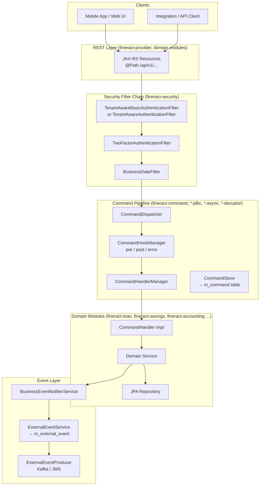
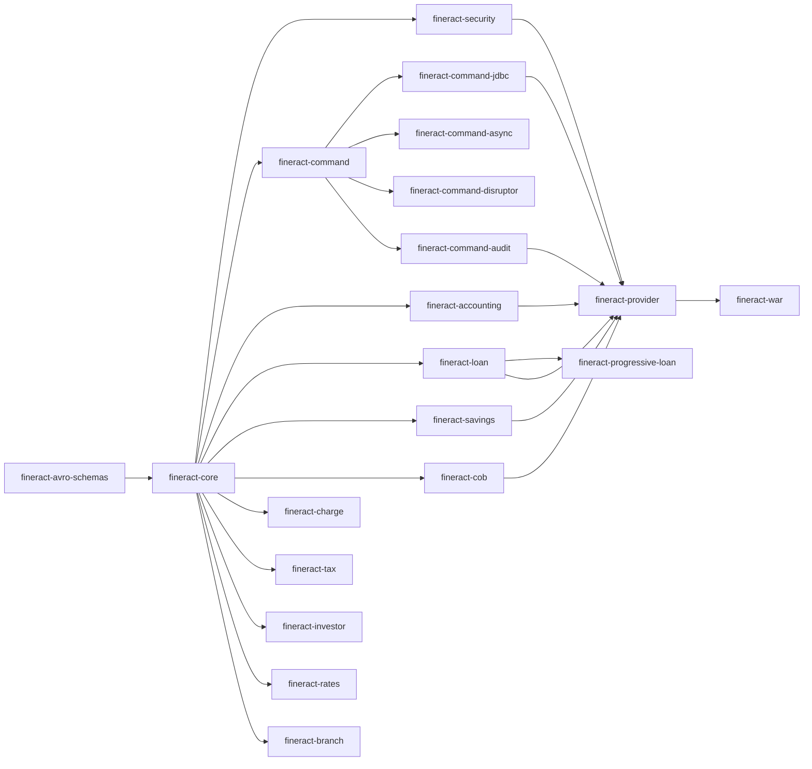
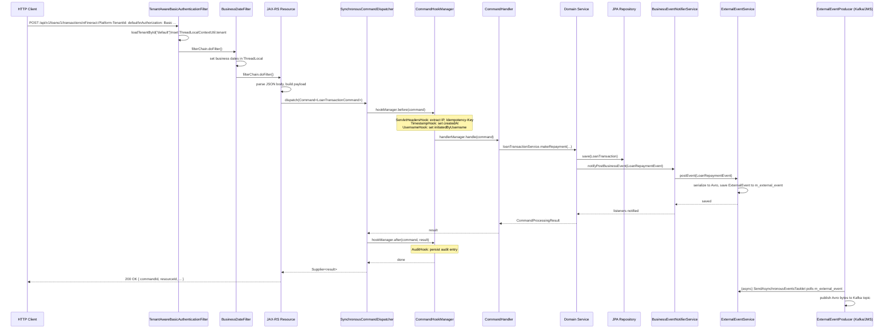

Fineract is a layered Spring Boot application whose design centres on three cross-cutting concerns: **multi-tenancy** (every request is scoped to an isolated tenant datasource), **CQRS-style command dispatch** (all writes flow through a `CommandDispatcher` pipeline), and **domain event emission** (every significant state change raises a typed `BusinessEvent` that can be forwarded to external brokers). Understanding these three pillars lets you navigate any feature area quickly.

## High-Level Architecture



## Spring Boot Bootstrap

`ServerApplication` (in `fineract-provider`) is the application entry point. It delegates configuration loading to two nested configuration classes via `@Import`:

```java
// fineract-provider/.../ServerApplication.java
@Import({ FineractWebApplicationConfiguration.class,
          FineractLiquibaseOnlyApplicationConfiguration.class })
private static final class Configuration {}

public static void main(String[] args) throws IOException {
    configureApplication(new SpringApplicationBuilder(ServerApplication.class)).run(args);
}
```

- `FineractWebApplicationConfiguration` — activates the full web stack: security, JPA, Jersey (JAX-RS), scheduling, caching.
- `FineractLiquibaseOnlyApplicationConfiguration` — a lighter mode used for schema-only migration runs (no web context).

Auto-configuration for the command subsystem is triggered via `CommandAutoConfiguration` in `fineract-command`, `JdbcCommandAutoConfiguration` in `fineract-command-jdbc`, and their equivalents for the async and disruptor variants.

## Key Architectural Patterns

### Multi-Tenancy: Per-Request Datasource Switching

Every HTTP request must carry the `Fineract-Platform-TenantId` header (or `tenantIdentifier` query parameter). `TenantAwareBasicAuthenticationFilter` (Basic Auth mode) calls `AuthTenantDetailsService.loadTenantById(tenantIdentifier, ...)` which resolves a `FineractPlatformTenant` record from the shared tenant metadata database and stores it in `ThreadLocalContextUtil`. All JPA repositories transparently use the tenant-scoped `DataSource` for the lifetime of that request thread.

```java
// TenantAwareBasicAuthenticationFilter.doFilterInternal(...)
String tenantIdentifier = request.getHeader("Fineract-Platform-TenantId");
final FineractPlatformTenant tenant =
    basicAuthTenantDetailsService.loadTenantById(tenantIdentifier, isReportRequest);
ThreadLocalContextUtil.setTenant(tenant);
```

### CQRS Command Dispatch

All write operations follow a command object pattern. A REST resource constructs a typed payload, wraps it in a `Command<T>`, and hands it to `CommandDispatcher.dispatch(command)`. The default `SynchronousCommandDispatcher` sequences pre-hooks → handler → post-hooks in the calling thread. See [Command System](/core/command-system) for full details.

### Layered Domain Modules

Each domain area (loan, savings, accounting, etc.) is structured as:

```
api/          JAX-RS resource (@Path)
service/      Read and write platform service interfaces
domain/       JPA entities and repositories
data/         DTOs / API data classes
handler/      CommandHandler implementations
exception/    Domain-specific exceptions
mapper/       MapStruct entity→DTO mappers
```

This layering keeps concerns separated and prevents domain logic from leaking into REST resources.

## Module Dependency Graph



<Note>
`fineract-provider` is the assembly module: it contains the `ServerApplication` main class and pulls in nearly every domain module. Keeping business logic out of `fineract-provider` and inside the appropriate domain module is the intended contribution pattern.
</Note>

## Write Request Sequence Diagram

The diagram below traces a typical write call — for example, `POST /api/v1/loans/{loanId}/transactions` — from HTTP ingress through to event emission.



<Tip>
The `ExternalEventProducer` does **not** publish inline during the request. `ExternalEventService.postEvent()` persists the serialized Avro payload to the `m_external_event` table within the same transaction. A separate Spring Batch tasklet (`SendAsynchronousEventsTasklet`) polls that table and dispatches to Kafka or JMS, providing at-least-once delivery without blocking the HTTP thread.
</Tip>
