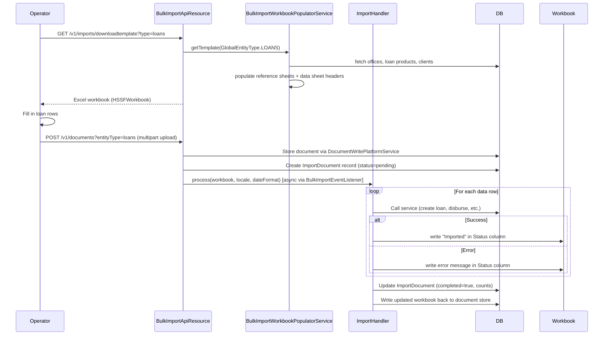

The bulk import subsystem in `fineract-provider` (`org.apache.fineract.infrastructure.bulkimport`) provides a complete Excel-driven data import pipeline. Operators download a pre-populated template workbook, fill it in with data (clients, loans, offices, savings accounts, etc.), and upload it back. Fineract processes each row by calling the same REST API services used by individual UI interactions, so all business rule validation is applied consistently. Any row-level error is written back into the workbook as an error annotation and returned to the caller.

<CardGroup cols={2}>
  <Card title="Organisation" icon="sitemap" href="/platform/organisation">
    Office and staff import handlers
  </Card>
  <Card title="User Administration" icon="users" href="/platform/user-administration">
    User import handler
  </Card>
  <Card title="Reporting" icon="chart-bar" href="/platform/reporting">
    Datatables can be used alongside import data
  </Card>
</CardGroup>

---

## Module layout

```
fineract-provider/src/main/java/org/apache/fineract/infrastructure/bulkimport/
├── api/
│   └── BulkImportApiResource.java        # GET /v1/imports
├── constants/
├── data/
│   ├── GlobalEntityType.java             # enum of all importable entity types
│   ├── ImportData.java                   # DTO returned by the API
│   ├── Count.java                        # success/failure row counts
│   └── BulkImportEvent.java
├── domain/
│   └── ImportDocument.java               # JPA entity: m_import_document
├── exceptions/
├── importhandler/
│   ├── ImportHandler.java                # SPI interface
│   ├── ImportHandlerUtils.java           # shared worksheet helpers
│   ├── center/                           # center import
│   ├── chartofaccounts/                  # GL account import
│   ├── client/                           # client (person & entity) import
│   ├── fixeddeposits/
│   ├── group/
│   ├── guarantor/
│   ├── helper/
│   ├── journalentry/
│   ├── loan/                             # loan import (disbursal + repayment)
│   ├── loanrepayment/
│   ├── office/
│   ├── recurringdeposit/
│   ├── savings/
│   ├── sharedaccount/
│   ├── staff/
│   └── users/
├── mapping/
│   └── ImportDocumentMapper.java
├── populator/
│   ├── WorkbookPopulator.java            # template generation SPI
│   ├── AbstractWorkbookPopulator.java
│   ├── OfficeSheetPopulator.java
│   ├── ClientSheetPopulator.java
│   ├── LoanProductSheetPopulator.java
│   ├── PersonnelSheetPopulator.java
│   └── ... (one populator per reference data sheet)
└── service/
    ├── BulkImportWorkbookService.java
    ├── BulkImportWorkbookServiceImpl.java
    ├── BulkImportWorkbookPopulatorServiceImpl.java
    └── BulkImportEventListener.java
```

---

## The `ImportHandler` SPI

Every import handler must implement this interface:

```java
// fineract-provider/src/main/java/org/apache/fineract/infrastructure/bulkimport/importhandler/ImportHandler.java
public interface ImportHandler {

    Count process(Workbook workbook, String locale, String dateFormat);
}
```

- `workbook` — the Apache POI `Workbook` object loaded from the uploaded file.
- `locale` — locale string (e.g. `"en"`) for number and date parsing.
- `dateFormat` — format string (e.g. `"dd MMMM yyyy"`) for date cell parsing.
- Returns `Count` — a pair of `(successCount, failureCount)` row counts.

Handlers live in sub-packages of `importhandler/`. Each handler knows the column layout of its specific template sheet and processes rows sequentially.

---

## The `WorkbookPopulator` SPI

Before import, operators need a pre-filled template. The `WorkbookPopulator` interface generates it:

```java
// fineract-provider/src/main/java/org/apache/fineract/infrastructure/bulkimport/populator/WorkbookPopulator.java
public interface WorkbookPopulator {

    void populate(Workbook workbook, String dateFormat);
}
```

Each concrete populator (e.g., `LoanProductSheetPopulator`, `ClientSheetPopulator`) creates one or more worksheet tabs in the workbook and populates them with reference data fetched from the live system (office names, staff names, loan product names, etc.). These are used as dropdown validation sources in the main data entry sheet.

`AbstractWorkbookPopulator` provides shared utilities for formatting cells, writing date values, and creating named ranges for Excel data validation lists.

---

## `GlobalEntityType` — supported import types

```java
public enum GlobalEntityType {
    CLIENTS_PERSON(1, "clients.person"),
    CLIENTS_ENTITY(2, "clients.entity"),
    GROUPS(3, "groups"),
    CENTERS(4, "centers"),
    OFFICES(5, "offices"),
    STAFF(6, "staff"),
    USERS(7, "users"),
    LOANS(15, "loans"),
    LOAN_TRANSACTIONS(18, "loantransactions"),
    GUARANTORS(19, "guarantors"),
    SAVINGS_ACCOUNT(23, "savingsaccount"),
    GL_JOURNAL_ENTRIES(27, "gljournalentries"),
    CHART_OF_ACCOUNTS(30, "chartofaccounts"),
    FIXED_DEPOSIT_ACCOUNTS(31, "fixeddepositaccounts"),
    SHARE_ACCOUNTS(33, "shareaccounts"),
    RECURRING_DEPOSIT_ACCOUNTS(34, "recurringdeposits"),
    // ...
}
```

Source: `fineract-core/src/main/java/org/apache/fineract/infrastructure/bulkimport/data/GlobalEntityType.java`

The `code` string (second constructor argument) is what callers pass as the `?entityType=` query parameter to `GET /v1/imports`.

---

## `ImportDocument` entity

Upload metadata is persisted in `m_import_document`:

```java
@Entity
@Table(name = "m_import_document")
public final class ImportDocument extends AbstractPersistableCustom<Long> {
    // entity_type, document_id (FK to m_document), import_time,
    // end_time, completed, total_records, success_count, failure_count, created_by
}
```

Source: `fineract-provider/src/main/java/org/apache/fineract/infrastructure/bulkimport/domain/ImportDocument.java`

The uploaded workbook is stored via `DocumentWritePlatformService` (backed by the configured content store — filesystem or S3). The `ImportDocument` record tracks completion status so callers can poll for progress.

---

## Import handler examples

### Office import handler

Located at `importhandler/office/`, the office handler reads each row from the "Office" sheet, extracts the office name, parent office name, and opening date, then calls the same `CreateOfficeCommandHandler` used by the REST API. Row-level errors are written back as a string in the "Status" column.

### Loan import handler

Located at `importhandler/loan/`, the loan handler processes two separate sheets:
1. **Loan sheet** — loan application data (client, product, disbursal date, principal, interest rate).
2. **Disbursal sheet** — disbursal transaction details.

It submits, approves, and disburses loans row by row using the loan write service. Any step that fails (e.g., client not found, product not applicable) writes an error message to the row's error column and increments the failure count.

### User import handler

Located at `importhandler/users/`, the user handler creates `AppUser` records. It cross-references office names and role names populated into reference sheets by the corresponding populators.

---

## Template download and import upload flow



---

## Error handling

Row-level errors are **written back into the workbook** itself rather than returned as a JSON error list. This means:

1. The import completes (with a non-zero `failureCount`).
2. The operator downloads the processed workbook via `GET /v1/imports?entityType=loans`.
3. Rows with errors have a non-empty "Status" or "Failure Report" column showing the exact error message.
4. The operator corrects those rows and re-uploads only the failed rows.

`ImportHandlerUtils` provides the shared method for writing error messages to specific cells, and `Count` tracks the running `successCount` and `failureCount` across all rows.

<Warning>
Import processing is triggered asynchronously via `BulkImportEventListener` (Spring `ApplicationEvent`). The upload API returns immediately; polling `GET /v1/imports?entityType=...` shows when `completed = true`.
</Warning>

---

## REST API

### Download template

```
GET /v1/imports/downloadtemplate?type={entityTypeCode}&officeId={id}&staffId={id}
```

Returns an `.xls` workbook file. The `type` parameter corresponds to the `code` field of `GlobalEntityType` (e.g., `"loans"`, `"offices"`, `"clients.person"`).

### Upload workbook

Import upload goes through the document management API with the entity type header:

```
POST /v1/documents
  Content-Type: multipart/form-data
  Query: entityType=loans

Body: form-data field "file" = <Excel workbook>
```

### List imports

```
GET /v1/imports?entityType={code}
```

Returns a list of `ImportData` objects for past imports of the given entity type, including `importTime`, `completed`, `successCount`, `failureCount`, and a link to download the annotated result workbook.

Source: `fineract-provider/src/main/java/org/apache/fineract/infrastructure/bulkimport/api/BulkImportApiResource.java`

---

## Adding a new import handler

1. **Create the handler** implementing `ImportHandler`:

   ```java
   @Service
   @RequiredArgsConstructor
   public class MyEntityImportHandler implements ImportHandler {

       @Override
       public Count process(Workbook workbook, String locale, String dateFormat) {
           Sheet sheet = workbook.getSheet("MyEntity");
           int successCount = 0, failureCount = 0;
           for (int rowIndex = 1; rowIndex <= sheet.getLastRowNum(); rowIndex++) {
               Row row = sheet.getRow(rowIndex);
               try {
                   // extract cells, call service
                   successCount++;
               } catch (Exception e) {
                   ImportHandlerUtils.writeErrorMessage(row, e.getMessage());
                   failureCount++;
               }
           }
           return Count.instance(successCount, failureCount);
       }
   }
   ```

2. **Create the populator** implementing `WorkbookPopulator` to generate the template sheet.

3. **Add a `GlobalEntityType` enum value** (if it's a new entity type).

4. **Wire the handler** in `BulkImportWorkbookServiceImpl` — the service dispatches to the correct `ImportHandler` bean based on `GlobalEntityType`.

<Tip>
Use `ImportHandlerUtils` static methods for consistent cell value extraction and error writing across all handlers. The helper handles null cells, date parsing, number formatting, and the status column position convention.
</Tip>
