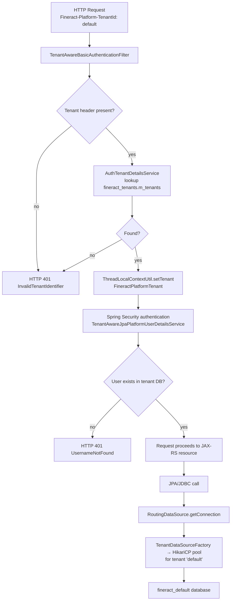

Apache Fineract is a multi-tenant platform at its core. Every inbound HTTP request carries a `Fineract-Platform-TenantId` header that identifies which tenant database the request should be executed against. The platform maintains a central `fineract_tenants` registry database alongside one or more per-tenant databases (e.g., `fineract_default`). A `ThreadLocal` context carries the resolved tenant identity through the request lifecycle so that all downstream JPA and JDBC calls are automatically routed to the correct data source.

<CardGroup cols={2}>
  <Card title="User Administration" icon="users" href="/platform/user-administration">
    AppUser, roles, and permissions are per-tenant
  </Card>
  <Card title="COB Framework" icon="gears" href="/batch/cob-framework">
    How batch jobs inherit tenant context from workers
  </Card>
  <Card title="Scheduled Jobs" icon="clock" href="/batch/scheduled-jobs">
    Tenant context in remote job message dispatch
  </Card>
</CardGroup>

---

## Two-database architecture

```
┌─────────────────────────┐
│   fineract_tenants      │  ← master registry (shared)
│   m_tenants table       │     tenant_id, schema_server, schema_name,
│                         │     schema_username, schema_password, …
└─────────────────────────┘
          │  lookup
          ▼
┌─────────────────────────┐   ┌─────────────────────────┐
│  fineract_default       │   │  fineract_acme_corp      │
│  (tenant DB)            │   │  (another tenant DB)     │
│  m_appuser, m_loan, … │   │  m_appuser, m_loan, … │
└─────────────────────────┘   └─────────────────────────┘
```

The `fineract_tenants` database is specified via `fineract.tenant.*` properties and is a fixed, single connection. Each per-tenant database is discovered at runtime from the `m_tenants` table and backed by a dedicated HikariCP connection pool created by `TenantDataSourceFactory`.

---

## `FineractPlatformTenant` — in-memory tenant descriptor

```java
@Builder
@Getter
public class FineractPlatformTenant implements Serializable {

    private final Long id;
    private final String tenantIdentifier;   // matches the request header value
    private final String name;
    private final String timezoneId;
    private final FineractPlatformTenantConnection connection;
}
```

Source: `fineract-core/src/main/java/org/apache/fineract/infrastructure/core/domain/FineractPlatformTenant.java`

`FineractPlatformTenantConnection` carries JDBC connection parameters including host, port, username, encrypted password, and schema name for both the read-write and optional read-only datasources.

---

## Tenant resolution filter: `TenantAwareBasicAuthenticationFilter`

This filter (in `fineract-security`) extends Spring Security's `BasicAuthenticationFilter` and is the entry point for tenant resolution:

```
Request arrives with header:
  Fineract-Platform-TenantId: default
  Authorization: Basic <base64>

→ TenantAwareBasicAuthenticationFilter.doFilterInternal()
    1. Extract "Fineract-Platform-TenantId" header value
    2. Call basicAuthTenantDetailsService.loadTenantById(tenantIdentifier)
       → queries fineract_tenants.m_tenants
    3. Store FineractPlatformTenant in ThreadLocal via ThreadLocalContextUtil.setTenant()
    4. Set business dates into ThreadLocal (BusinessDateType.BUSINESS_DATE, etc.)
    5. Proceed to Spring Security authentication
```

Source: `fineract-security/src/main/java/org/apache/fineract/infrastructure/security/filter/TenantAwareBasicAuthenticationFilter.java`

```java
private static final String TENANT_ID_REQUEST_HEADER = "Fineract-Platform-TenantId";
```

If the header is missing or the tenant identifier is not found in `m_tenants`, the filter throws `InvalidTenantIdentifierException` and returns HTTP 401.

---

## `ThreadLocalContextUtil` — per-request tenant storage

```java
public final class ThreadLocalContextUtil {

    private static final ThreadLocal<FineractPlatformTenant> tenantContext = new ThreadLocal<>();
    private static final ThreadLocal<HashMap<BusinessDateType, LocalDate>> businessDateContext
        = new ThreadLocal<>();
    private static final ThreadLocal<ActionContext> actionContext = new ThreadLocal<>();
    // ...
}
```

Source: `fineract-core/src/main/java/org/apache/fineract/infrastructure/core/service/ThreadLocalContextUtil.java`

Every layer of the application (services, repositories, batch workers) calls `ThreadLocalContextUtil.getTenant()` to determine which tenant is in scope. **Always clear the ThreadLocal at the end of a request or batch step** — Fineract's filter chain and batch listener infrastructure handles this automatically, but custom extensions must do so manually.

---

## Per-tenant user lookup: `TenantAwareJpaPlatformUserDetailsService`

Spring Security's `UserDetailsService` contract is implemented by `TenantAwareJpaPlatformUserDetailsService`, which looks up users in the *current tenant's* database:

```java
@Service("userDetailsService")
public class TenantAwareJpaPlatformUserDetailsService implements PlatformUserDetailsService {

    @Cacheable(
        value = "usersByUsername",
        key = "T(org.apache.fineract.infrastructure.core.service.ThreadLocalContextUtil)"
            + ".getTenant().getTenantIdentifier().concat(#username+'ubu')"
    )
    public UserDetails loadUserByUsername(String username) {
        final PlatformUser appUser =
            platformUserRepository.findByUsernameAndDeletedAndEnabled(username, false, true);
        if (appUser == null) throw new UsernameNotFoundException(username + ": not found");
        return appUser;
    }
}
```

Source: `fineract-security/src/main/java/org/apache/fineract/infrastructure/security/service/TenantAwareJpaPlatformUserDetailsService.java`

The cache key includes the tenant identifier, so user records from different tenants are never confused even if two tenants have a user with the same username.

---

## Datasource routing: `RoutingDataSource`

`RoutingDataSource` is the primary Spring `DataSource` bean. Every JPA / JDBC operation goes through it:

```java
@Service(value = "dataSource")
@Primary
public class RoutingDataSource extends AbstractDataSource {

    @Autowired
    private RoutingDataSourceServiceFactory dataSourceServiceFactory;

    @Override
    public Connection getConnection() throws SQLException {
        return determineTargetDataSource().getConnection();
    }

    public DataSource determineTargetDataSource() {
        return dataSourceServiceFactory
                   .determineDataSourceService()
                   .retrieveDataSource();
    }
}
```

Source: `fineract-core/src/main/java/org/apache/fineract/infrastructure/core/service/database/RoutingDataSource.java`

`RoutingDataSourceServiceFactory` chooses between the read-write datasource service and the read-only datasource service based on the current request context. Each tenant's connection pool is created lazily by `TenantDataSourceFactory` using HikariCP:

```java
// TenantDataSourceFactory.java
public HikariDataSource create(FineractPlatformTenant tenant) {
    HikariDataSource dataSource = new HikariDataSource();
    dataSource.setMinimumIdle(tenantDataSource.getMinimumIdle());
    dataSource.setMaximumPoolSize(tenantDataSource.getMaximumPoolSize());
    // JDBC URL built from FineractPlatformTenantConnection
    dataSource.setJdbcUrl(toJdbcUrl(...));
    // ...
}
```

Source: `fineract-core/src/main/java/org/apache/fineract/infrastructure/core/service/migration/TenantDataSourceFactory.java`

---

## Configuration reference

### Default tenant properties

```properties
fineract.tenant.host=${FINERACT_DEFAULT_TENANTDB_HOSTNAME:localhost}
fineract.tenant.port=${FINERACT_DEFAULT_TENANTDB_PORT:5432}
fineract.tenant.username=${FINERACT_DEFAULT_TENANTDB_UID:root}
fineract.tenant.password=${FINERACT_DEFAULT_TENANTDB_PWD:postgres}
fineract.tenant.identifier=${FINERACT_DEFAULT_TENANTDB_IDENTIFIER:default}
fineract.tenant.name=${FINERACT_DEFAULT_TENANTDB_NAME:fineract_default}
fineract.tenant.description=${FINERACT_DEFAULT_TENANTDB_DESCRIPTION:Default Demo Tenant}
fineract.tenant.master-password=${FINERACT_DEFAULT_TENANTDB_MASTER_PASSWORD:fineract}
fineract.tenant.encrytion=${FINERACT_DEFAULT_TENANTDB_ENCRYPTION:"AES/CBC/PKCS5Padding"}
fineract.tenant.timezone=${FINERACT_DEFAULT_TENANTDB_TIMEZONE:Asia/Kolkata}
```

### Read-only replica properties

```properties
fineract.tenant.read-only-host=${FINERACT_DEFAULT_TENANTDB_RO_HOSTNAME:}
fineract.tenant.read-only-port=${FINERACT_DEFAULT_TENANTDB_RO_PORT:}
fineract.tenant.read-only-username=${FINERACT_DEFAULT_TENANTDB_RO_UID:}
fineract.tenant.read-only-password=${FINERACT_DEFAULT_TENANTDB_RO_PWD:}
fineract.tenant.read-only-name=${FINERACT_DEFAULT_TENANTDB_RO_NAME:}
```

When `read-only-host` is set, read-API requests are routed to the replica datasource. Batch workers ignore the read-only datasource.

### Connection pool sizing

```properties
fineract.tenant.config.min-pool-size=${FINERACT_CONFIG_MIN_POOL_SIZE:-1}
fineract.tenant.config.max-pool-size=${FINERACT_CONFIG_MAX_POOL_SIZE:-1}
fineract.tenant.config.leak-detection-threshold=${FINERACT_CONFIG_LEAK_DETECTION_THRESHOLD:0}
```

`-1` means HikariCP defaults are used. Set these explicitly in production.

### Instance mode flags

```properties
fineract.mode.read-enabled=${FINERACT_MODE_READ_ENABLED:true}
fineract.mode.write-enabled=${FINERACT_MODE_WRITE_ENABLED:true}
fineract.mode.batch-worker-enabled=${FINERACT_MODE_BATCH_WORKER_ENABLED:true}
fineract.mode.batch-manager-enabled=${FINERACT_MODE_BATCH_MANAGER_ENABLED:true}
```

| Mode combination | Typical use case |
|---|---|
| All `true` | Single-node development / small deployments |
| `read=true, write=false, batch-*=false` | Read-only API replica |
| `read=false, write=false, batch-worker=true, batch-manager=false` | Dedicated COB worker node |
| `read=true, write=true, batch-worker=false, batch-manager=true` | API + COB manager node |

---

## How to add a new tenant

1. **Create the tenant database** in your RDBMS:

   ```sql
   CREATE DATABASE fineract_newtenant;
   ```

2. **Insert a row** into `fineract_tenants.m_tenants` with the connection details:

   ```sql
   INSERT INTO m_tenants (
       identifier, name, timezone_id, country_id, joined_date,
       schema_name, schema_server, schema_server_port,
       schema_username, schema_password, auto_update
   ) VALUES (
       'newtenant', 'New Tenant', 'UTC', NULL, NOW(),
       'fineract_newtenant', 'localhost', '5432',
       'fineract', 'AES_ENCRYPTED_PASSWORD', 1
   );
   ```

3. **Trigger Liquibase migration** for the new schema. On next startup (or via the admin endpoint), Fineract detects new tenants with `auto_update = 1` and applies the full Liquibase changelog to the new database.

4. **Verify** with a request: `GET /fineract-provider/api/v1/offices` with header `Fineract-Platform-TenantId: newtenant`.

<Warning>
Passwords stored in `m_tenants` are AES-encrypted using the `master-password` configured in `fineract.tenant.master-password`. Never store plaintext passwords there.
</Warning>

---

## Request flow diagram


