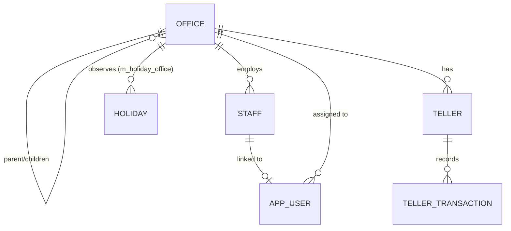

The `org.apache.fineract.organisation` package in `fineract-provider` (and shared domain in `fineract-core`) models the real-world structure of a financial institution. An office hierarchy defines branches and sub-branches, staff are assigned to offices, tellers manage cash at the branch level, and a calendar of working days and holidays controls when transactions and schedules are valid. Every other domain object in Fineract — clients, loans, savings accounts — is ultimately anchored to an office node.

<CardGroup cols={2}>
  <Card title="User Administration" icon="users" href="/platform/user-administration">
    AppUsers are linked to offices and inherit hierarchy access
  </Card>
  <Card title="Multi-Tenancy" icon="building" href="/platform/multi-tenancy">
    Organisation data is per-tenant
  </Card>
  <Card title="Bulk Import" icon="file-import" href="/platform/bulk-import">
    Offices and staff can be batch-imported via Excel
  </Card>
</CardGroup>

---

## Office hierarchy

### `Office` entity

```java
@Entity
@Table(name = "m_office",
       uniqueConstraints = {
           @UniqueConstraint(columnNames = {"name"}, name = "name_org"),
           @UniqueConstraint(columnNames = {"external_id"}, name = "externalid_org")
       })
public class Office extends AbstractPersistableCustom<Long> implements Serializable {

    @OneToMany(fetch = FetchType.LAZY)
    @JoinColumn(name = "parent_id")
    private List<Office> children = new ArrayList<>();

    @ManyToOne(fetch = FetchType.LAZY)
    @JoinColumn(name = "parent_id")
    private Office parent;

    @Column(name = "name", nullable = false, length = 100)
    private String name;

    @Column(name = "hierarchy", length = 50)
    private String hierarchy;         // materialised path, e.g. ".1.3.7."

    @Column(name = "opening_date", nullable = false)
    private LocalDate openingDate;
    // ...
}
```

Source: `fineract-core/src/main/java/org/apache/fineract/organisation/office/domain/Office.java`

The `hierarchy` column is a materialized path string (dot-delimited IDs) that enables efficient subtree queries without recursive CTEs: `WHERE hierarchy LIKE '.1.%'` selects all offices under root 1. The root office has no parent and is always created first during tenant setup.

**Key operations:**
- `CreateOfficeCommandHandler` — inserts with an auto-generated `hierarchy` value.
- `UpdateOfficeCommandHandler` — validates that an office cannot be reparented to one of its own descendants (guarded by `CannotUpdateOfficeWithParentOfficeSameAsSelf`).
- `OfficeTransaction` entity (`m_office_transaction`) — records inter-office fund transfers.

### REST endpoints

| Method | Path | Description |
|---|---|---|
| `GET` | `/v1/offices` | List offices (filtered by hierarchy) |
| `POST` | `/v1/offices` | Create an office |
| `GET` | `/v1/offices/{officeId}` | Get single office |
| `PUT` | `/v1/offices/{officeId}` | Update office |
| `GET` | `/v1/offices/template` | Retrieve parent office options |
| `POST` | `/v1/officetransactions` | Create inter-office transfer |
| `GET` | `/v1/officetransactions` | List inter-office transfers |

Source: `organisation/office/api/OfficesApiResource.java` and `OfficeTransactionsApiResource.java`

---

## Staff

### `Staff` entity

```java
@Entity
@Table(name = "m_staff",
       uniqueConstraints = @UniqueConstraint(columnNames = {"display_name"}))
public class Staff extends AbstractPersistableCustom<Long> {

    @ManyToOne
    @JoinColumn(name = "office_id")
    private Office office;

    @Column(name = "firstname")
    private String firstname;

    @Column(name = "lastname")
    private String lastname;

    @Column(name = "display_name", nullable = false)
    private String displayName;   // computed as "lastname, firstname"

    @Column(name = "is_loan_officer")
    private boolean loanOfficer;

    @Column(name = "mobile_no")
    private String mobileNo;
    // ...
}
```

Source: `fineract-core/src/main/java/org/apache/fineract/organisation/staff/domain/Staff.java`

Staff members are linked to exactly one office. The `is_loan_officer` flag makes them selectable as the loan officer on a loan product. `AppUser` records can optionally reference a `Staff` record to link a login identity to an organisational role.

### REST endpoints

| Method | Path | Description |
|---|---|---|
| `GET` | `/v1/staff` | List staff (with `?officeId=`, `?loanOfficersOnly=` filters) |
| `POST` | `/v1/staff` | Create staff member |
| `GET` | `/v1/staff/{staffId}` | Get single staff |
| `PUT` | `/v1/staff/{staffId}` | Update staff |

---

## Tellers and cash management

Teller management lives in the `fineract-branch` module at `org.apache.fineract.organisation.teller`.

### `Teller` entity

```java
@Entity
@Table(name = "m_tellers")
public class Teller extends AbstractPersistableCustom<Long> {

    @ManyToOne
    @JoinColumn(name = "office_id")
    private Office office;

    @ManyToOne
    @JoinColumn(name = "staff_id")
    private Staff staff;             // the teller operator

    @Column(name = "name", nullable = false)
    private String name;

    @Column(name = "description")
    private String description;

    @Enumerated(EnumType.STRING)
    @Column(name = "state")
    private TellerStatus status;     // ACTIVE | INACTIVE | PENDING
    // ...
}
```

Source: `fineract-branch/src/main/java/org/apache/fineract/organisation/teller/domain/Teller.java`

### `TellerTransaction` entity

`TellerTransaction` (table `m_teller_transactions`) records individual cash-in / cash-out operations performed at a teller. Each transaction is typed (`DEPOSIT`, `WITHDRAWAL`, `INWARD_REMITTANCE`, `OUTWARD_REMITTANCE`, `REVERSAL`) and linked to an optional `Cashier` intermediary.

### REST endpoints

| Method | Path | Description |
|---|---|---|
| `GET` | `/v1/tellers` | List tellers (with `?officeId=` filter) |
| `POST` | `/v1/tellers` | Create teller |
| `PUT` | `/v1/tellers/{tellerId}` | Update teller |
| `DELETE` | `/v1/tellers/{tellerId}` | Delete teller |
| `GET` | `/v1/tellers/{tellerId}/cashiers` | List cashiers for a teller |
| `POST` | `/v1/tellers/{tellerId}/cashiers` | Allocate a cashier |
| `GET` | `/v1/tellers/{tellerId}/transactions` | Teller transaction history |

---

## Monetary and currency configuration

### `Currency` and `ApplicationCurrency`

Currency support is in `org.apache.fineract.organisation.monetary`. The `ApplicationCurrency` entity (`m_currency`) stores:
- ISO 4217 currency code (e.g., `USD`, `KES`)
- Name and namecode for display
- Decimal places and in-multiples-of rounding
- The currency display symbol

A tenant can enable multiple currencies. Loan and savings products reference a specific currency code.

### REST endpoints

| Method | Path | Description |
|---|---|---|
| `GET` | `/v1/currencies` | List all application currencies |
| `PUT` | `/v1/currencies` | Update the set of enabled currencies |

Source: `organisation/monetary/` in `fineract-provider`

---

## Working days

### `WorkingDays` entity

```java
@Entity
@Table(name = "m_working_days")
public class WorkingDays extends AbstractPersistableCustom<Long> {

    @Column(name = "recurrence", nullable = false)
    private String recurrence;    // iCalendar RRULE, e.g. FREQ=WEEKLY;BYDAY=MO,TU,WE,TH,FR

    @Column(name = "repayment_rescheduling_enum")
    private Integer repaymentReschedulingType;
    // SAME_DAY=1, MOVE_TO_NEXT_WORKING_DAY=2, MOVE_TO_NEXT_REPAYMENT_MEETING_DAY=3,
    // MOVE_TO_PREVIOUS_WORKING_DAY=4
    // ...
}
```

Source: `fineract-core/src/main/java/org/apache/fineract/organisation/workingdays/domain/WorkingDays.java`

The `recurrence` field is an iCalendar `RRULE` expression. A typical 5-day working week is `FREQ=WEEKLY;BYDAY=MO,TU,WE,TH,FR`. When a loan installment falls on a non-working day, `repaymentReschedulingType` determines how the due date is adjusted.

### REST endpoints

| Method | Path | Description |
|---|---|---|
| `GET` | `/v1/workingdays` | Get working days configuration |
| `PUT` | `/v1/workingdays` | Update working days |
| `GET` | `/v1/workingdays/template` | Get rescheduling type options |

---

## Holidays

### `Holiday` entity

```java
@Entity
@Table(name = "m_holiday")
public class Holiday extends AbstractPersistableCustom<Long> {

    @Column(name = "name", nullable = false, length = 100)
    private String name;

    @Column(name = "from_date", nullable = false)
    private LocalDate fromDate;

    @Column(name = "to_date", nullable = false)
    private LocalDate toDate;

    @Column(name = "repayments_rescheduled_to")
    private LocalDate repaymentsRescheduledTo;

    @Column(name = "status_enum")
    private Integer status;   // 100=PENDING, 300=ACTIVE, 500=DELETED

    @ManyToMany
    @JoinTable(name = "m_holiday_office",
               joinColumns = @JoinColumn(name = "holiday_id"),
               inverseJoinColumns = @JoinColumn(name = "office_id"))
    private Set<Office> offices;  // which offices observe this holiday
    // ...
}
```

Source: `fineract-core/src/main/java/org/apache/fineract/organisation/holiday/domain/Holiday.java`

Holidays are scoped to one or more offices (via `m_holiday_office`). When a loan installment falls within a holiday's `fromDate..toDate` range, the repayment is rescheduled to `repaymentsRescheduledTo`. Holidays must be explicitly activated (`status = 300`) before they take effect — creating a holiday in `PENDING` state allows review before activation.

The `ActivateHolidayCommandHandler`, `CreateHolidayCommandHandler`, `UpdateHolidayCommandHandler`, and `DeleteHolidayCommandHandler` are in `organisation/holiday/handler/`.

### REST endpoints

| Method | Path | Description |
|---|---|---|
| `GET` | `/v1/holidays?officeId={id}` | List holidays for an office |
| `POST` | `/v1/holidays` | Create holiday |
| `GET` | `/v1/holidays/{holidayId}` | Get single holiday |
| `PUT` | `/v1/holidays/{holidayId}` | Update holiday |
| `DELETE` | `/v1/holidays/{holidayId}` | Delete holiday |
| `POST` | `/v1/holidays/{holidayId}?command=activate` | Activate a pending holiday |

---

## Provisioning criteria

`ProvisioningCriteria` (`m_provisioning_criteria`) is configured at the organisation level and linked to loan products. It defines the loan loss provisioning buckets (current, watch, substandard, doubtful, loss) with their corresponding percentage provisions. Although managed via `organisation/provisioning/api/ProvisioningCriteriaApiResource`, it is referenced primarily from the loans domain during journal entry generation for provisions.

### REST endpoints

| Method | Path | Description |
|---|---|---|
| `GET` | `/v1/provisioningcriteria` | List provisioning criteria |
| `POST` | `/v1/provisioningcriteria` | Create criteria |
| `PUT` | `/v1/provisioningcriteria/{criteriaId}` | Update criteria |
| `DELETE` | `/v1/provisioningcriteria/{criteriaId}` | Delete criteria |

---

## Organisation entity relationship


