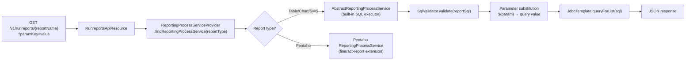

Fineract's reporting infrastructure has two complementary mechanisms: **Stretchy Reports** — parameterized SQL queries stored in the `stretchy_report` table and executed on demand — and **Datatables** — dynamic extension tables that attach extra columns to any core entity. On top of these, a `ReportMailingJob` scheduler can deliver reports by email on a recurring basis. The `fineract-report` module provides the `ReportingProcessService` SPI that allows plugging alternative report engines (e.g., Pentaho) alongside the built-in SQL renderer.

<CardGroup cols={2}>
  <Card title="Scheduled Jobs" icon="clock" href="/batch/scheduled-jobs">
    Report mailing is executed as a scheduled job
  </Card>
  <Card title="Multi-Tenancy" icon="building" href="/platform/multi-tenancy">
    Reports and datatables are per-tenant
  </Card>
  <Card title="Bulk Import" icon="file-import" href="/platform/bulk-import">
    Bulk import uses datatables for error tracking
  </Card>
</CardGroup>

---

## `Report` entity (Stretchy Reports)

The core report entity maps to the `stretchy_report` table:

```java
@Entity
@Table(name = "stretchy_report",
       uniqueConstraints = @UniqueConstraint(columnNames = {"report_name"}))
public final class Report extends AbstractPersistableCustom<Long> {

    @Column(name = "report_name", nullable = false, unique = true)
    private String reportName;

    @Column(name = "report_type", nullable = false)
    private String reportType;       // "Table", "Chart", "SMS", "Pentaho"

    @Column(name = "report_subtype")
    private String reportSubType;    // e.g., "Bar", "Pie" for Chart type

    @Column(name = "report_category")
    private String reportCategory;   // grouping label in the UI

    @Column(name = "report_sql")
    private String reportSql;        // parameterized SQL with ${param} placeholders

    @Column(name = "core_report")
    private boolean coreReport;      // seeded by Liquibase, not user-deletable

    @Column(name = "use_report")
    private boolean useReport;       // whether report appears in the UI list

    @OneToMany(cascade = CascadeType.ALL, mappedBy = "report")
    private Set<ReportParameterUsage> reportParameterUsages;
    // ...
}
```

Source: `fineract-provider/src/main/java/org/apache/fineract/infrastructure/dataqueries/domain/Report.java`

### Report types

| `report_type` value | Description |
|---|---|
| `Table` | Executes `report_sql` and returns rows as JSON |
| `Chart` | Same as Table but hints the UI to render a chart |
| `SMS` | Used for SMS campaign template substitution |
| `Pentaho` | Delegates to Pentaho PRD engine (requires `fineract-report` extension) |

### `ReportParameter` and `ReportParameterUsage`

Report SQL can reference named parameters in the form `${parameterName}`. These are declared via `ReportParameterUsage` records (table `stretchy_report_parameter`) that link a `ReportParameter` (table `stretchy_parameter`) to a report. The `RunreportsApiResource` substitutes actual values from the query string before execution.

SQL injection is prevented by `SqlValidator` — all report SQL is validated against a whitelist of allowed statement patterns before execution.

---

## Report lifecycle



---

## `ReportingProcessService` SPI

The `fineract-report` module defines the SPI:

```java
// fineract-report/src/main/java/org/apache/fineract/infrastructure/report/service/ReportingProcessService.java
public interface ReportingProcessService {

    Response processRequest(String reportName, MultivaluedMap<String, String> queryParams);
}
```

Implementations are annotated with `@ReportService(type = "Pentaho")` (or other type strings). `ReportingProcessServiceProvider` discovers all beans of this type and routes by the `report_type` column value at runtime.

```java
// AbstractReportingProcessService provides shared SQL-execution logic
// for Table, Chart, and SMS report types.
public abstract class AbstractReportingProcessService implements ReportingProcessService {
    // ...
}
```

Source: `fineract-report/src/main/java/org/apache/fineract/infrastructure/report/`

---

## Datatables

Datatables are dynamically created extension tables that can be associated with any registered Fineract entity (loan, client, savings account, etc.). They provide a schema-per-tenant extensibility mechanism without requiring code changes.

### How datatables work

1. A user defines a datatable via `POST /v1/datatables` specifying column names and types.
2. Fineract executes a `CREATE TABLE` DDL statement in the tenant's database creating a table named after the datatable.
3. Every row in the datatable has a foreign key back to the entity it extends (e.g., `loan_id`).
4. Read and write operations go through `DatatablesApiResource` using dynamic SQL generated from the schema.

### REST endpoints

| Method | Path | Description |
|---|---|---|
| `GET` | `/v1/datatables` | List datatables (optionally filtered by `?apptable=`) |
| `POST` | `/v1/datatables` | Create a datatable (runs DDL) |
| `GET` | `/v1/datatables/{datatableName}` | Get datatable schema |
| `DELETE` | `/v1/datatables/{datatableName}` | Drop the datatable |
| `GET` | `/v1/datatables/{datatableName}/{entityId}` | Read rows for an entity |
| `POST` | `/v1/datatables/{datatableName}/{entityId}` | Insert row(s) |
| `PUT` | `/v1/datatables/{datatableName}/{entityId}` | Update row |
| `DELETE` | `/v1/datatables/{datatableName}/{entityId}` | Delete row |

Source: `fineract-provider/src/main/java/org/apache/fineract/infrastructure/dataqueries/api/DatatablesApiResource.java`

### `EntityDatatableChecks`

`EntityDatatableChecksApiResource` (`/v1/entityDatatableChecks`) allows operators to mandate that certain datatables are filled in before a workflow action completes (e.g., a custom KYC datatable must be populated before a loan can be approved).

<Note>
Datatable column types are mapped to database-agnostic types (`String`, `Number`, `Decimal`, `Boolean`, `Date`, `DateTime`, `Text`). Fineract translates these to the appropriate dialect-specific SQL types for MySQL/PostgreSQL.
</Note>

---

## Reports REST API

### Managing report definitions

| Method | Path | Description |
|---|---|---|
| `GET` | `/v1/reports` | List all reports |
| `POST` | `/v1/reports` | Create a report |
| `GET` | `/v1/reports/{reportId}` | Get report definition |
| `PUT` | `/v1/reports/{reportId}` | Update report SQL or parameters |
| `DELETE` | `/v1/reports/{reportId}` | Delete a non-core report |

Source: `fineract-provider/src/main/java/org/apache/fineract/infrastructure/dataqueries/api/ReportsApiResource.java`

### Running reports

| Method | Path | Description |
|---|---|---|
| `GET` | `/v1/runreports/{reportName}` | Execute report; returns JSON or binary (Pentaho PDF/Excel) |

Query parameters map to `${paramName}` placeholders in the SQL. Example:

```
GET /v1/runreports/LoanListByOffice?R_officeId=5&R_dateFrom=2024-01-01&R_dateTo=2024-12-31
```

The `R_` prefix is the conventional naming for report parameters and is stripped before substitution.

---

## Report mailing jobs

`ReportMailingJob` (table `m_report_mailing_job`) pairs a `Report` with a delivery schedule and email recipient list:

```java
@Entity
@Table(name = "m_report_mailing_job",
       uniqueConstraints = @UniqueConstraint(columnNames = {"name"}))
public class ReportMailingJob extends AbstractAuditableCustom {

    @Column(name = "name", nullable = false)
    private String name;

    @ManyToOne
    @JoinColumn(name = "stretchy_report_id")
    private Report stretchyReport;      // which report to run

    @Column(name = "start_datetime", nullable = false)
    private LocalDateTime startDatetime;

    @Column(name = "recurrence")
    private String recurrence;          // iCalendar RRULE for schedule

    @Column(name = "email_recipients", nullable = false)
    private String emailRecipients;     // comma-separated email addresses

    @Column(name = "email_subject")
    private String emailSubject;

    @Column(name = "email_message")
    private String emailMessage;

    @Enumerated(EnumType.STRING)
    @Column(name = "email_attachment_file_format")
    private ReportMailingJobEmailAttachmentFileFormat emailAttachmentFileFormat;
    // XLS, XLSX, CSV, PDF
    // ...
}
```

Source: `fineract-provider/src/main/java/org/apache/fineract/infrastructure/reportmailingjob/domain/ReportMailingJob.java`

The `Report Mailing Job` scheduled job (see [Scheduled Jobs](/batch/scheduled-jobs)) queries for all active `ReportMailingJob` records whose `next_run_datetime` has passed, executes each report, and emails the result as an attachment using the SMTP configuration in `ExternalServicesProperties`.

### REST endpoints

| Method | Path | Description |
|---|---|---|
| `GET` | `/v1/reportmailingjobs` | List all mailing jobs |
| `POST` | `/v1/reportmailingjobs` | Create mailing job |
| `GET` | `/v1/reportmailingjobs/{jobId}` | Get single mailing job |
| `PUT` | `/v1/reportmailingjobs/{jobId}` | Update mailing job |
| `DELETE` | `/v1/reportmailingjobs/{jobId}` | Delete mailing job |

---

## MIX reporting (`fineract-mix`)

The `fineract-mix` module generates XBRL reports compatible with the Microfinance Information Exchange (MIX) standard. It reads `MixReportXBRLNamespace` records (table `m_mix_xbrl_namespace`) and produces structured XML output. This module is separate from the core report infrastructure and has its own REST resource and domain. It is not commonly used in new deployments.

---

## `FineractReportProperties`

Report-related tuning is under `fineract.report.*` in `FineractProperties`. These control timeout thresholds and maximum row counts for SQL report execution to prevent runaway queries from impacting production databases.

<Warning>
Report SQL is executed with the tenant's read-write credentials unless a read-only datasource is configured. For complex or slow reports, configure `fineract.tenant.read-only-*` to route report execution to a replica.
</Warning>
