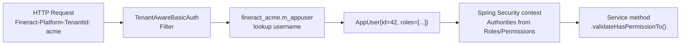

User administration in Fineract is handled by the `org.apache.fineract.useradministration` package in `fineract-provider`, with shared domain classes in `fineract-core`. Every user belongs to a specific tenant and is authenticated against that tenant's database — there is no cross-tenant user identity. Role-based access control (RBAC) is implemented through `Role` and `Permission` entities: a user may hold multiple roles, and each role grants a set of fine-grained permissions that gate individual API operations.

<CardGroup cols={2}>
  <Card title="Multi-Tenancy" icon="building" href="/platform/multi-tenancy">
    Users are per-tenant; TenantAwareJpaPlatformUserDetailsService
  </Card>
  <Card title="Organisation" icon="sitemap" href="/platform/organisation">
    AppUsers are assigned to an Office in the hierarchy
  </Card>
</CardGroup>

---

## `AppUser` entity

```java
@Entity
@Table(name = "m_appuser",
       uniqueConstraints = @UniqueConstraint(columnNames = {"username"}, name = "username_org"))
public class AppUser extends AbstractPersistableCustom<Long> implements PlatformUser {

    @Column(name = "email", nullable = false, length = 100)
    private String email;

    @Column(name = "username", nullable = false, length = 100)
    private String username;

    @Column(name = "password", nullable = false)
    private String password;            // BCrypt or PBKDF2 hashed

    @Column(name = "nonexpired")
    private boolean accountNonExpired;

    @Column(name = "nonlocked")
    private boolean accountNonLocked;

    @Column(name = "failed_login_attempts")
    private int failedLoginAttempts;

    @Column(name = "is_login_retries_enabled")
    private boolean loginRetryLimitEnabled;

    @Column(name = "nonexpired_credentials")
    private boolean credentialsNonExpired;

    @Column(name = "enabled")
    private boolean enabled;

    @ManyToOne
    @JoinColumn(name = "office_id")
    private Office office;              // office-level access scope

    @ManyToOne
    @JoinColumn(name = "staff_id")
    private Staff staff;                // optional link to Staff entity

    @ManyToMany(fetch = FetchType.EAGER)
    @JoinTable(name = "m_appuser_role",
               joinColumns = @JoinColumn(name = "appuser_id"),
               inverseJoinColumns = @JoinColumn(name = "role_id"))
    private Set<Role> roles;
    // ...
}
```

Source: `fineract-core/src/main/java/org/apache/fineract/useradministration/domain/AppUser.java`

`AppUser` implements Spring Security's `UserDetails` via the `PlatformUser` interface, so it is returned directly from `TenantAwareJpaPlatformUserDetailsService.loadUserByUsername()`. The `GrantedAuthority` list is derived by collecting all `Permission` records across all assigned `Role` objects.

<Note>
The `username` uniqueness constraint is scoped to the tenant database, not globally. Two different tenants can have a user named `admin` without conflict.
</Note>

---

## `Role` entity

```java
@Entity
@Table(name = "m_role")
public class Role extends AbstractPersistableCustom<Long> {

    @Column(name = "name", nullable = false, length = 100)
    private String name;

    @Column(name = "description", nullable = false)
    private String description;

    @Column(name = "is_disabled")
    private Boolean disabled;   // soft-disable without deleting

    @ManyToMany(fetch = FetchType.EAGER)
    @JoinTable(name = "m_role_permission",
               joinColumns = @JoinColumn(name = "role_id"),
               inverseJoinColumns = @JoinColumn(name = "permission_id"))
    private Set<Permission> permissions;
    // ...
}
```

Source: `fineract-core/src/main/java/org/apache/fineract/useradministration/domain/Role.java`

Roles are many-to-many with both users (`m_appuser_role`) and permissions (`m_role_permission`). A disabled role (`is_disabled = true`) is excluded from the authority collection during Spring Security authentication — effectively revoking all permissions granted by that role without removing it.

---

## `Permission` entity

```java
@Entity
@Table(name = "m_permission")
public class Permission extends AbstractPersistableCustom<Long> {

    @Column(name = "grouping", nullable = false, length = 45)
    private String grouping;     // e.g. "loan", "savings", "report"

    @Column(name = "code", nullable = false, length = 100)
    private String code;         // e.g. "CREATE_LOAN", "READ_LOAN", "APPROVE_LOAN"

    @Column(name = "entity_name", length = 100)
    private String entityName;

    @Column(name = "action_name", length = 100)
    private String actionName;   // e.g. "CREATE", "READ", "APPROVE", "REJECT"

    @Column(name = "can_maker_checker")
    private boolean canMakerChecker;  // eligible for four-eyes approval
    // ...
}
```

Source: `fineract-core/src/main/java/org/apache/fineract/useradministration/domain/Permission.java`

Permissions follow an `{ACTION}_{ENTITY}` naming convention. The `PlatformSecurityContext.authenticatedUser().hasNotPermissionForAnyOf(...)` guard is called at the start of each service method to enforce authorization. Special super-user permission `ALL_FUNCTIONS` bypasses all individual checks.

---

## Password policy

### `PasswordValidationPolicy` entity

```java
@Entity
@Table(name = "m_password_validation_policy")
public class PasswordValidationPolicy extends AbstractPersistableCustom<Long> {

    @Column(name = "regex", nullable = false)
    private String regex;        // Java regex for minimum complexity

    @Column(name = "description")
    private String description;

    @Column(name = "active")
    private boolean active;      // only one policy can be active at a time
    // ...
}
```

Source: `fineract-provider/src/main/java/org/apache/fineract/useradministration/domain/PasswordValidationPolicy.java`

### `AppUserPreviousPassword` entity

The platform tracks password history to prevent reuse. `AppUserPreviousPassword` (table `m_appuser_previous_password`) stores hashed previous passwords. `PasswordPreviouslyUsedException` is thrown if a new password matches any stored hash.

### Force-reset and expiry

`AppUser` fields:
- `firstTimeLoginRemaining` — forces a password change before any API call proceeds (column: `firsttime_login_remaining`).
- `credentialsNonExpired` — set to `false` when the password expires; the user is redirected to the change-password endpoint.
- `failedLoginAttempts` — incremented on each bad password; `loginRetryLimitEnabled` controls whether the account locks after a threshold.

---

## Command handlers

All write operations on users and roles go through the CQRS command bus in `useradministration/handler/`:

| Handler class | Command | Description |
|---|---|---|
| `CreateUserCommandHandler` | `CREATE_APPUSER` | Validates, hashes password, persists `AppUser` |
| `ChangeUserPasswordCommandHandler` | `UPDATE_APPUSER_PASSWORD` | Validates complexity, checks history, updates hash |
| `DeleteUserCommandHandler` | `DELETE_APPUSER` | Soft-delete (sets `deleted = true`) |
| `CreateRoleCommandHandler` | `CREATE_ROLE` | Creates role and seeds empty permission set |
| `UpdateRoleCommandHandler` | `UPDATE_ROLE` | Renames role or changes description |
| `DeleteRoleCommandHandler` | `DELETE_ROLE` | Fails if role is assigned to any user |
| `EnableRoleCommandHandler` | `ENABLE_ROLE` | Sets `is_disabled = false` |
| `DisableRoleCommandHandler` | `DISABLE_ROLE` | Sets `is_disabled = true` |
| `UpdateMakerCheckerPermissionsCommandHandler` | `PERMISSIONS` | Updates `canMakerChecker` flag per permission |
| `UpdatePasswordPreferencesCommandHandler` | `UPDATE_PASSWORD_PREFERENCES` | Changes active password policy |

---

## `AppUserRepository`

`AppUserRepository` (Spring Data JPA) lives in `fineract-provider` at `useradministration/domain/`. Key query methods:

```java
AppUser findByUsernameAndDeletedAndEnabled(String username, boolean deleted, boolean enabled);
```

This is the lookup called by `TenantAwareJpaPlatformUserDetailsService` during authentication. The cache key includes the tenant identifier (from `ThreadLocalContextUtil`) to prevent cross-tenant leakage.

---

## Spring Security integration

`AppUser` implements `org.apache.fineract.infrastructure.security.domain.PlatformUser`, which extends `org.springframework.security.core.userdetails.UserDetails`. The authority list is built from permissions:

```java
// In AppUser.populateGrantedAuthorities():
for (final Role role : this.roles) {
    final Collection<Permission> permissions = role.getPermissions();
    for (final Permission permission : permissions) {
        grantedAuthorities.add(new SimpleGrantedAuthority(permission.getCode()));
    }
}
```

Service methods guard themselves with `PlatformSecurityContext`:

```java
// Example in a service method:
context.authenticatedUser().validateHasPermissionTo("CREATE_LOAN");
// Throws NoAuthorizationException if the permission is absent.
```

The `PlatformSecurityContext` bean is injected wherever authorization is needed. It calls `SecurityContextHolder.getContext().getAuthentication().getPrincipal()` to retrieve the current `AppUser`.

---

## REST API

### User management

| Method | Path | Description |
|---|---|---|
| `GET` | `/v1/users` | List users |
| `POST` | `/v1/users` | Create user |
| `GET` | `/v1/users/{userId}` | Get single user |
| `PUT` | `/v1/users/{userId}` | Update user (incl. role assignment) |
| `DELETE` | `/v1/users/{userId}` | Soft-delete user |

Source: `useradministration/api/UsersApiResource.java`

### Role management

| Method | Path | Description |
|---|---|---|
| `GET` | `/v1/roles` | List roles |
| `POST` | `/v1/roles` | Create role |
| `GET` | `/v1/roles/{roleId}` | Get role with permission list |
| `PUT` | `/v1/roles/{roleId}` | Update role |
| `DELETE` | `/v1/roles/{roleId}` | Delete role |
| `GET` | `/v1/roles/{roleId}/permissions` | Get permissions for role |
| `PUT` | `/v1/roles/{roleId}/permissions` | Update permission assignments |
| `POST` | `/v1/roles/{roleId}?command=enable` | Enable a disabled role |
| `POST` | `/v1/roles/{roleId}?command=disable` | Disable a role |

Source: `useradministration/api/RolesApiResource.java`

### Permission list

| Method | Path | Description |
|---|---|---|
| `GET` | `/v1/permissions` | List all permissions (with `canMakerChecker` flag) |
| `PUT` | `/v1/permissions` | Bulk-update `canMakerChecker` flags |

### Password management

| Method | Path | Description |
|---|---|---|
| `POST` | `/v1/users/{userId}?command=updatePassword` | Change own password |
| `GET` | `/v1/passwordpreferences` | Get active password policy |
| `PUT` | `/v1/passwordpreferences` | Switch active password policy |
| `POST` | `/v1/forgotpassword` | Initiate password reset flow |

---

## Multi-tenant isolation summary



<Warning>
`AppUser` objects are cached in Spring Cache with key `tenantId + username`. If you modify a user's roles directly in the database (bypassing the API), flush the cache (`/v1/caches?command=clearCache`) or restart the node to avoid stale authority sets.
</Warning>
