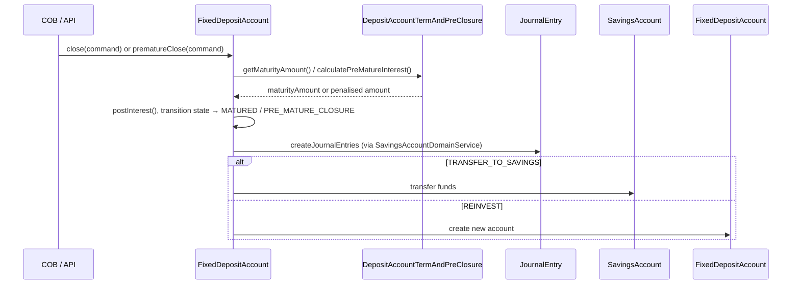

Fixed Deposit (FD) and Recurring Deposit (RD) accounts are specialised savings instruments with a defined term. Both are modelled as subclasses of `SavingsAccount` using single-table inheritance, adding product-level configuration via `FixedDepositProduct` / `RecurringDepositProduct` and a dedicated term entity `DepositAccountTermAndPreClosure`. All domain classes live in the `fineract-savings` and `fineract-provider` modules under `org.apache.fineract.portfolio.savings`.

<CardGroup cols={2}>
  <Card title="Savings Accounts" icon="piggy-bank" href="/savings/savings-accounts">
    Base SavingsAccount entity, lifecycle states, and transaction types
  </Card>
  <Card title="Journal Entries" icon="receipt" href="/accounting/journal-entries">
    How maturity postings and pre-closure penalties land in the GL
  </Card>
</CardGroup>

---

## Inheritance hierarchy

```
m_savings_account (deposit_type_enum discriminator)
  ├── 100 → SavingsAccount           (fineract-savings)
  ├── 200 → FixedDepositAccount      (fineract-provider)
  └── 300 → RecurringDepositAccount  (fineract-provider)
```

The discriminator is the `deposit_type_enum` column. Both FD and RD classes use `@DiscriminatorValue` to claim their partition:

```java
// FixedDepositAccount.java (fineract-provider)
@Entity
@DiscriminatorValue("200")
public class FixedDepositAccount extends SavingsAccount { ... }

// RecurringDepositAccount.java (fineract-provider)
@Entity
@DiscriminatorValue("300")
public class RecurringDepositAccount extends SavingsAccount { ... }
```

<Note>
Both classes override interest calculation and maturity logic. The parent `SavingsAccount` provides all shared columns and the full account lifecycle (approve → activate → mature / close). See [Savings Accounts](/savings/savings-accounts) for the base entity field reference.
</Note>

---

## Product classes

### `FixedDepositProduct`

**Source:** `fineract-savings/.../savings/domain/FixedDepositProduct.java`

`FixedDepositProduct` extends `SavingsProduct` and holds a reference to a `DepositProductTermAndPreClosure` (per-product default term settings) and the list of `InterestRateChart` entries that govern tiered interest.

| Field | Description |
|---|---|
| `depositProductTermAndPreClosure` | Default term period, min/max deposit, pre-closure penalty config |
| `charts` | `Set<InterestRateChart>` — one or more tiered rate charts |
| `minDepositTerm` / `maxDepositTerm` | Constraint on allowed tenures |
| `depositAmountDetails` | Optional min/max/default deposit principal (`DepositProductAmountDetails`) |

### `RecurringDepositProduct`

**Source:** `fineract-savings/.../savings/domain/RecurringDepositProduct.java`

Adds `DepositProductRecurringDetail` (mandatory vs optional instalment, allowed flexible deposits) on top of `FixedDepositProduct`'s structure. The recurring instalment schedule is driven by `RecurringDepositScheduleInstallment` rows on the account.

---

## Term and pre-closure: `DepositAccountTermAndPreClosure`

**Source:** `fineract-savings/.../savings/domain/DepositAccountTermAndPreClosure.java`  
**Table:** `m_deposit_account_term_and_preclosure`

This entity is a `@OneToOne` on both `FixedDepositAccount` and `RecurringDepositAccount`. It stores the per-account term configuration:

| Column | Java field | Purpose |
|---|---|---|
| `deposit_amount` | `depositAmount` | Principal deposited |
| `maturity_amount` | `maturityAmount` | Computed maturity payout |
| `maturity_date` | `maturityDate` | Derived maturity date |
| `deposit_period` | `depositPeriod` | Numeric length of the term |
| `deposit_period_frequency_enum` | – | Period unit (months, years, etc.) |
| `on_account_closure_id` | – | Closure action code (`DepositAccountOnClosureType`) |
| `transfer_to_savings_account_id` | – | Target savings account for maturity transfer |
| `transfer_interest_to_savings` | – | Whether interest-only is transferred |
| `maturity_instruction_id` | – | Per-account override of the closure action |
| `expected_first_deposit_on_date` | – | (RD only) First instalment due date |

### Maturity closure types (`DepositAccountOnClosureType`)

```java
// fineract-core/.../savings/DepositAccountOnClosureType.java
public enum DepositAccountOnClosureType {
    WITHDRAW_DEPOSIT(100, ...),
    TRANSFER_TO_SAVINGS(200, ...),
    REINVEST_PRINCIPAL_AND_INTEREST(300, ...),
    REINVEST_PRINCIPAL_ONLY(400, ...);
}
```

- **`WITHDRAW_DEPOSIT`** — Full principal + interest is disbursed to the client.
- **`TRANSFER_TO_SAVINGS`** — Funds are moved to a nominated savings account (`transfer_to_savings_account_id`).
- **`REINVEST_PRINCIPAL_AND_INTEREST`** — Auto-renewal: a new FD/RD is created for principal + interest.
- **`REINVEST_PRINCIPAL_ONLY`** — Auto-renewal: a new FD/RD is created for principal; interest is paid out separately.

<Warning>
Auto-renewal creates a new account entity with a fresh `account_no`. The original account transitions to `CLOSED` or `MATURED`. Ensure downstream systems listen to both the `SavingsAccountActivatedBusinessEvent` and `SavingsAccountMaturedBusinessEvent` if they need to track the chain.
</Warning>

---

## Interest rate charts with pre-closure penalty slabs

FD/RD accounts replace the flat `nominalAnnualInterestRate` of the base savings account with a chart lookup. The chart is attached to the account via `DepositAccountInterestRateChart` (an account-level copy) which mirrors the product-level `InterestRateChart`.

**Table:** `m_deposit_account_interest_rate_chart`  
**Source:** `fineract-savings/.../savings/domain/DepositAccountInterestRateChart.java`

Each slab (`DepositAccountInterestRateChartSlabs`, table `m_deposit_account_interest_rate_slab`) contributes:

| Slab field | Purpose |
|---|---|
| `from_period` / `to_period` | Tenure range the rate applies to |
| `annual_interest_rate` | Rate for normal maturity |
| `period_type_enum` | Period unit |
| `amount_range_from` / `amount_range_to` | Optional principal band |

**Pre-closure** applies a penalty when the account is closed before maturity. The penalty is configured on the product's `DepositPreClosureDetail` (stored in `m_deposit_account_term_and_preclosure`):

- `pre_closure_penal_applicable` — boolean toggle
- `pre_closure_penal_interest` — percentage reduction (e.g. 1.0 = subtract 1% from the applicable slab rate)
- `pre_closure_penal_interest_on_type_enum` — whether the penalty applies to the `WHOLE_TERM` rate or the `TILL_PREMATURE_WITHDRAWAL` rate

The combined effective rate = `slabRate - penaltyRate` (floored at 0).

---

## Deposit product packages

| Package | Location | Contents |
|---|---|---|
| `portfolio.savings.domain` | `fineract-savings` | `FixedDepositProduct`, `RecurringDepositProduct`, `DepositAccountTermAndPreClosure`, `DepositProductAssembler`, etc. |
| `portfolio.savings.domain` | `fineract-provider` | `FixedDepositAccount`, `RecurringDepositAccount` |
| `portfolio.savings.service` | `fineract-savings` | `DepositProductReadPlatformService`, `FixedDepositProductWritePlatformService`, `RecurringDepositProductWritePlatformService`, `DepositAccountWritePlatformService`, `DepositApplicationProcessWritePlatformService` |
| `portfolio.savings.api` | `fineract-provider` | `FixedDepositAccountsApiResource`, `RecurringDepositAccountsApiResource`, `FixedDepositProductsApiResource`, `RecurringDepositProductsApiResource` |

---

## Maturity and pre-mature closure flow



The `DepositAccountPreMatureCalculationPlatformService` interface (in `fineract-savings`) provides a read-only preview of the pre-mature amount before the destructive close is committed.

---

## REST endpoints

### Fixed Deposit Accounts

Base path: `/fineract-provider/api/v1/fixeddepositaccounts`

| Method | Path | Action |
|---|---|---|
| `POST` | `/fixeddepositaccounts` | Submit FD application |
| `GET` | `/fixeddepositaccounts/{accountId}` | Retrieve FD account |
| `PUT` | `/fixeddepositaccounts/{accountId}` | Update FD account |
| `POST` | `/fixeddepositaccounts/{accountId}/transactions` | Deposit / withdrawal / close / premature close |
| `GET` | `/fixeddepositaccounts/{accountId}/transactions/{transactionId}` | Retrieve transaction |

### Recurring Deposit Accounts

Base path: `/fineract-provider/api/v1/recurringdepositaccounts`

Same shape as FD: `POST`, `GET`, `PUT` on the collection/instance, `POST /transactions` for all transaction types.

### Fixed Deposit Products

Base path: `/fineract-provider/api/v1/fixeddepositproducts`

| Method | Path | Action |
|---|---|---|
| `POST` | `/fixeddepositproducts` | Create product |
| `GET` | `/fixeddepositproducts` | List all products |
| `GET` | `/fixeddepositproducts/{productId}` | Retrieve product with chart slabs |
| `PUT` | `/fixeddepositproducts/{productId}` | Update product |

`/recurringdepositproducts` mirrors the same structure.

---

## Key service interfaces

### `DepositAccountWritePlatformService`

Handles all account-level mutations: activate, deposit, withdrawal, close, premature close, add interest rate chart. Implementations in `fineract-savings` delegate interest calculation to the shared `SavingsAccountDomainService`.

### `DepositApplicationProcessWritePlatformService`

Manages the application workflow (submit, approve, reject, undo approval). Parallels `SavingsApplicationProcessWritePlatformService` from the base savings module.

### `DepositProductReadPlatformService`

Returns `SavingsProductData` enriched with FD/RD specific fields — term constraints, pre-closure penalty rates, chart slabs. Used by the API resource to hydrate the product template.

<Tip>
When debugging interest shortfalls on an FD, start with `DepositAccountInterestRateChartReadPlatformService.retrieveOne(accountId)` to confirm which slab the account resolved to, then cross-check `m_deposit_account_term_and_preclosure.pre_closure_penal_interest` to see if a penalty was applied.
</Tip>
