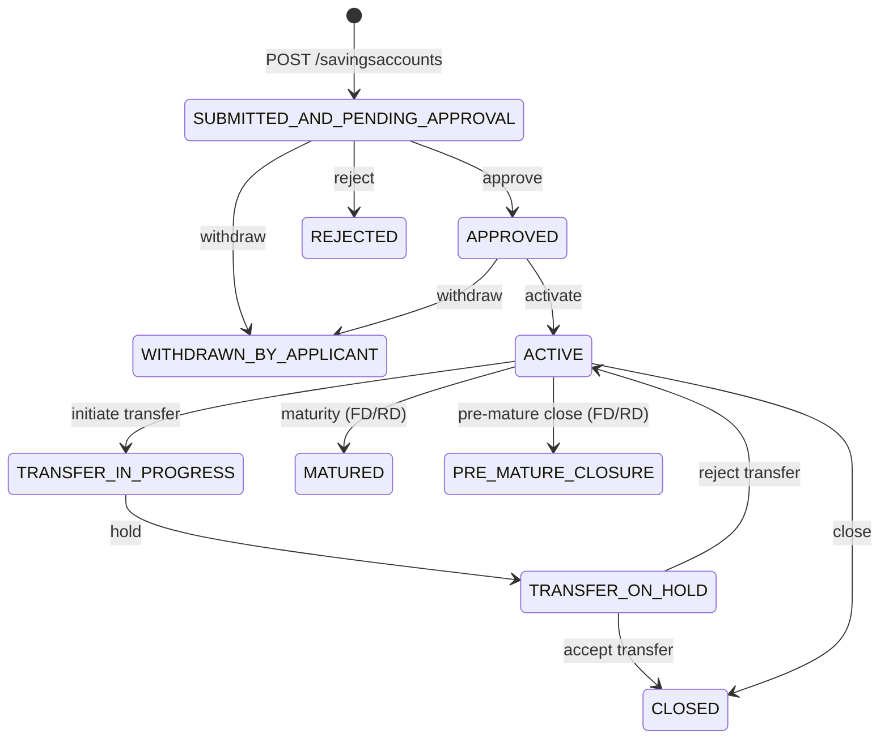

The savings account subsystem lives in the `fineract-savings` module under the root package `org.apache.fineract.portfolio.savings`. It owns the domain model, service layer, and REST API for all deposit-based accounts — regular savings, overdraft-enabled accounts, and the parent class for fixed and recurring deposit specialisations. COB (Close-of-Business) batch processing and interoperability wiring also live here.

<CardGroup cols={2}>
  <Card title="Deposit Products" icon="piggy-bank" href="/savings/deposit-products">
    Fixed Deposit and Recurring Deposit accounts — specialised subclasses and maturity handling
  </Card>
  <Card title="Share Accounts" icon="building-columns" href="/savings/share-accounts">
    Member equity shares, purchases, redemptions, and market-price management
  </Card>
  <Card title="Journal Entries" icon="receipt" href="/accounting/journal-entries">
    How savings transactions generate debit/credit pairs in the GL
  </Card>
  <Card title="General Ledger" icon="book" href="/accounting/general-ledger">
    Chart of accounts, trial balance, and product-to-GL mapping
  </Card>
</CardGroup>

---

## Module layout

```
fineract-savings/src/main/java/org/apache/fineract/
├── cob/savings/                        # COB business steps and locking
│   ├── SavingsCOBBusinessStep.java
│   ├── SavingsLockingService.java
│   └── RetrieveSavingsIdService.java
├── interoperation/                     # Interoperability identifiers & data
│   ├── domain/InteropIdentifier.java
│   └── data/InteropAccountData.java
└── portfolio/
    ├── interestratechart/              # Rate chart + slab domain
    │   └── domain/
    │       ├── InterestRateChart.java
    │       ├── InterestRateChartFields.java
    │       ├── InterestRateChartSlab.java
    │       └── InterestRateChartSlabFields.java
    └── savings/
        ├── api/                        # JAX-RS resource (provider module)
        ├── data/                       # Read-side DTOs
        ├── domain/                     # JPA entities
        ├── exception/
        └── service/                    # Platform service interfaces + impls
```

`fineract-provider` hosts the JAX-RS API layer (`SavingsAccountsApiResource`) while core domain types such as `SavingsAccountStatusType` and `SavingsAccountTransactionType` are published from `fineract-core` to avoid circular dependencies.

---

## `SavingsAccount` entity

**Source:** `fineract-savings/.../savings/domain/SavingsAccount.java`  
**Table:** `m_savings_account`

`SavingsAccount` is the JPA root for the single-table inheritance hierarchy. The discriminator column is `deposit_type_enum`:

| Discriminator | Class | Meaning |
|---|---|---|
| `100` | `SavingsAccount` | Regular savings / current account |
| `200` | `FixedDepositAccount` | Fixed deposit (see [Deposit Products](/savings/deposit-products)) |
| `300` | `RecurringDepositAccount` | Recurring deposit |

```java
@Entity
@Table(name = "m_savings_account", uniqueConstraints = {
    @UniqueConstraint(columnNames = {"account_no"}, name = "sa_account_no_UNIQUE"),
    ...
})
@Inheritance(strategy = InheritanceType.SINGLE_TABLE)
@DiscriminatorColumn(name = "deposit_type_enum", discriminatorType = DiscriminatorType.INTEGER)
@DiscriminatorValue("100")
public class SavingsAccount extends AbstractAuditableWithUTCDateTimeCustom<Long>
        implements IDepositAccountType { ... }
```

### Key fields

| Column | Java field | Purpose |
|---|---|---|
| `account_no` | `accountNo` | Human-readable account number (unique) |
| `external_id` | `externalId` | Caller-supplied external reference |
| `status_enum` | `status` | Integer FK into `SavingsAccountStatusType` |
| `sub_status_enum` | `subStatus` | Dormancy sub-state |
| `nominal_annual_interest_rate` | `nominalAnnualInterestRate` | Base rate (`BigDecimal`) |
| `interest_compounding_period_enum` | `interestCompoundingPeriodType` | Compounding frequency |
| `interest_posting_period_enum` | `interestPostingPeriodType` | Posting frequency |
| `interest_calculation_type_enum` | `interestCalculationType` | DAILY_BALANCE or AVERAGE_DAILY_BALANCE |
| `interest_calculation_days_in_year_type_enum` | `interestCalculationDaysInYearType` | 360 or 365 |
| `allow_overdraft` | `allowOverdraft` | Whether negative balance is permitted |
| `overdraft_limit` | `overdraftLimit` | Maximum overdraft amount |
| `nominal_annual_interest_rate_overdraft` | – | Separate overdraft interest rate |
| `enforce_min_required_balance` | `enforceMinRequiredBalance` | Whether minimum balance is enforced |
| `min_required_balance` | `minRequiredBalance` | Hard floor balance |
| `is_lien_allowed` / `max_allowed_lien_limit` | `lienAllowed` / `maxAllowedLienLimit` | Lien/hold configuration |
| `on_hold_funds_derived` | `onHoldFunds` | Running total of funds placed on hold |
| `lockin_period_frequency` / `lockin_period_frequency_enum` | – | Lock-in period for withdrawals |
| `deposit_type_enum` | `depositType` | Read-only discriminator mirror |
| `min_balance_for_interest_calculation` | – | Minimum balance threshold for interest eligibility |

<Note>
`status_enum` stores integer codes from `SavingsAccountStatusType` (e.g. `300` = ACTIVE). Always call `SavingsAccountStatusType.fromInt(account.getStatus())` rather than comparing raw integers.
</Note>

---

## Account lifecycle

The full set of states is defined in `fineract-core/.../savings/domain/SavingsAccountStatusType.java`:

```java
public enum SavingsAccountStatusType {
    INVALID(0, ...),
    SUBMITTED_AND_PENDING_APPROVAL(100, ...),
    APPROVED(200, ...),
    ACTIVE(300, ...),
    TRANSFER_IN_PROGRESS(303, ...),
    TRANSFER_ON_HOLD(304, ...),
    WITHDRAWN_BY_APPLICANT(400, ...),
    REJECTED(500, ...),
    CLOSED(600, ...),
    PRE_MATURE_CLOSURE(700, ...),
    MATURED(800, ...);
}
```



<Warning>
The `WITHDRAWN_BY_APPLICANT` (400) and `REJECTED` (500) states are terminal. The helper `isClosed()` on `SavingsAccountStatusType` returns `true` for both of them plus `CLOSED(600)`.
</Warning>

---

## Transaction types

Defined in `fineract-core/.../savings/SavingsAccountTransactionType.java`. Each variant carries an optional `TransactionEntryType` that drives the double-entry direction:

| Enum value | ID | Entry type | Description |
|---|---|---|---|
| `DEPOSIT` | 1 | CREDIT | Cash or transfer in |
| `WITHDRAWAL` | 2 | DEBIT | Cash out |
| `INTEREST_POSTING` | 3 | CREDIT | Calculated interest credited |
| `WITHDRAWAL_FEE` | 4 | DEBIT | Per-withdrawal charge |
| `ANNUAL_FEE` | 5 | DEBIT | Annual maintenance charge |
| `WAIVE_CHARGES` | 6 | — | Charge waiver (no GL entry) |
| `PAY_CHARGE` | 7 | DEBIT | General charge payment |
| `DIVIDEND_PAYOUT` | 8 | CREDIT | Dividend from share product |
| `ACCRUAL` | 10 | — | Accrual marker (no posting) |
| `OVERDRAFT_INTEREST` | 17 | DEBIT | Overdraft interest charge |
| `WITHHOLD_TAX` | 18 | DEBIT | Tax withheld at source |
| `ESCHEAT` | 19 | DEBIT | Transfer to dormancy/escheat |
| `AMOUNT_HOLD` | 20 | DEBIT | Place funds on hold |
| `AMOUNT_RELEASE` | 21 | CREDIT | Release held funds |

Each `SavingsAccountTransaction` record is stored in `m_savings_account_transaction`. Reversals are created as new opposing transactions rather than deletion.

---

## Interest rate charts

For deposit products and savings products that use tiered rates, interest is governed by `InterestRateChart` → `InterestRateChartSlab`.

**Tables:** `m_interest_rate_chart`, `m_interest_rate_slab`

```java
// InterestRateChart entity
@Entity
@Table(name = "m_interest_rate_chart")
public class InterestRateChart extends AbstractPersistableCustom<Long> {
    @Embedded
    private InterestRateChartFields chartFields;   // name, fromDate, endDate, isPrimaryGroupingByAmount

    @OneToMany(mappedBy = "interestRateChart", cascade = CascadeType.ALL,
               orphanRemoval = true, fetch = FetchType.EAGER)
    private Set<InterestRateChartSlab> chartSlabs = new HashSet<>();
}

// InterestRateChartSlab entity
@Entity
@Table(name = "m_interest_rate_slab")
public class InterestRateChartSlab extends AbstractPersistableCustom<Long> {
    @Embedded
    private InterestRateChartSlabFields slabFields;

    @ManyToOne(optional = false)
    @JoinColumn(name = "interest_rate_chart_id", ...)
    private InterestRateChart interestRateChart;

    @OneToMany(mappedBy = "interestRateChartSlab", cascade = CascadeType.ALL,
               orphanRemoval = true, fetch = FetchType.EAGER)
    private Set<InterestIncentives> interestIncentives = new HashSet<>();
}
```

`InterestRateChartSlabFields` (`@Embeddable`) carries:

| Column | Meaning |
|---|---|
| `period_type_enum` | Period unit (DAYS, WEEKS, MONTHS, YEARS) |
| `from_period` / `to_period` | Deposit tenure range this slab applies to |
| `amount_range_from` / `amount_range_to` | Optional principal-band filter |
| `annual_interest_rate` | Rate as a `BigDecimal` |

When `isPrimaryGroupingByAmount` is false (the default), slabs are selected based on tenure; when true, the principal amount is the primary axis. Each slab can carry `InterestIncentives` — adjustments applied for specific client attributes (e.g. gender, age group), assembled via `AttributeIncentiveCalculationFactory`.

<Tip>
To trace which slab applies to a given account, look at `InterestRateChart.findSlab(depositTenure, depositAmount)`. The `InterestRateChartSlabComparator` ensures slabs are ordered for binary search.
</Tip>

---

## Key service interfaces

All service interfaces live in `fineract-savings/.../savings/service/`.

### `SavingsAccountReadPlatformService`

```java
public interface SavingsAccountReadPlatformService {
    Page<SavingsAccountData> retrieveAll(SearchParameters searchParameters);
    SavingsAccountData retrieveOne(Long savingsId);
    Collection<SavingsAccountTransactionData> retrieveAllTransactions(
        Long savingsId, DepositAccountType depositAccountType);
    SavingsAccountTransactionData retrieveDepositTransactionTemplate(
        Long savingsId, DepositAccountType depositAccountType);
    Collection<SavingsAccountData> retrieveActiveForLookup(
        Long clientId, DepositAccountType depositAccountType);
    // ... additional lookup methods
}
```

### `SavingsAccountWritePlatformService`

```java
public interface SavingsAccountWritePlatformService {
    CommandProcessingResult activate(Long savingsId, JsonCommand command);
    CommandProcessingResult deposit(Long savingsId, JsonCommand command);
    CommandProcessingResult withdrawal(Long savingsId, JsonCommand command);
    CommandProcessingResult calculateInterest(Long savingsId);
    CommandProcessingResult close(Long savingsId, JsonCommand command);
    CommandProcessingResult reverseTransaction(Long savingsId, Long transactionId,
        boolean allowAccountTransferModification, JsonCommand command);
    CommandProcessingResult adjustSavingsTransaction(Long savingsId, Long transactionId,
        JsonCommand command);
    // transfer lifecycle methods ...
}
```

### `SavingsAccountDomainService`

Lower-level service invoked by the write platform service for actions that must be atomic with the aggregate (e.g. posting interest, applying charges). Lives at the same package level.

### `SavingsAccountInterestPostingService`

Handles scheduled and manual interest postings. Called both on-demand and by the scheduled job configured in `SavingsSchedularInterestPosterTask`.

---

## REST endpoints

Base path registered in `SavingsAccountsApiResource`:  
`/fineract-provider/api/v1/savingsaccounts`

| Method | Path | Action |
|---|---|---|
| `GET` | `/savingsaccounts` | Paginated list (supports `SearchParameters`) |
| `GET` | `/savingsaccounts/template` | Template for new account form |
| `POST` | `/savingsaccounts` | Submit new savings application |
| `POST` | `/savingsaccounts/gsim` | Group Savings Individual Monitoring batch create |
| `GET` | `/savingsaccounts/{accountId}` | Retrieve single account |
| `GET` | `/savingsaccounts/external-id/{externalId}` | Retrieve by external ID |
| `PUT` | `/savingsaccounts/{accountId}` | Update account fields |
| `POST` | `/savingsaccounts/{accountId}/transactions` | Post a transaction |
| `GET` | `/savingsaccounts/{accountId}/transactions/{transactionId}` | Retrieve transaction |

Transaction command dispatch is routed through the `commandId` query parameter (e.g. `?command=deposit`, `?command=withdrawal`, `?command=postInterest`). The API resource lives at `fineract-provider/.../savings/api/SavingsAccountsApiResource.java`.

---

## COB integration

The savings COB infrastructure is contained in `fineract-savings/.../cob/savings/`.

**`SavingsCOBBusinessStep`** is the marker interface extending `COBBusinessStep<SavingsAccount>` that all savings-specific COB steps must implement:

```java
// fineract-savings/.../cob/savings/SavingsCOBBusinessStep.java
public interface SavingsCOBBusinessStep extends COBBusinessStep<SavingsAccount> {
}
```

**`SavingsLockingService`** acquires per-account row locks before COB steps execute. The lock owner is tracked via `SavingsLockOwner`, and accounts that remain locked after processing emit a `SavingsAccountsStayedLockedBusinessEvent`.

**`RetrieveSavingsIdService`** provides the list of account IDs eligible for a given COB run — it respects partition ranges used by the batch Spring Batch job infrastructure.

COB steps run inside the Spring Batch framework configured in `fineract-provider`. Savings accounts enter COB as individual items; the lock/unlock cycle is handled by `SavingsLockingService.acquireLock()` / `releaseLock()`.

---

## Interoperability module integration

The `fineract-savings` module also ships the interoperability domain classes under `org.apache.fineract.interoperation.*`. Key types:

| Class | Purpose |
|---|---|
| `InteropIdentifier` | Binds a savings account to an external interop network identifier (MSISDN, account number, alias) |
| `InteropAccountData` | Read-side DTO carrying the account-level view for interop responses |
| `InteropActionState` | State machine for an interop transaction action (`ACCEPTED`, `REJECTED`, etc.) |
| `InteropAmountType` | `SEND` vs `RECEIVE` amount semantics in a transfer request |

The interop module itself lives in `fineract-provider` as a separate REST layer; these domain classes are the shared contract.
