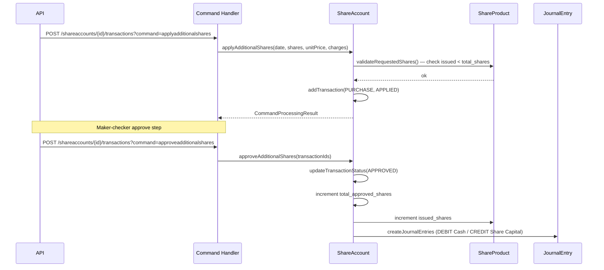

The share account subsystem models member equity participation in cooperatives and credit unions — a member buys shares at a unit price, receives dividends, and may redeem shares subject to product rules. The implementation lives in `fineract-provider` under two sibling packages: `org.apache.fineract.portfolio.shareaccounts` (the member-facing account) and `org.apache.fineract.portfolio.shareproducts` (the product template and market price history).

<CardGroup cols={2}>
  <Card title="Savings Accounts" icon="piggy-bank" href="/savings/savings-accounts">
    Regular deposit accounts — contrast with share equity
  </Card>
  <Card title="Journal Entries" icon="receipt" href="/accounting/journal-entries">
    How share purchases and dividends hit the GL
  </Card>
  <Card title="General Ledger" icon="book" href="/accounting/general-ledger">
    Product-to-GL account mapping for share products
  </Card>
</CardGroup>

---

## Package structure

```
fineract-provider/src/main/java/org/apache/fineract/portfolio/
├── shareaccounts/
│   ├── api/                        # JAX-RS resource (ShareAccountsApiResource)
│   ├── data/                       # Read-side DTOs
│   │   ├── ShareAccountData.java
│   │   ├── ShareAccountTransactionData.java
│   │   └── ShareAccountDividendData.java
│   ├── domain/                     # JPA entities
│   │   ├── ShareAccount.java
│   │   ├── ShareAccountTransaction.java
│   │   ├── ShareAccountCharge.java
│   │   ├── ShareAccountDividendDetails.java
│   │   └── ShareAccountStatusType.java
│   └── handler/                    # Command handlers
└── shareproducts/
    ├── api/                        # ShareDividendApiResource
    ├── data/
    │   ├── ShareProductData.java
    │   └── ShareProductMarketPriceData.java
    ├── domain/
    │   ├── ShareProduct.java
    │   ├── ShareProductMarketPrice.java
    │   ├── ShareProductDividendPayOutDetails.java
    │   └── ShareProductDividendStatusType.java
    └── handler/
```

Avro event schemas live in `fineract-avro-schemas/src/main/avro/share/v1/`.

---

## `ShareProduct` entity

**Source:** `fineract-provider/.../shareproducts/domain/ShareProduct.java`  
**Table:** `m_share_product`

`ShareProduct` extends `AbstractAuditableCustom` and carries the configuration shared by all accounts opened against it.

| Column | Java field | Purpose |
|---|---|---|
| `name` / `short_name` | `name` / `shortName` | Display identifiers (both unique) |
| `external_id` | `externalId` | Caller-supplied reference |
| `total_shares` | `totalShares` | Total authorised shares (`Long`) |
| `issued_shares` | `totalSharesIssued` | Currently issued shares |
| `totalsubscribed_shares` | `totalSubscribedShares` | Subscribed but not yet approved |
| `unit_price` | – | Face value per share (`BigDecimal`) |
| `minimum_shares` / `nominal_shares` / `maximum_shares` | – | Per-account limits |
| `start_date` / `end_date` | `startDate` / `endDate` | Optional subscription window |
| `allow_dividends_for_inactive_clients` | – | Boolean flag |
| `lock_period` / `lock_period_type_enum` | – | Redemption lock-in |
| `minimum_active_period_for_dividends` / `_frequency_type` | – | Minimum hold for dividend eligibility |
| Accounting | – | `AccountingRuleType` (`NONE`, `CASH`, `ACCRUAL_PERIODIC`) |

The product holds a `@OneToMany` list of `ShareProductMarketPrice` entries (table `m_share_product_market_price`) and a `@ManyToMany` set of applicable `Charge` entities.

---

## `ShareProductMarketPrice` — price history

**Source:** `fineract-provider/.../shareproducts/domain/ShareProductMarketPrice.java`  
**Table:** `m_share_product_market_price`

```java
@Entity
@Table(name = "m_share_product_market_price")
public class ShareProductMarketPrice extends AbstractPersistableCustom<Long> {

    @ManyToOne(optional = false)
    @JoinColumn(name = "product_id", referencedColumnName = "id", nullable = false)
    private ShareProduct product;

    @Column(name = "from_date")
    private LocalDate fromDate;

    @Column(name = "share_value", nullable = false)
    private BigDecimal shareValue;
}
```

Each row represents the share unit price effective from `fromDate` until superseded by a later entry. The effective price at any given date is the row with the greatest `fromDate` that is ≤ the transaction date. Purchase and redemption transactions are valued at this price.

<Note>
Market price history is append-only. To change the current price, `POST` a new entry via `PUT /shareproducts/{productId}` with an updated `marketPrice` array in the request body. Do not update or delete historical rows.
</Note>

---

## `ShareAccount` entity

**Source:** `fineract-provider/.../shareaccounts/domain/ShareAccount.java`  
**Table:** `m_share_account`

```java
@Entity
@Table(name = "m_share_account")
public class ShareAccount extends AbstractPersistableCustom<Long> {

    @ManyToOne
    @JoinColumn(name = "client_id")
    private Client client;

    @ManyToOne
    @JoinColumn(name = "product_id")
    private ShareProduct shareProduct;

    @Column(name = "status_enum", nullable = false)
    protected Integer status;

    @Column(name = "submitted_date")
    private LocalDate submittedDate;

    @Column(name = "approved_date")
    protected LocalDate approvedDate;

    // + rejected, activated, closed dates and corresponding AppUser references
    // + account_no, external_id, currency
    // + total_approved_shares, total_pending_shares
    // + Set<ShareAccountTransaction> shareAccountTransactions
    // + Set<ShareAccountCharge>     shareAccountCharges
    // + SavingsAccount              savingsAccount   (linked for dividend payout)
}
```

| Field | Purpose |
|---|---|
| `status_enum` | Integer from `ShareAccountStatusType` |
| `total_approved_shares` | Current approved/active share count |
| `total_pending_shares` | Shares in a pending purchase request |
| `savingsAccount` | The savings account where dividend and redemption proceeds are credited |
| `account_no` | Auto-generated account number |

### `ShareAccountStatusType`

```java
public enum ShareAccountStatusType {
    INVALID(0),
    SUBMITTED_AND_PENDING_APPROVAL(100),
    APPROVED(200),
    ACTIVE(300),
    REJECTED(500),
    CLOSED(600);
}
```

---

## `ShareAccountTransaction` — purchases and redemptions

**Source:** `fineract-provider/.../shareaccounts/domain/ShareAccountTransaction.java`  
**Table:** `m_share_account_transactions`

Each transaction row records a purchase or redemption:

| Column | Meaning |
|---|---|
| `transaction_date` | Value date of the transaction |
| `total_shares` | Number of shares in this transaction |
| `unit_price` | Price per share at time of transaction (snapshot from `ShareProductMarketPrice`) |
| `amount` | `total_shares × unit_price` |
| `status_enum` | `PurchasedSharesStatusType`: APPLIED, APPROVED, REJECTED, CHARGE_BACK |
| `type_enum` | Purchase (1) or Redemption (2) |
| `charge_amount_if_applicable` | Any applicable charge deducted at point of transaction |

The `PurchasedSharesStatusType` enum tracks whether an individual transaction has been approved or rejected by a maker/checker workflow.

---

## Purchase and redemption flow



Redemptions follow the same pattern using `command=redeemshares` / `command=approveredeemshares`. Rejected purchases use `command=rejectadditionalshares`.

---

## Dividend processing

Dividends are declared at the product level via `ShareProductDividendPayOutDetails`. The flow is:

1. `POST /shareproducts/{productId}/dividends` — create a dividend payout for a given period
2. Status starts at `INITIATED` (`ShareProductDividendStatusType`)
3. `POST /shareproducts/{productId}/dividends/{dividendId}?command=approve` — approve; per-account dividend credit transactions are written to each active `ShareAccount`'s linked `SavingsAccount`
4. If approved incorrectly: `DELETE /shareproducts/{productId}/dividends/{dividendId}` before approval

`ShareAccountDividendDetails` (table `m_share_account_dividend_details`) stores the per-account dividend amount and links back to the product-level payout row.

---

## Avro event schemas

Fineract emits Avro-serialised events for share domain changes. Schemas are in  
`fineract-avro-schemas/src/main/avro/share/v1/`:

| Schema file | Record name | Namespace |
|---|---|---|
| `ShareAccountDataV1.avsc` | `ShareAccountDataV1` | `org.apache.fineract.avro.share.v1` |
| `ShareProductDataV1.avsc` | `ShareProductDataV1` | `org.apache.fineract.avro.share.v1` |
| `ShareAccountTransactionDataV1.avsc` | `ShareAccountTransactionDataV1` | `org.apache.fineract.avro.share.v1` |
| `ShareAccountStatusEnumDataV1.avsc` | `ShareAccountStatusEnumDataV1` | `org.apache.fineract.avro.share.v1` |
| `ShareProductMarketPriceDataV1.avsc` | `ShareProductMarketPriceDataV1` | `org.apache.fineract.avro.share.v1` |

`ShareAccountDataV1` fields include `id`, `accountNo`, `externalId`, `savingsAccountNumber`, `clientId`, and nested product and transaction collections. `ShareProductDataV1` mirrors the `ShareProduct` entity with `id`, `name`, `shortName`, `description`, and `externalId` as the primary top-level fields.

---

## REST endpoints

### Share Accounts — `/fineract-provider/api/v1/shareaccounts`

| Method | Path | Action |
|---|---|---|
| `POST` | `/shareaccounts` | Submit share account application |
| `GET` | `/shareaccounts` | Paginated list |
| `GET` | `/shareaccounts/{accountId}` | Retrieve account |
| `PUT` | `/shareaccounts/{accountId}` | Modify application (pre-approval) |
| `POST` | `/shareaccounts/{accountId}?command=approve` | Approve application |
| `POST` | `/shareaccounts/{accountId}?command=activate` | Activate account |
| `POST` | `/shareaccounts/{accountId}?command=reject` | Reject application |
| `POST` | `/shareaccounts/{accountId}?command=close` | Close account |
| `POST` | `/shareaccounts/{accountId}/transactions?command=applyadditionalshares` | Apply to purchase shares |
| `POST` | `/shareaccounts/{accountId}/transactions?command=approveadditionalshares` | Approve purchase |
| `POST` | `/shareaccounts/{accountId}/transactions?command=rejectadditionalshares` | Reject purchase |
| `POST` | `/shareaccounts/{accountId}/transactions?command=redeemshares` | Apply to redeem shares |
| `POST` | `/shareaccounts/{accountId}/transactions?command=approveredeemshares` | Approve redemption |

### Share Products — `/fineract-provider/api/v1/shareproducts`

| Method | Path | Action |
|---|---|---|
| `POST` | `/shareproducts` | Create product |
| `GET` | `/shareproducts` | List products |
| `GET` | `/shareproducts/{productId}` | Retrieve product with price history |
| `PUT` | `/shareproducts/{productId}` | Update product / add market price |
| `POST` | `/shareproducts/{productId}/dividends` | Create dividend payout |
| `GET` | `/shareproducts/{productId}/dividends` | List dividend payouts |
| `POST` | `/shareproducts/{productId}/dividends/{dividendId}?command=approve` | Approve payout |
| `DELETE` | `/shareproducts/{productId}/dividends/{dividendId}` | Delete unapproved payout |

<Tip>
The `ShareProductToGLAccountMappingHelper` (in `fineract-accounting`) is responsible for resolving which GL accounts to debit/credit on share purchases, redemptions, and dividends. Product-level accounting is configured with `accountingRule = CASH` or `ACCRUAL_PERIODIC` and must be mapped before accounts can be activated.
</Tip>
